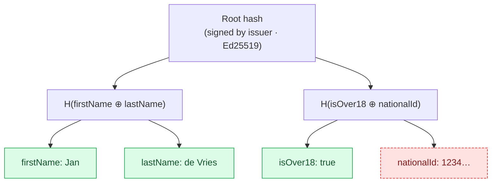

# OwlID

**Privacy-preserving digital identity on Midnight** — verifiable credentials, Merkle-tree selective disclosure, zero-knowledge predicates, and WebAuthn/passkey authentication.

OwlID lets a holder prove facts about themselves (age, nationality, KYC status) to any verifier without disclosing the underlying document. Issuers sign Merkle-rooted credentials; holders generate selective-disclosure tokens locally; verifiers check signatures, predicates, expiry, and revocation against a public REST API.

---

## What's in the box

| Layer                    | Component                                 | Status    |
| ------------------------ | ----------------------------------------- | --------- |
| Cryptographic core       | `crates/crypto`, `crates/proof-system`    | stable    |
| ZK predicates            | `crates/zk-circuits`                      | stable    |
| Verification API (8000)  | `crates/verification-service`             | stable    |
| Issuer API (8001)        | `crates/issuer-service`                   | stable    |
| Midnight bridge (3000)   | `packages/midnight-sidecar`               | stable    |
| TypeScript SDK           | `packages/sdk`                            | stable    |
| Native bindings + WASM   | `packages/native-sdk`                     | stable    |
| Generated API clients    | `packages/{verifier,issuer,admin}-client` | generated |
| Holder app (5000)        | `packages/app`                            | stable    |
| Verifier demo app (5001) | `packages/verifier-app`                   | stable    |
| Admin dashboard (4000)   | `packages/admin`                          | stable    |
| Compact contracts        | `packages/compact-contracts`              | testnet   |

The "generated" packages (`@owlid/verifier-client`, `@owlid/issuer-client`, `@owlid/admin-client`) are produced by `just generate-api-client` from the live OpenAPI specs of the Rust services. Don't hand-edit the `apis/`, `models/`, or `runtime.ts` directories under those packages.

---

## How selective disclosure works



The holder picks which leaves to disclose. Hidden leaves are replaced with their hashes plus a Merkle path. The verifier reconstructs the root, checks the issuer signature, validates the holder's WebAuthn signature against a fresh challenge, and consults the revocation registry. Predicates (e.g. `age >= 18`, `nationality in {NL,DE}`) are proved with ZK circuits — the underlying value never leaves the holder.

For the full architecture see [`docs/ARCHITECTURE.md`](docs/ARCHITECTURE.md).

---

## Quick start

### Prerequisites

| Tool   | Version | Install                         |
| ------ | ------- | ------------------------------- |
| Rust   | 1.75+   | https://rustup.rs               |
| Bun    | 1.0+    | https://bun.sh                  |
| Docker | 24+     | https://docs.docker.com/engine/ |
| just   | any     | `cargo install just`            |

```bash
just check-tools   # verify the toolchain
```

### Run

```bash
git clone <repo-url> && cd OwlID
cp .env.example .env
just setup         # bun install + cargo fetch + native-sdk build
just dev           # backends + holder app
```

Live URLs:

| Service           | URL                               |
| ----------------- | --------------------------------- |
| Holder app        | http://localhost:5000             |
| Verifier demo     | http://localhost:5001             |
| Admin dashboard   | http://localhost:4000             |
| Verification API  | http://localhost:8000             |
| Issuer API        | http://localhost:8001             |
| Verification docs | http://localhost:8000/swagger-ui/ |
| Issuer docs       | http://localhost:8001/swagger-ui/ |

For a full local end-to-end run with Midnight devnet (node + indexer + proof server + sidecar):

```bash
just dev-e2e
```

Detailed setup, contract deploy, and Midnight versions in [`docs/E2E-SETUP.md`](docs/E2E-SETUP.md).

---

## Customer integrations

### Verifier (server-side)

Install the SDK + verifier client and call `POST /verify` with a token:

```bash
bun add @owlid/sdk
```

```typescript
import { configure } from '@owlid/sdk'
import { getVerificationApi, getPresentationApi } from '@owlid/sdk/verifier'

configure({
  verificationUrl: 'https://verify.example.com',
  apiKey: process.env.OWLID_API_KEY,
})

// Direct token verification
const verify = getVerificationApi()
const result = await verify.verifyToken({
  verifyRequest: { token, challenge },
})

// Or open a QR / WebSocket presentation session.
// Verifier creates an empty session, renders the QR; the
// proof request itself is negotiated over the WebSocket channel.
const presentation = getPresentationApi()
const session = await presentation.createSession()
// session.sessionId, session.wsUrl, session.nonce
```

### Issuer-side integration

```typescript
import { configure } from '@owlid/sdk'
import { getSessionsApi, getCredentialsApi } from '@owlid/sdk/issuer'

configure({ issuerUrl: 'https://issuer.example.com' })

const sessions = getSessionsApi()
const session = await sessions.createSession({
  createSessionRequest: { providerId: 'didit' },
})
// then redirect / poll / submit per the provider's flow
```

### Holder (browser)

The browser SDK runs WebAuthn registration, signs tokens, manages credential storage, and speaks the OwlID presentation protocol over WebSocket. See [`packages/sdk/README.md`](packages/sdk/README.md) for the full surface.

---

## Documentation map

| Document                                               | When to read                                                       |
| ------------------------------------------------------ | ------------------------------------------------------------------ |
| [`docs/GETTING_STARTED.md`](docs/GETTING_STARTED.md)   | Build, run, write your first token                                 |
| [`docs/integration/`](docs/integration/)               | Integration guides — verifier, issuer, holder app                  |
| [`docs/ARCHITECTURE.md`](docs/ARCHITECTURE.md)         | C4-style architecture, design rationale, data model                |
| [`docs/DEPLOYMENT.md`](docs/DEPLOYMENT.md)             | Production compose, env vars, Midnight versions                    |
| [`docs/RUNBOOK.md`](docs/RUNBOOK.md)                   | Operations: revoking, rotating keys, GDPR erasure, troubleshooting |
| [`docs/E2E-SETUP.md`](docs/E2E-SETUP.md)               | Full local stack with Midnight devnet                              |
| [`docs/E2E_SCENARIOS.md`](docs/E2E_SCENARIOS.md)       | End-to-end use cases (age check, KYC, etc.)                        |
| [`docs/COMPACT.md`](docs/COMPACT.md)                   | Midnight Compact language reference                                |
| [`SERVICES.md`](SERVICES.md)                           | Local-development URL cheatsheet                                   |
| [`deploy/gcp/README.md`](deploy/gcp/README.md)         | GCP deploy: Terraform infra, Cloud Build, Cloud Run                |
| [`deploy/gcp/RUNBOOK.md`](deploy/gcp/RUNBOOK.md)       | GCP deploy: step-by-step playbooks for every change scenario       |
| [`deploy/gcp/SECRETS.md`](deploy/gcp/SECRETS.md)       | GCP deploy: secret storage, rotation, audit                        |
| [`deploy/gcp/ENV-WIRING.md`](deploy/gcp/ENV-WIRING.md) | GCP deploy: every env var, source, consumer                        |

API references:

- Verification HTTP API: see [`crates/verification-service/README.md`](crates/verification-service/README.md) or `http://localhost:8000/swagger-ui/`
- Issuer HTTP API: see [`crates/issuer-service/README.md`](crates/issuer-service/README.md) or `http://localhost:8001/swagger-ui/`
- TypeScript SDK: [`packages/sdk/README.md`](packages/sdk/README.md)
- Native bindings: [`packages/native-sdk/README.md`](packages/native-sdk/README.md)
- Admin dashboard: [`packages/admin/README.md`](packages/admin/README.md)

---

## Development

```bash
just dev             # all services
just dev-backend     # rust services + sidecar
just dev-app         # holder app only
just build           # full build
just test            # rust + ts tests
just check           # fmt + lint + test
just generate-api-client  # regenerate verifier/issuer/admin clients from OpenAPI
just generate-zk-keys     # regenerate Groth16 PK/VK artifacts (after circuit edits)
```

**Groth16 keys.** ZK predicates use Groth16 over BLS12-381. Proving keys (~150–350 KB each) and verifying keys (~40 KB each) are produced by `just generate-zk-keys` and committed under `crates/zk-circuits/artifacts/` — they are loaded via `include_bytes!` at compile time, never regenerated at runtime. The verifier service serves PKs at `GET /zk-keys/<circuit>.pk.bin` so wallet WASM builds (which don't bundle the keys) can fetch them on demand and cache in IndexedDB. The committed keys come from a deterministic-seed dev setup; production deployment must replace them with output from a Phase-2 MPC ceremony — see [`crates/zk-circuits/CEREMONY.md`](crates/zk-circuits/CEREMONY.md).

Always use `bun`, never `npm`. Format Rust with `just fmt`, lint with `just lint`. Pre-commit hooks (`husky` + `lint-staged`) run oxlint + prettier + taplo on staged files.

## Repository layout

```
.
├── crates/                       # Rust workspace
│   ├── crypto/                   # Ed25519, P-256, BLAKE3, SHA-256, Merkle, WebAuthn
│   ├── proof-system/             # Document, Credential, Token, revocation
│   ├── zk-circuits/              # Predicate proofs
│   ├── verification-service/     # Verifier HTTP API + admin
│   └── issuer-service/           # Issuance HTTP API
├── packages/
│   ├── sdk/                      # @owlid/sdk — customer-facing TS SDK
│   ├── native-sdk/               # @owlid/native-sdk — NAPI + WASM bindings
│   ├── verifier-client/          # generated OpenAPI client (verification)
│   ├── issuer-client/            # generated OpenAPI client (issuer)
│   ├── admin-client/             # generated OpenAPI client (admin, private)
│   ├── app/                      # holder app (Vite + React + TanStack)
│   ├── verifier-app/             # verifier demo
│   ├── admin/                    # admin dashboard (TanStack Start)
│   ├── midnight-sidecar/         # Bun + Hono bridge to Midnight
│   └── compact-contracts/        # Compact source for Midnight contracts
├── docs/                         # current docs (+ archive/)
├── docker-compose*.yml           # local + prod compose stacks
├── justfile                      # task runner
└── monitoring/                   # Prometheus + Grafana configs
```

## License

MIT — see [`LICENSE`](LICENSE).
