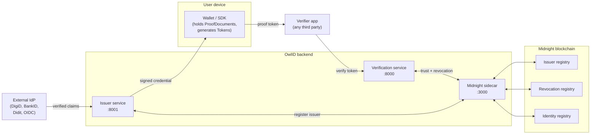
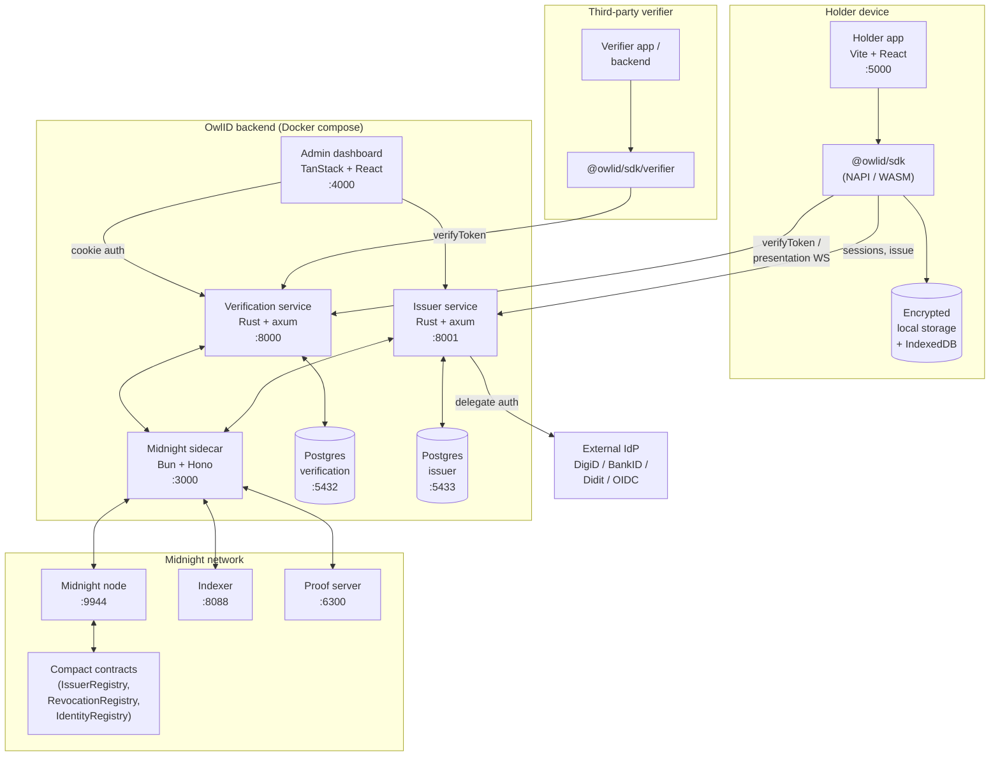
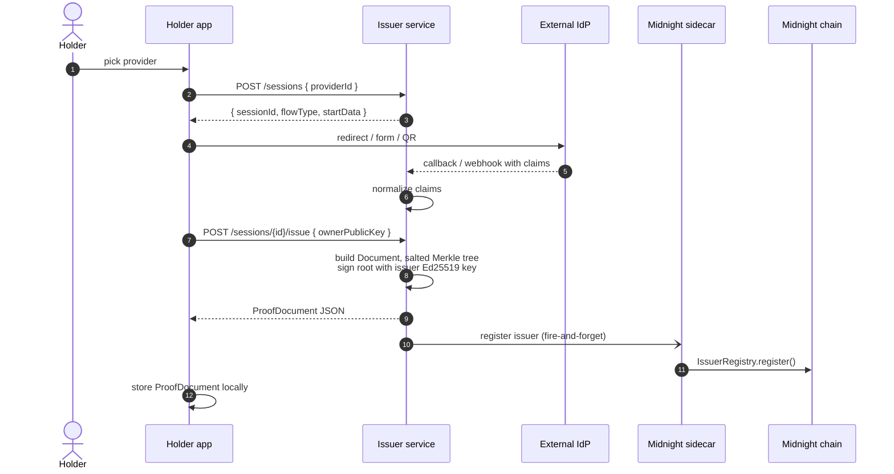
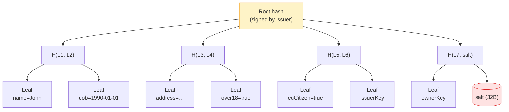
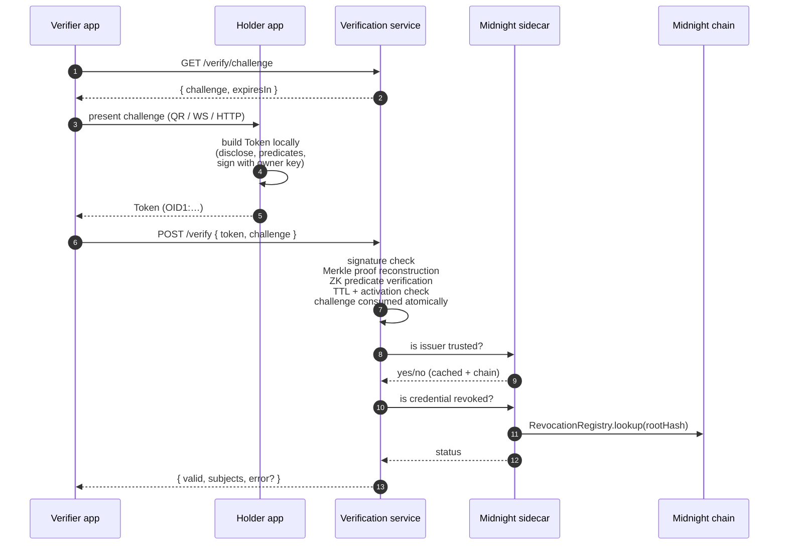
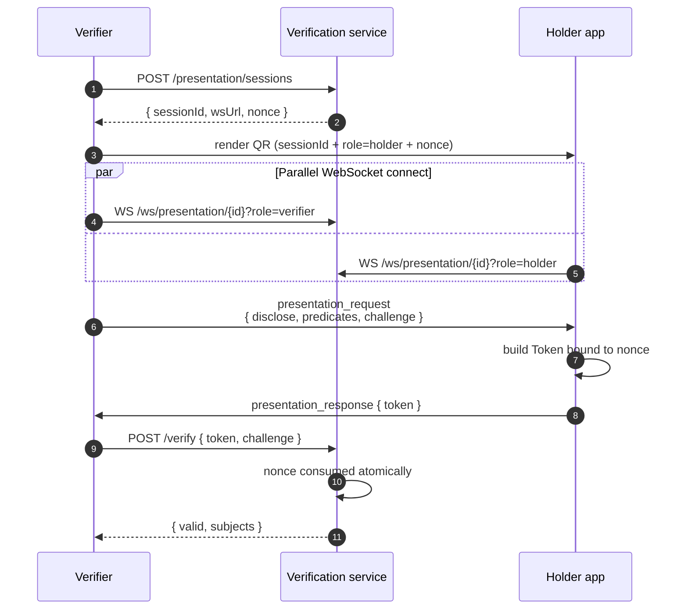
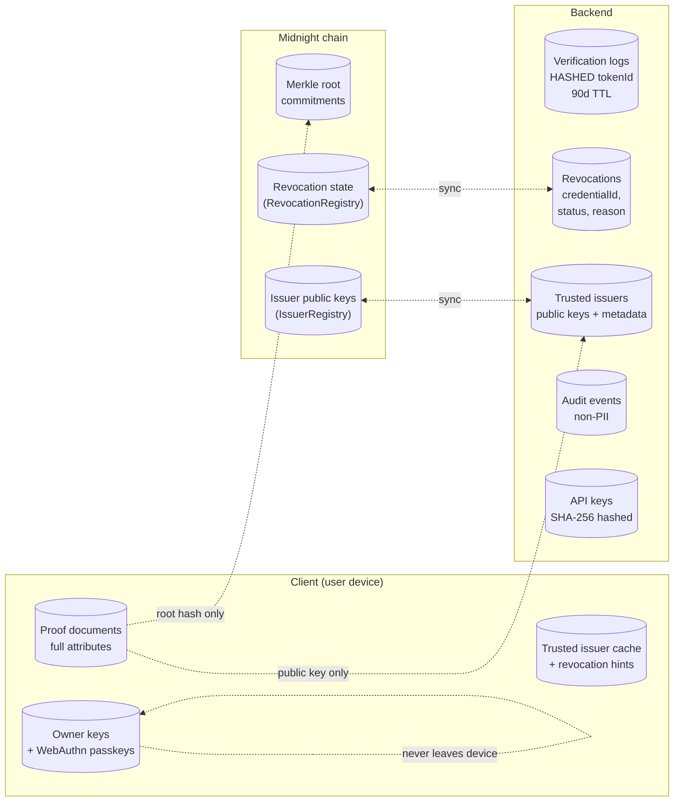

# OWL ID — Midnight Identity Layer

**Software Architecture Document**

_November 2025 (last review: 2026-05)_

_Triple Play Labs — www.tripleplaylabs.com_

> This document is the design-level spec — mission, principles, C4 components, data architecture, non-functional requirements. It evolves slowly. For exact route signatures and request/response shapes see the per-service references and the live OpenAPI specs at `/swagger-ui/`.

---

## I. Introduction

### Mission

To empower individuals and organizations with a privacy-preserving digital identity framework that enables verifiable trust without compromising personal data.

### Vision

To redefine digital trust in a decentralized world where identity is verified, not exposed, and privacy becomes a default right, not an optional feature.

### Background

Modern digital identity systems rely heavily on centralized authorities that store and process sensitive personal information. This centralization introduces privacy risks, legal compliance burdens, and single points of failure. The Midnight Network (a privacy-focused blockchain) provides cryptographic foundations that enable private smart contracts and confidential transactions.

This project delivers a client-side, privacy-preserving Verifiable Credential (VC) and Zero-Knowledge Proof (ZKP) system, enabling users to prove facts about themselves without revealing the underlying data. This system is designed to provide transparency in data handling while safeguarding individual privacy. The platform uses Merkle-root commitments, zero-knowledge circuits, and a Token Verification Service that validates ZK proofs both on-chain and offline.

We landed on the name Owl ID because the owl is the classic symbol of wisdom and quiet observation, exactly what we want from an identity layer that understands enough to verify you, without exposing more than necessary. Just like an owl sees clearly in the dark without being seen itself, Owl ID gives verifiers the signals they need while keeping the user's data shielded, and the "ID" anchors it back to what it really is: a smarter, privacy-first way to handle identity.

### Problem Definition and Context

Current identity and KYC solutions require users to disclose entire documents or datasets to prove simple attributes. Even "decentralized identity" frameworks often leak metadata or depend on online verification with issuers. Our challenge is to create a GDPR-compliant, offline-verifiable, and developer-friendly architecture that integrates seamlessly with the Midnight blockchain.

### Purpose of This Document

This document defines the full technical architecture of the system, structure, components, interfaces, data models, and non-functional requirements, in line with IEEE 1471 and C4 Model practices. It provides engineers, auditors, and partners with a common reference for implementation and review.

### Audience

- **Developers**: implementation details and SDK interfaces
- **Architects**: component interactions, system boundaries
- **Project Stakeholders**: rationale and roadmap

### Scope and Assumptions

#### In Scope

- Proof Generator SDK (TypeScript + Rust)
- Token (Certificate) Verification Service (REST / gRPC)
- VC integration and ZKP predicate proofs
- Compact-based smart contract interactions
- Cloud deployment architecture
- GDPR privacy and security compliance

#### Out of Scope

- DID Registry implementation (it is consumed only)
- TEE Cloud Proof Server (modality handled elsewhere)
- Native mobile apps and UI design

---

## II. System Overview

### System Summary

The system provides a complete privacy-preserving credential lifecycle:

1. **Credential Issuance**: Users collect signed verifiable credentials from trusted issuers from our MID System.
2. **Proof Generation**: Using the local SDK, users create zero-knowledge proofs (Tokens) of specific credential predicates (e.g., over 18, citizen of EU) based on their Identity (MID Passport).
3. **Verification**: Verifiers or smart contracts validate proofs using the Token (Certificate) Verification Service and on-chain public data.
4. **Audit & Compliance**: Only non-identifying commitments and logs are stored; personal data remains local to the user.



### Objectives and Use Cases

| ID    | Use Case              | Description                                            |
| ----- | --------------------- | ------------------------------------------------------ |
| UC-01 | Age Proof             | User proves being over 18 without revealing DOB        |
| UC-02 | Residency Proof       | User proves residence in EU country                    |
| UC-03 | Credential Revocation | Issuer revokes credential; updated proof invalid       |
| UC-04 | Offline Verification  | Verifier checks proof validity without reaching issuer |
| UC-05 | Developer Integration | dApp uses SDK API to request local proof               |

### Core Functionalities

- VC management and revocation tracking
- ZKP circuit execution and proof serialization
- Token (Certificate) Verification Service for proof validation
- Secure storage of local keys and secrets
- Google Cloud-hosted backend services (API + audit)

### Design Principles

- **Privacy by Design**: Minimize data disclosure and retain control at user side.
- **Modularity**: Clear separation between SDK, services, and chain logic.
- **Extensibility**: Plug-in new ZK schemes or circuits.
- **Compliance**: GDPR alignment through data minimization and erasure flows.
- **Security**: Zero-trust posture and cryptographic integrity validation.

### Tokens (Zero-Knowledge Proofs)

The following sequence illustrates the process of creating a Token (POI):

1. **User Initiation**: The user initiates the Token creation process by providing the required details.
2. **System Validation**: The system validates the provided information against our on-chain registry.
3. **Token Setup**: Upon successful validation, the system creates the Token and links it to the user's identity.
4. **Confirmation**: The user receives a confirmation that the Token has been successfully created.
5. With that Token the User can perform certain restricted action on a (d)App.

This system allows businesses to easily verify digital identities with no compromise on privacy and security.

### ID - Passports & Wallet

| Problem                                                                    | Solution                                                                                                                                                                                                                          |
| -------------------------------------------------------------------------- | --------------------------------------------------------------------------------------------------------------------------------------------------------------------------------------------------------------------------------- |
| **Data Breaches**: Businesses lack the expertise on securing personal data | **Passports**: Our Identity solution does not provide any personal data, removing the risk of data breaches, instead our Identity creates identity property Passports, proving the derived identity rather than raw personal data |
| **Data Duplication**: Users need to prove their identity multiple times    | **Wallet**: Users store their Passport in a secure digital wallet, allowing them to prove their identity properties multiple times without the need to go through multiple KYC/KYB processes again.                               |
| **Data Sharing**: Users have no control over their personal data           | **Service Vaults**: Users can share data received from services in a verifiable and privacy preserving way with anyone.                                                                                                           |
| **Data Sharing**: Users have no control over their personal data           | **Seamless Onboarding**: Users can select a KYC/KYB provider of choice and reuse their KYC/KYB across multiple services, reducing friction and drop-off rates.                                                                    |

---

## III. Architecture Principles and Style

### Architecture Style

A hybrid architecture combining:

- Client-side monolith (SDK) for offline proof generation.
- Microservice-based backend for verification and credential metadata.
- Event-driven audit logging for compliance.

### Rationale

This separation balances user privacy (local proofs) with maintainability and scalability of verification logic. Microservices allow independent scaling of verification workloads and compliance modules.

### Conventions and Guidelines

- All inter-service calls over HTTPS.
- JSON for API requests, CBOR for binary proof payloads.
- Deterministic builds and semantic versioning.

---

## IV. Component Architecture

### C4 — Container view



### Component responsibilities

| Component                  | Responsibilities                                 | Interfaces                                   |
| -------------------------- | ------------------------------------------------ | -------------------------------------------- |
| Proof Generator SDK        | Generates ZK proofs from VCs; manages local keys | TS API (generateProof(), verifyLocal())      |
| Token Verification Service | Verifies proofs; checks revocation; logs results | REST/gRPC (/verify, /revocations)            |
| Compact Smart Contract     | Stores Merkle roots and verification parameters  | On-chain functions commitRoot(), getRoot()   |
| Audit Service              | GDPR logging and retention management            | Pub/Sub topics proof.validated, data.deleted |

### Document

A document is a representation of data stored in a Merkle Tree. The form of the document attributes is defined by the issuer. The values of the attributes are expected to be in the form of a JSON object string. The document will be most flexible when the granularity of the attributes is kept to a minimum. This allows the owner of the document to reveal only the necessary information to the verifier.

### Document Attributes

The attributes of a document are defined by the issuer and can be any information that the issuer wants to make verifiable. The attributes can have as many attributes as the issuer wants, but there are 2 mandatory attributes that must be present in the document:

- **issuerKey**: The public key of the issuer that signed the document.
- **ownerKey**: The public key of the owner of the document.

The issuerKey and ownerKey are used to verify the authenticity of the document and the signature. The issuerKey is used to verify the signature of the document, while the ownerKey is used to verify the signature of the token. With the presence of the issuerKey and ownerKey, the verifier can verify the authenticity of a token without relying on network connections.

### Document Issuing

To issue a document, the issuer must compute the roothash of the document. Each attribute of the document is first JSON stringified alongside its key and then hashed using the SHA-256 algorithm. Each attribute will then be computed into a string value, resulting in a JSON representation.



Example transformation:

```json
// Original document
{
  "issuerKey": "issuerKey",
  "ownerKey": "ownerKey",
  "name": "John Doe",
  "dob": "1990-01-01",
  "address": "123 Main St",
  "over18": true,
  "euCitizen": true
}

// Transformed to array of hashed key-value pairs
[
  '{"issuerKey":"issuerKey"}',
  '{"ownerKey":"ownerKey"}',
  '{"name":"John Doe"}',
  '{"dob":"1990-01-01"}',
  '{"address":"123 Main St"}',
  '{"over18":true}',
  '{"euCitizen":true}'
]
```

The hashed leaves are then arranged into a salted Merkle tree. The issuer signs only the root — never the individual attributes. This is what makes selective disclosure cryptographically sound: a holder can prove a leaf belongs to the tree without revealing the others.



When the holder builds a token disclosing only `over18`, the token carries leaf `over18=true`, the sibling hashes along its branch, and the salt. The verifier reconstructs the root and checks the issuer signature — every other attribute remains hashed.

### Proof Document

The issuer will then sign the Root Hash of the document and store the signature alongside the Root Hash and the Document Attributes, resulting in a Proof Document:

```typescript
type ProofDocument = {
  rootHash: string
  attributes: Record<string, any>
  signature: string
}
```

A Proof Document is a document that allows a token/certificate to be generated, which includes a selection of the document's attributes. The order of the attributes in the Proof Document is defined by the issuer, and if tampered with, will result in a different Root Hash. The Proof Document should be stored by the document owner on a secure location of their choice. This truly allows the user to take ownership of their data.

In most cases the Issuer will store a copy of the Proof Document, but this opens up the avenue for use cases where the Issuer can immediately forget the Proof Document, which allows Issuers to not store any private data and be GDPR compliant without any effort.

### API surface

The original spec listed three endpoints. The implementation has grown to ~22 verification-service routes and ~16 issuer-service routes. Rather than restate them here (and rot), the canonical references are:

- SDK reference for the public surface (`OwlVerifier`, `OwlIssuer`, token primitives)
- Generated OpenAPI: `http://localhost:8000/swagger-ui/` and `http://localhost:8001/swagger-ui/`

### Token Generation

Token generation is a process that involves two parties: the prover and the verifier. The process will involve multiple steps, but should be straightforward from a user perspective. On a high level, the process will involve the following steps:

1. **Information Request**: The verifier requests information from the prover.
2. **Document Selection**: The prover selects a document to generate a Token for.
3. **Token Generation**: The prover generates a Token based on the selected document.
4. **Token Presentation**: The prover presents the Token to the verifier.
5. **Token Verification**: The verifier verifies the Token.

#### Information Request

The flow starts with the verifier requesting information from the prover. The information requested will always be paired with a challenge that the prover has to include in the Token. The challenge is a random string generated by the verifier and is used to prevent replay attacks.

The information requested should have mandatory fields and optional fields. The fields should be provided in an array of strings. Additionally, the verifier should provide a list of trusted issuers that the prover can use to generate the Token.

```json
{
  "mandatory": ["isOlderThan18", "isOlderThan65"],
  "optional": ["name", "date_of_birth", "address"],
  "trusted_issuers": ["issuer1", "issuer2"],
  "challenge": "random_string"
}
```

#### Document Selection

The prover selects a document to generate a Token for. The prover is free to select any document from the list of trusted issuers provided by the verifier and include any fields from the document in the Token. The prover can then create a Token based on the selected document.

#### Token Payload

The Token payload should include the following fields:

- **challenge**: The challenge provided by the verifier.
- **rootHash**: The root hash of the document.
- **signature**: The signature of the document.
- **proofLeaves**: The proof leaves of the document.
- **subjects**: The fields from the document that the prover wants to include in the Token.
- **signers**: The list of signers that will sign the Token.
- **ttl**: The time-to-live of the Token.
- **activationTime**: The time when the Token was generated.
- **data**: Optional additional data to be included in the Token.

Building a Token payload serves to prepare for a token that will represent a portion of the document. Since the Token will be handed out to the verifier, the Token should have a time-to-live (ttl) and an activation time. This allows the prover to scope the Token's lifetime. The challenge is included in the Token to prove to the verifier that only the prover could have generated the Token.

#### Proof of Inclusion

To include document attributes in the token, the prover must provide a proof of inclusion. The proof of inclusion is a cryptographic proof that the document contains the attributes that the prover wants to include in the token.

There are 2 attributes that the prover should include in the token to prove that the issuer has issued the document to the prover:

- **issuerKey**: The public key of the issuer.
- **ownerKey**: The public key of the prover.

The verifier can use this information to verify the issuer, by matching the public key of the issuer with known public keys of trusted issuers. Once that is verified, the verifier can verify the signature using the roothash as message. If the roothash has been confirmed to be signed by the issuer, then the verifier can now assume the document is valid.

This allows the content of the document to be holding value that the verifier can trust. The proof of inclusion can now disclose the content included in the token to the verifier and the verifier can trust the content to have been granted by the trusted authority.

### Token Verification

The verifier can now verify the token by checking the following:

- **Challenge**: The challenge in the token should match the challenge provided by the verifier.
- **Proof of Inclusion**: The proof of inclusion should be valid.
- **Data integrity**: The payload should match the hash of the token.
- **Signature**: The signature of the document should be valid.
- **Time-to-live**: The token should not be expired.
- **Activation time**: The token should not be activated before the current time.
- **Issuer**: The issuer should be a trusted issuer.
- **Owner**: The owner should be proven in the proof of inclusion.

#### Verification flow



#### Presentation session (QR / WebSocket)



---

## V. Data Architecture

### Overview

The data architecture is designed to maximize privacy, verifiability, and regulatory compliance while minimizing the amount of personal data that leaves the user's device. It defines which data exists, where it lives (client, backend, or chain), how it flows between components, and how its lifecycle is managed in line with GDPR and similar regulations.

At a high level:

- Personally identifiable information (PII) and detailed credential content remain with the user's wallet/client.
- The backend persists only non-identifying metadata, revocation markers, and audit trails.
- The blockchain (Midnight) stores cryptographic commitments and Merkle roots, never raw identity data.



**Reading the diagram**: solid borders are persistent stores; dashed arrows show that only minimal commitments cross the trust boundary. Full PII never leaves the client domain.

### Data Design Goals

The data model and storage strategy are driven by the following goals:

1. **Data Minimization**: Collect, process, and store only the data strictly required for proof verification and compliance. Whenever possible, keep rich data on the client and use commitments or hashes elsewhere.

2. **Separation of Concerns**: Clearly separate:
   - User-owned data (wallet, proof documents, tokens)
   - Verifier/issuer metadata (IDs, trusted keys, revocation states)
   - System operational data (audit logs, metrics, configuration)

3. **Cryptographic Verifiability**: Ensure that all persisted records involved in verification (e.g., Merkle roots, revocation states, public keys) can be validated cryptographically and are tamper-evident.

4. **GDPR Alignment**: Architect the data lifecycle so that:
   - PII is controllable and erasable by the data subject (via local deletion).
   - Server-side records are either non-identifying or pseudonymized and subject to retention policies and deletion workflows.

5. **Performance & Scalability**: Structure data to support:
   - High-volume proof verification with efficient indexing and caching.
   - Horizontal scaling of verification services without shared mutable state.

6. **Portability & Interoperability**: Use neutral, standards-aligned structures (e.g., W3C VC concepts, JSON-based attributes, typed identifiers) so that additional issuers, registries, and chains can be integrated without redesigning the core model.

### Conceptual Model

#### Core Entities

**Subject (User)**

- The natural or legal person whose identity properties are being proven.
- Owns one or more Proof Documents.
- Controls one or more cryptographic keys (owner keys).
- Generates tokens locally on demand.

**Issuer**

- A trusted entity that issues verifiable documents/credentials.
- Identified by a long-lived public key recorded in the Trusted Registry.
- Signs Merkle root commitments of documents it issues.

**Verifier**

- A relying party (service provider, dApp, contract) that validates tokens.
- Sends an Information Request to the user.
- Calls the Token Verification Service with the token.

**Document**

- A logical representation of user-related data to be made verifiable.
- Contains multiple attributes (name, dob, over18, euCitizen, etc.).
- Attributes are modeled as (key, value) pairs in JSON.

**Proof Document**

- The cryptographic envelope around a Document.
- Contains:
  - rootHash: Merkle root of all attributes.
  - attributes: JSON object with all key–value pairs.
  - signature: issuer's signature over rootHash.
- Owned by the Subject, optionally backed up by the Issuer.

**Token**

- A Zero Trust Proof (ZTP) generated from a Proof Document for a specific verifier request.
- Includes a subset of attributes plus cryptographic Proofs of Inclusion.
- Includes a challenge from the verifier, TTL, and activation time.
- Signed by the owner key (and possibly additional signers).

**Trusted Registry Entry**

- Represents a trusted issuer or registry record.
- Contains issuer public key, metadata, and trust level/validity period.

**Revocation Record**

- Represents the revocation status of a document or credential.
- Links to a rootHash or credential ID.
- Includes revocation reason, timestamp, and status (active/revoked).

**Merkle Tree & Root Commitment**

- Merkle Tree Nodes: Derived from hashed attributes.
- Merkle Root: Anchored on-chain as a commitment to the document contents.

**Audit Event**

- A non-identifying event describing interactions with the verification service (e.g., proof verified, revocation checked) for compliance and observability.

#### Relationships (Conceptual)

- One Issuer issues many Proof Documents (via Merkle roots).
- One Subject owns many Proof Documents and can create many Tokens/Certificates.
- A Token/Token references exactly one Proof Document (via rootHash) and may include multiple attributes from it.
- Revocation Records reference one or more Proof Documents or credential IDs.
- Audit Events reference verification requests and outcomes, but not raw PII.
- On-chain Merkle Root Commitments correspond to one or more Proof Documents.

This model ensures that user-level data and system-level metadata are distinct but cryptographically linked through hashes and signatures.

### Logical Data Model & Storage Responsibilities

The logical model splits storage responsibilities across three domains:

1. Client / Wallet (User-controlled)
2. Backend (Token Verification Service and supporting services)
3. Blockchain (Midnight smart contracts)

#### Client / Wallet

The client stores all PII-rich data and cryptographic material required for proof generation:

**Proof Documents**

- Full attributes in JSON (e.g., name, DOB, address, flags like over18).
- Issuer signature and root hash.
- Stored in encrypted local storage or secure hardware (depending on platform).

**User Key Material**

- Owner private/public keys.
- Optional backup keys or recovery information (per UX design).
- Stored in secure enclaves, OS key stores, or encrypted files.

**Service Vaults and Receipts**

- Additional service-specific data (e.g., receipts, external proofs) bound to user identity in a privacy-preserving way.
- Indexed locally by local identifiers or tags, not by global PII.

**Local Cache of Verifiers and Trusted Issuers (optional)**

- To validate information requests and display trust indicators.

No backend is required to reconstruct the full identity profile of a user; that profile exists only in the client domain.

#### Backend Storage

The backend focuses on verification and compliance metadata. Example logical entities:

**Verification Requests**

- Parsed token payload (without raw PII where possible).
- Hashed tokenId or rootHash for deduplication and replay detection.
- Status fields (pending, success, failed, error codes, timestamps).

**Revocation Records**

- revocation_id (UUID or hash).
- Reference to rootHash or credential identifier.
- Revocation status, reason, issuer, and timestamps.
- Indexed by rootHash and issuer ID for fast lookup.

**Trusted Issuers & Registries**

- issuer_id, public keys, algorithm, trust level.
- Validity periods and rotation schedules.
- Optionally a reference to on-chain registry entries.

**Audit Events**

- Event type (verification_started, verification_success, verification_failed, revocation_updated, etc.).
- Timestamps, service instance, and correlation IDs.
- Token identifiers are hashed or pseudonymized to avoid PII, while still supporting compliance reporting.

**Configuration & Circuit Metadata**

- Registered ZK circuits (IDs, versions, parameters).
- Mappings between proof types and verification logic.

Backends must not store raw attributes such as name, DOB, or address. When attributes must be logged (e.g., for regulated environments), they should be hashed or selectively redacted, and only where absolutely necessary.

#### Blockchain Storage

The Midnight blockchain (via smart contracts) stores:

**Merkle Root Commitments**

- rootHash and related parameters (e.g., circuit ID, schema ID, validity period).
- Optional issuer ID or registry references.

**Proof/Verification Parameters**

- Public verification keys or references to them (if not kept entirely off-chain).
- Versioning information to ensure reproducibility of proofs.

**Revocation Anchors (optional)**

- Compact revocation sets or commitment roots, enabling on-chain revocation checking for contracts.

Smart contracts never handle PII; they only operate on cryptographic primitives and identifiers.

### Data Flows

#### Credential Issuance / Document Creation

1. Issuer constructs the document attributes (e.g., KYC result, eligibility flags).
2. Each attribute is serialized to JSON and hashed (e.g., SHA-256).
3. A Merkle Tree is built over these hashed attributes, producing a rootHash.
4. The issuer signs the rootHash with its private key.
5. The resulting Proof Document (rootHash, attributes, signature) is:
   - Delivered to the Subject's wallet for storage.
   - Optionally stored (encrypted) by the issuer for backup or audit.
6. The rootHash and any required verification parameters are anchored on-chain via the smart contract.

Backend involvement is minimal: only optional registration metadata may be stored (for analytics or convenience).

#### Token Generation

1. The Verifier sends an Information Request specifying:
   - Required and optional fields (mandatory, optional).
   - List of trusted issuers.
   - A random challenge string.
2. The Subject's wallet:
   - Selects an appropriate Proof Document from a trusted issuer.
   - Selects attributes to reveal or use as predicates.
   - Computes Proofs of Inclusion for the selected attributes.
   - Constructs a Token Payload including:
     - challenge
     - rootHash
     - proofLeaves (Merkle branches)
     - subjects (selected attributes or derived flags)
     - ttl, activationTime
     - Optional additional data
   - Signs the token with the owner key (and any additional signers).
3. The Token is sent to the verifier, who forwards it to the Token Verification Service.

Only the verifier and user see any revealed attributes; the backend service can be configured to log either non-identifying token metadata or redacted attributes depending on compliance needs.

#### Token Verification

1. The Token Verification Service receives the token and:
   - Validates the challenge against the verifier's expectation (to prevent replay).
   - Validates Proofs of Inclusion to ensure attributes are derived from the underlying Proof Document.
   - Verifies the issuer signature over rootHash using issuer keys from the Trusted Registry.
   - Queries revocation state (local database/Redis or on-chain revocation anchor).
   - Validates ttl and activationTime.
2. The service emits an Audit Event with:
   - Outcome (success/failure).
   - Error codes and high-level reason (e.g., revoked, expired, invalid signature).
   - Non-identifying token reference (e.g., hash of rootHash or token).
3. The verifier receives a simple yes/no plus reason code response; no PII is leaked beyond what the user explicitly shared via the token.

#### Revocation Updates

Issuers can revoke previously issued documents/credentials:

1. The issuer updates the Revocation Record in the backend (or updates on-chain anchor).
2. The verification service:
   - Caches revocation status in Redis for fast access.
   - Persists revocation changes in Cloud SQL for durability.
   - Emits audit events for revocation changes.

This ensures that future token verifications can deterministically fail for revoked documents.

### Data Lifecycle & GDPR Alignment

The data lifecycle is designed around GDPR principles, especially data minimization, purpose limitation, and right to erasure.

#### Collection

- **Client-side**: Full documents and attributes are collected from issuers and stored locally by the user. This is primarily in the user's domain of control.
- **Server-side**: Only data necessary to perform verification or maintain trust registries is collected:
  - Token metadata, rootHash, issuer ID, timestamps.
  - No raw PII (e.g., full names, addresses) is required or persisted by default.

#### Processing

- Proof verification happens primarily in-memory within the Token Verification Service.
- Intermediate data (e.g., decoded token content, proof structures) is held in memory only and discarded after the request completes.
- Logs use redaction and hashing for any fields that might be sensitive.

#### Storage

- **Client**: Stores Proof Documents and attributes, under user control. The user can delete or export them at will.
- **Backend**:
  - Stores pseudonymized identifiers (hashes of rootHash or token IDs).
  - Stores revocation statuses and audit logs.
  - Applies encryption-at-rest for all datasets.
- **Blockchain**:
  - Stores immutable commitments (Merkle roots) and possibly revocation anchors.
  - Contains no PII or raw attributes, by design.

#### Retention & Deletion

**Configurable Retention Policies per dataset:**

- Verification logs: e.g., 90 days for operational debugging, longer for regulated environments if required.
- Audit events: based on legal obligations; after expiration, they are hard-deleted or anonymized.

**Automated Deletion Flows:**

- Scheduled jobs or Pub/Sub triggers to:
  - Expire old verification logs.
  - Remove or anonymize old audit records.

**Right to Erasure:**

- Because PII is primarily stored on the client, the user can exercise erasure by deleting local Proof Documents and keys.
- Any accidental or optional PII stored server-side is subject to an erasure workflow keyed by pseudonymous identifiers (e.g., a subject-provided token or handle).

#### Data Subject Rights

- **Right of Access**: Users can inspect their local Proof Documents and tokens in the wallet interface.
- **Right to Rectification**: Requires re-issuance of a Proof Document by the issuer; old roots can be revoked.
- **Right to Restriction of Processing**: Users can simply refrain from generating tokens or can revoke consent in any UI that sends tokens automatically.
- **Right to Data Portability**: Proof Documents are JSON-based and can be exported and imported across compatible wallets.

### Example Data Structures

Below are illustrative (not normative) types that reflect the conceptual model:

```typescript
type ProofDocument = {
  rootHash: string // Merkle root commitment
  attributes: Record<string, any> // Full attribute set, local only
  signature: string // Issuer signature over rootHash
  issuerKey: string // Optional cached issuer public key
  ownerKey: string // Owner public key
}

type TokenPayload = {
  challenge: string
  rootHash: string
  signature: string // Owner (and co-signer) signature over payload
  proofLeaves: string[] // Merkle branches to prove inclusion
  subjects: Record<string, any> // Attributes or predicates the user reveals
  signers: string[] // Public keys of signers
  ttl: number // Time-to-live (seconds)
  activationTime: number // UNIX epoch (ms)
  data?: Record<string, any> // Optional extra data
}

type RevocationRecord = {
  id: string
  rootHash: string
  issuerId: string
  status: 'active' | 'revoked'
  reason?: string
  revokedAt?: string
  createdAt: string
  updatedAt: string
}

type AuditEvent = {
  id: string
  type:
    | 'verification_started'
    | 'verification_success'
    | 'verification_failed'
    | 'revocation_updated'
  tokenRef: string // Hash of rootHash or token
  timestamp: string
  issuerId?: string
  verifierId?: string
  errorCode?: string
  metadata?: Record<string, any> // Non-identifying context
}
```

---

## VI. Integrations and External Systems

The system is designed to operate as a first-class citizen in a broader identity ecosystem. It integrates with existing identity providers (e.g. Apple and Google), the Midnight network, and observability tooling, while using standards-based protocols and a did:midnight–based layer.

### External Interfaces

The core platform exposes and consumes a small set of clearly defined interfaces.

#### Identity Providers (VC / OIDC / DID Issuers)

External Identity Providers (IdPs) act as sources of truth about users or organizations. They may provide:

- Verifiable Credentials (VCs) in W3C VC format
- OpenID Connect (OIDC) ID tokens (e.g. Apple Identity, Google, enterprise IdPs)
- Traditional Tokens (e.g. PDF / X.509 / regulator-issued attestations)

The platform treats these as external credentials that can be committed to and bound into our Proof Documents and DIDs, but are never stored on chain in raw form.

**Typical IdPs include:**

**KYC (Stripe) / Bank / Government eID Providers**

- Provide high-assurance identity attributes: legal name, date of birth, address, KYC status, nationality, etc.
- Usually integrated via REST + OAuth/OIDC or direct VC issuance.
- Relevant claims are normalized into an internal schema and used as input for Proof Documents and Merkle trees.

**Enterprise IdPs (e.g. Azure AD, Okta)**

- Provide workforce / B2B identities, group memberships, and role information.
- Integrated via OIDC or SAML; mapped to attributes such as employeeId, department, role.
- These attributes can be turned into Proof Documents or used in access control policies.

**Apple Identity**

- "User authenticated via Apple Identity → we receive name + (where configured) birthdate and other claims → we derive a privacy-preserving proof and store only the root hash on chain."

**Google Identity / Sign In with Google**

- Google Identity Services provide identity via OAuth 2.0 and OpenID Connect. A successful sign-in yields an ID token (JWT) with claims like sub, email, email_verified, and optionally hd for hosted domains.
- This enables Google-based sign-in as an input into our proof system, while ensuring only commitments (not raw Google tokens) end up on chain.

IdPs therefore provide input to the system; the output is:

- Proof Documents in the wallet
- rootHash commitments and Token commitments recorded via DIDs on Midnight

> Note that in the Grant version, we will only implement one identity provider. Later on we can add multiple more.

#### Midnight Node and Smart Contract APIs

The platform interacts with Midnight nodes to:

**Read on-chain state:**

- Merkle root commitments used by Proof Documents
- DID Documents for issuers, verifiers, and (optionally) subjects
- Revocation anchors or other registry data

**Submit transactions to:**

- Anchor new Merkle root commitments
- Update revocation structures or registries
- Create, update, and deactivate did:midnight identifiers

These capabilities are encapsulated in a Midnight client library, used by backend services such as:

- Token Verification Service
- DID Integration Service
- Issuer/registry management components

#### DID Management API

On top of direct smart contract calls, the system assumes a DID Management API offering a more convenient abstraction:

- **POST /dids/create**: Create a new did:midnight and optionally include initial root hash and Token commitments.
- **GET /dids/resolve?id=did:midnight:…**: Resolve a DID into its DID Document (including verification methods, credentials, credentialProof, service endpoints).
- **PATCH /dids/update**: Append or update:
  - New credentials entries with updated root values (e.g. new credential batches)
  - Updated credentialProof commitments for external credentials (e.g. refreshed KYC cert, renewed license)
  - Rotated verification keys or service endpoints
- **DELETE /dids/deactivate**: Deactivate a DID so it is no longer considered a valid trust anchor.

This API is used for:

- Onboarding issuers and verifiers
- Linking external credentials (Apple Identity, Google, KYC) to Midnight-native DIDs
- Managing the lifecycle of on-chain commitments (root hashes, Tokens)

### DIDs and On-Chain Storage of Root Hashes and Tokens

The did:midnight method is the primary identity anchor for issuers, verifiers and (optionally) subjects. In line with the Distributed Identity for the Midnight Network draft, a DID Document contains the standard W3C DID Core fields (id, verificationMethod, authentication, controller, service, credentials) and a small set of Midnight-specific extensions for external credentials and ZK use:

- **credentials** – structured entries describing credentials or credential batches associated with this DID (including root commitments).
- **externalVerificationMethod** – links external public keys (e.g., from VCs or other networks) to this DID with a reference to the ZK circuit used to validate their signatures.
- **credentialProof** – a cryptographic commitment (e.g. Merkle root / Poseidon hash) to one or more external credentials, used as the on-chain anchor.
- **zkpCircuits** – optional references to the ZK circuits used for external signature and credential verification.

#### Actor Roles for DIDs

**Subject DIDs**

- Represent individual users or organizations.
- DID Documents publish authentication keys and may reference credentials and credentialProof entries that commit to subject-linked data (KYC results, attributes, etc.).

**Issuer DIDs**

- Represent entities allowed to issue verifiable documents / credentials.
- DID Documents:
  - Publish issuer verification keys (verificationMethod, assertionMethod).
  - Contain credentials entries describing batches of issued documents (with Merkle root and metadata).
  - Use credentialProof to commit to external credentials (e.g. bank KYC Tokens) via a single Merkle root or hash.

**Verifier DIDs**

- Represent relying parties (services, dApps) integrated with the platform.
- DID Documents publish verification endpoints and keys, and may include credentials/credentialProof for compliance attestations (e.g. audit reports, policy statements).

This keeps the identity anchor (did:midnight) and the credential commitments in a single, standards-compatible structure.

#### DID Document Structure with Commitments

Instead of introducing new top-level arrays (rootHashes, Tokens), commitments are expressed via the existing fields from the DID method draft:

```json
{
  "id": "did:midnight:d36d6f76-e463-4e48-a97e-908edaee6453",

  "verificationMethod": [
    {
      "id": "#issuer-key-1",
      "type": "Ed25519VerificationKey2020",
      "controller": "did:midnight:d36d6f76-e463-4e48-a97e-908edaee6453",
      "publicKeyMultibase": "z6Mkv...",
      "zkpCircuit": "issuer-sig-circuit-v1"
    }
  ],

  "authentication": ["#issuer-key-1"],
  "assertionMethod": ["#issuer-key-1"],

  "service": [
    {
      "id": "#vc-issuance",
      "type": "VerifiableCredentialService",
      "serviceEndpoint": "https://issuer.example.com/vc"
    }
  ],

  "credentials": [
    {
      "id": "cred-batch-2025-01",
      "type": "CredentialBatchRoot",
      "schema": "urn:schema:kyc-basic-v1",
      "root": "0xabc123...", // Merkle root of documents
      "issuer": "did:midnight:...",
      "validFrom": "2025-01-01T00:00:00Z",
      "validUntil": "2027-01-01T00:00:00Z"
    }
  ],

  "credentialProof": "0xdeadbeef..." // Commitment over one or more external credentials
}
```

**Interpretation:**

- Document / token Merkle roots are represented as `credentials[*].root`.
- Hashes of external Tokens or IdP tokens (Apple Identity, Google, bank KYC, etc.) are folded into a single or hierarchical `credentialProof` value (e.g. a Merkle root of Token hashes).
- For more complex cases you can have:
  - Multiple credentials entries for different schemas / batches.
  - A credentialProof that itself is a Merkle root over Apple/Google/KYC Token hashes.

This mapping keeps you fully aligned with the DID method draft instead of inventing a new DID dialect.

#### Linking External Identities

When external IdPs issue credentials or identity tokens:

1. **Validate externally**: The wallet or backend validates the external credential (signature, issuer, audience, expiry).

2. **Normalize & commit**:
   - Extract relevant attributes (e.g. name, date of birth, residency, assurance level).
   - Build either:
     - a Merkle root over those attributes; or
     - a salted hash over a canonical representation.
   - Add / update a credentials entry with root = Merkle root for a batch, and/or fold the Token hash into the DID's credentialProof commitment.

3. **Prove in ZK**: Proof generation uses the corresponding ZK circuit (referenced in zkpCircuits or verificationMethod.zkpCircuit) to show that:
   - the credential hash appears in the committed Merkle tree (credentialProof), and
   - the predicate (e.g. "over 18", "resident in EU") holds.

Verification services and smart contracts then:

- Resolve the DID, read credentials[*].root and/or credentialProof.
- Check that the rootHash referenced in the token is one of the committed root values.
- Optionally validate a ZK proof that binds the external Token to credentialProof.

No raw Apple/Google tokens or external VCs are ever written on-chain; only root and credentialProof commitments are, in line with the DID method draft.

#### DID Lifecycle with Commitments

DID operations exactly follow the did:midnight method draft: Create, Read, Update, Deactivate.

- **Create**: DID and keys generated off-chain. /dids/create called on a Midnight-hosted DID gateway, which registers the DID and optional initial credentials / credentialProof on-chain.
- **Read**: /dids/resolve used to fetch the latest DID Document from the chain (via didVerify).
- **Update**: /dids/update appends new credentials entries or updates credentialProof (e.g. new Merkle root including fresh Tokens). Key rotation is handled by adding new verificationMethod entries and updating authentication / assertionMethod.
- **Deactivate**: /dids/deactivate marks the DID as deactivated; verifiers treat credentials and commitments under that DID as no longer valid.

> \*\* This architecture consumes the DID Management API and registry; it does not own or operate the canonical DID registry. Governance, contract deployment and W3C registration of the did:midnight method stay under Midnight / IAMX control.

---

## VII. Non-Functional Requirements

| Category        | Requirement                                   |
| --------------- | --------------------------------------------- |
| Performance     | Proof generation < 500 ms for simple circuits |
| Availability    | 99.9 % service uptime on Cloud Run            |
| Scalability     | Auto-scale verification instances             |
| Maintainability | Microservice isolation and typed interfaces   |
| Compliance      | GDPR Articles 5, 6, 17 supported              |
| Security        | OWASP ASVS Level 2 compliance                 |

---

## VIII. Technology Choices

| Layer        | Technology        | Reason                           |
| ------------ | ----------------- | -------------------------------- |
| Frontend/SDK | TypeScript + Rust | TS ergonomics + Rust performance |
| Backend      | Node.js + Rust    | Speed and ecosystem              |
| Database     | PostgreSQL        | Relational integrity             |
| Cloud        | tbd               | Serverless scaling               |

---

## IX. Roadmap and Future Vision

This roadmap outlines how we move from prototype to a production-ready Midnight identity platform. A key strategic choice is to start with a single identity provider (IdP) but build in a way we can add more once the core flow is proven.

### Phase 1 – Core Prototype (0–3 months)

**Goal**: Validate the core idea end-to-end with one IdP and one simple proof use case.

- Implement basic did:midnight support:
  - DID creation, resolution and on-chain storage of root hashes and Token hashes.
- Build the Proof Document + ZTP token flow in the wallet:
  - Ingest one external credential from a single IdP (e.g. KYC provider or Apple Identity).
  - Extract attributes (name, date of birth, etc.), build a Merkle tree and store the root hash via DID.
- Implement a minimal Token Verification Service:
  - Resolve issuer DID, check root hash, verify signatures, basic revocation flag.
- Provide a simple verifier integration (REST) and basic logging/metrics.

### Phase 2 – Hardened MVP (3–6 months)

**Goal**: Make the core flow secure, observable, and usable for real pilot scenarios.

- Security & transport:
  - OAuth 2.1 client credentials for issuers/verifiers.
- Data & compliance:
  - Persist only non-identifying verification metadata and revocation records.
  - Introduce structured AuditEvents with retention policies.

### Phase 3 – More IdPs & Better Developer Experience (6–12 months)

**Goal**: Expand beyond the first IdP and make integration easy for partners.

- Add additional IdPs:
  - Integrate a second and third IdP (e.g. Apple Identity, Google Identity, enterprise IdP), reusing the same pattern:
    - Validate external credential → normalize attributes → create Merkle root → commit via DID.
- SDKs and samples:
  - Lightweight client libraries (e.g. TypeScript) for:
    - Creating tokens from external credentials.
    - Calling the verification API.
    - Subscribing to revocation updates.
  - Example apps showing selective disclosure (age, residency, etc.).
- Pilot deployments with a small number of real verifiers to refine UX, policy, and error handling.

---

## X. Conclusion

This architecture defines a privacy-first, verifiable identity platform on Midnight, centred around Zero Trust Proof (ZTP) tokens, Merkle-based Proof Documents, and did:midnight as the primary identity anchor. The core design rule is simple: rich personal data stays off-chain under user and issuer control, while the chain only stores minimal, verifiable commitments (root hashes and Token hashes). Everything else – flows, integrations, and storage choices – reinforces that principle.

On the data side, the user wallet and issuers hold full attributes and credentials (including sensitive data such as name and date of birth from Apple Identity, Google, KYC providers and other IdPs like Stripe). These are turned into Proof Documents whose Merkle roots are anchored on Midnight. The backend persists only what it needs to operate securely at scale: non-identifying metadata, revocation status, configuration, and structured audit events. Smart contracts and DIDs never see raw PII; they work purely with commitments and keys.

On the integration side, the platform is intentionally interoperable. It can ingest assertions from Apple Identity, Google Identity, banks, government eIDs, and enterprise IdPs using standard protocols (e.g. REST/HTTPS, OAuth 2.x). These external credentials are validated, normalized, and then reduced to cryptographic commitments that are bound to DIDs and used in proofs.

did:midnight ties the whole trust model together. Issuers, verifiers, and optionally subjects are represented as DIDs that publish verification keys, root hash commitments for credential batches, and Token commitments (for KYC, regulatory or external identity proofs). This gives verifiers and smart contracts a single, consistent object to resolve when making trust decisions, while still allowing key rotation, revocation, and evolution of schemas and circuits over time.

Operationally, the design is ready for production deployment. It leverages standard cloud components for storage, caching, messaging, and observability. Structured AuditEvents provide the "black box" needed for compliance, forensics, and analytics without persisting unnecessary PII, and retention policies.

In summary, this architecture offers a modern, extensible identity and proof system: interoperable with today's identity providers, anchored in decentralized identifiers on Midnight, and built from the ground up to combine strong privacy guarantees with strong verifiability.

---

## Contact

For further inquiries:

- **Email**: product@tripleplaylabs.com
- **Website**: www.tripleplaylabs.com
