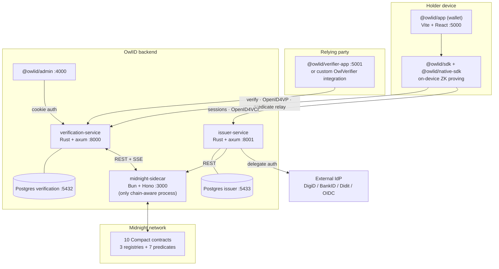

# OwlID Architecture

Maintainer-facing design reference. For the customer-facing concept tour see
`packages/docs-site/docs/architecture/overview.md`; for exact route signatures
see the live OpenAPI specs at `:8000/swagger-ui/` and `:8001/swagger-ui/`.

OwlID is a privacy-preserving digital identity platform. A holder proves facts
about themselves to a verifier without revealing the underlying documents.
**Midnight is the required trust + compute core** — every flow (issuer trust,
revocation, predicate attestation, identity anchoring) is computed or anchored
on Midnight. Standards-shaped wire formats (SD-JWT VC, OpenID4VCI, OpenID4VP,
IETF Token Status List, did:web/did:webs) are the interop _projection_ of
on-chain state, not a parallel system.

> **Midnight is not optional.** Earlier revisions of OwlID had a Midnight
> enable/disable toggle. That is gone. The verification and issuer services
> probe the sidecar on startup and exit if it is unreachable — there is no
> degraded mode and no in-memory-only path.

---

## 1. Components

### Rust crates (`crates/`)

| Crate                  | Type    | Responsibility                                                                                                                                                |
| ---------------------- | ------- | ------------------------------------------------------------------------------------------------------------------------------------------------------------- |
| `crypto`               | library | Cryptographic primitives — Ed25519, P-256, AES-GCM, BLAKE3, SHA-2.                                                                                            |
| `proof-system`         | library | SD-JWT VC (`sd_jwt.rs`), IETF Token Status List (`status_list.rs`), predicate attestation key recipes (`attestation.rs`), DID resolution.                     |
| `zk-circuits`          | library | Legacy Arkworks/Groth16 circuits. Superseded by the Compact predicate path; retained until `/zk-keys` consumers are gone.                                     |
| `verification-service` | service | **:8000** — SD-JWT VC presentation verification, DCQL, OpenID4VP, trusted-issuer + revocation mirror, predicate attestation relay/query, admin CRUD, metrics. |
| `issuer-service`       | service | **:8001** — IdP-driven identity verification sessions, SD-JWT VC signing, OpenID4VCI, did:web document, Token Status List.                                    |

### TypeScript / JavaScript packages (`packages/`)

| Package                                 | Type    | Purpose                                                                                                                                  | Port |
| --------------------------------------- | ------- | ---------------------------------------------------------------------------------------------------------------------------------------- | ---- |
| `@owlid/sdk`                            | library | Public developer surface — `OwlVerifier`, `OwlIssuer`, `OwlWallet`, SD-JWT VC primitives, WebAuthn, witness-on-device predicate proving. | —    |
| `@owlid/native-sdk`                     | library | NAPI (`.node`) + WASM build of the on-device ZK proving primitives consumed by `@owlid/sdk`.                                             | —    |
| `@owlid/config`                         | library | Shared runtime config — service URLs, API keys, WebSocket base.                                                                          | —    |
| `@owlid/ui`                             | library | Shared React component library.                                                                                                          | —    |
| `@owlid/{issuer,verifier,admin}-client` | library | OpenAPI-generated REST clients. Never hand-edited — see the API-client rule in `CLAUDE.md`.                                              | —    |
| `@owlid/app`                            | app     | Holder wallet — issuance, credential storage, presentation. Vite + React (TanStack Start SSR in prod).                                   | 5000 |
| `@owlid/verifier-app`                   | app     | Verifier QR scanner / kiosk demo.                                                                                                        | 5001 |
| `@owlid/admin`                          | app     | Operator dashboard — API keys, trusted issuers, revocations, audit, Midnight status.                                                     | 4000 |
| `@owlid/midnight-sidecar`               | service | **:3000** — the only chain-aware process. Bun + Hono.                                                                                    | 3000 |
| `@owlid/docs-site`                      | site    | rspress customer + developer docs.                                                                                                       | 4001 |

### Databases

Two PostgreSQL instances, one per service: `verification` (**:5432**) and
`issuer` (**:5433**). Migrations live under each service crate's `migrations/`.

### Midnight network (local devnet ports)

Midnight node **:9944**, indexer **:8088**, proof server **:6300**. In
production these are the managed Midnight network endpoints.



---

## 2. Credential format — SD-JWT VC

OwlID issues credentials as **SD-JWT VC** (`application/dc+sd-jwt`,
RFC 9901 + draft-ietf-oauth-sd-jwt-vc). There is no other credential format —
the legacy `OID1:` CBOR envelope, `Token`/`ProofDocument`/`Document` model and
salted-Merkle wire have been deleted.

Wire shape:

```
<issuer-signed JWT>~<disclosure>~<disclosure>~…~<KB-JWT>
```

- The **issuer JWT** carries the `_sd` digest array, `cnf` (holder confirmation
  key), `vct`, and `status` (Token Status List pointer). Signed EdDSA by the
  issuer.
- Each **disclosure** is a base64url `[salt, name, value]` triple; only its
  SHA-256 digest appears in `_sd`. The holder chooses which disclosures to send.
- The **KB-JWT** is the holder's key-binding JWT — EdDSA (Ed25519) or ES256
  (P-256) — signed over `aud` / `nonce` / `sd_hash` / `iat` with the
  wallet-held holder key.

The stable **credential id** is `base64url(sha-256(issuer JWT))`; its 32-byte
hex form (`credential_id_hex`) is what the Compact contracts and the
verification-service `/predicates/*` endpoints take as `Bytes<32>`.

Holder binding: the `cnf` key is a **wallet-held** Ed25519 or P-256 key pair.
A WebAuthn passkey is the unlock / user-verification gate and PRF-wraps the
holder key seed at rest — the passkey is **not** the JWS signer.

---

## 3. Trust model — three registry contracts

| Contract              | On-chain truth                                               | Standard projection                                           |
| --------------------- | ------------------------------------------------------------ | ------------------------------------------------------------- |
| `issuer_registry`     | Trusted issuer key set + status (ACTIVE/DEACTIVATED).        | `did:web` issuer document served by issuer-service.           |
| `revocation_registry` | Per-credential revocation status (ACTIVE/REVOKED/SUSPENDED). | IETF Token Status List (`statuslist+jwt`) at `/status/{id}`.  |
| `identity_registry`   | `sha-256(did.json)` keyed by `sha-256(did:web id)`.          | did:webs document-hash anchor — defeats DID-doc substitution. |

The verification service never reads the chain on the verify hot path. It
mirrors all three registries (see §6) and resolves issuer `did:web` identifiers
against the mirror. A presentation from an issuer whose resolved key is not
ACTIVE in `issuer_registry` is rejected.

Issuer identity uses `did:web` (DID Core 1.0) at
`https://<host>/.well-known/did.json`, CORS-public. At startup the issuer
anchors `sha-256(canonical_json(did.json))` into `identity_registry`
(the did:webs / hashlink pattern). The verifier resolves the DID, re-hashes the
document, and rejects a mismatch.

DID method support in `proof-system` / `verification-service`: `did:web`,
`did:key`, `did:jwk` are fully resolved; `did:webs` doc-hash anchoring is
enforced; `did:midnight` syntax is validated but chain resolution is stubbed
pending an upstream `midnight-did` release.

---

## 4. Predicate model — witness-on-device proving

A **predicate** is a fact derived from a credential attribute without
disclosing the attribute: `age ≥ 18`, `kyc ≥ 2`, `nationality ∈ EU set`,
verified residency / email, age range, unique personhood.

> Predicates are **not** issuer-evaluated SD-JWT claims and they are **not**
> proven inline at verify time. The holder device proves them in zero
> knowledge; the Midnight node verifies the proof in consensus; the verifier
> checks an SSE-mirrored on-chain set.

### Lifecycle

```
ATTEST  (one-time per credential + predicate + params, asynchronous)
  holder device:  derive witness from credential attribute (age, kyc, …)
                  bind witness into the compiled Compact contract
                  run the in-process zkir-v2 WASM prover  → proven, witness-
                  stripped transaction
        ──▶ verification-service POST /predicates/{kind}/relay
        ──▶ sidecar balances + submits to Midnight
        ──▶ Midnight node verifies the ZK proof IN CONSENSUS
        ──▶ predicate contract inserts attestation key into its `attestations` Set
        ──▶ SSE /events ──▶ verification-service mirror (Postgres + cache)

VERIFY  (per presentation, hot path, no chain access)
  for each DCQL claim that routes to a predicate:
    key = persistentHash([tag, credential_id_hex, param])   ← recomputed
    require key ∈ SSE-mirrored attestation set
```

The witness — the holder's actual age, KYC level, nationality, personhood
secret — is consumed on-device and never leaves it. Only the ZK proof bytes
and the public attestation key reach the chain.

### Seven predicate contracts

One Compact contract per predicate kind — they are forced apart by Midnight's
per-extrinsic block-weight cap. Each holds an `attestations: Set<Bytes<32>>`
plus a `HistoricMerkleTree` audit trail and exposes one `attest*` circuit.

| Kind          | Contract                | Witness                           | Attestation key tag    |
| ------------- | ----------------------- | --------------------------------- | ---------------------- |
| `age`         | `predicate_age`         | `ageValue: Uint<16>`              | `owlid:attest:age:`    |
| `age_range`   | `predicate_age_range`   | `ageValue: Uint<16>`              | `owlid:attest:agerng:` |
| `kyc`         | `predicate_kyc`         | `kycLevel: Uint<8>`               | `owlid:attest:kyc:`    |
| `residency`   | `predicate_residency`   | `residencyValue: Uint<8>`         | `owlid:attest:res:`    |
| `email`       | `predicate_email`       | `emailVerifiedFlag: Uint<8>`      | `owlid:attest:email:`  |
| `nationality` | `predicate_nationality` | `nationalityPath: MerkleTreePath` | `owlid:attest:nat:`    |
| `personhood`  | `predicate_personhood`  | `personhoodSecret: Bytes<32>`     | `owlid:attest:uniq:`   |

Attestation key recipe (`crates/proof-system/src/attestation.rs`, parity-tested
against the Compact `persistentHash`):

```
key = persistentHash<Vector<3,Bytes<32>>>([ pad32(tag), credential_id_hex, param ])
```

`param` is the threshold (age/kyc), `persistentHash([epoch, appId])` for
personhood, or `pad32("")` for the boolean kinds. The verifier **recomputes**
the key from the issuer-signed credential id — it never trusts a key carried
in the presentation, so a holder cannot replay another credential's attestation.

`predicate_personhood` additionally maintains a `nullifiers` Set: the nullifier
is `persistentHash([secret, epoch, appId])`. Sybil resistance is scoped per
`(epoch, appId)` — one human cannot claim unique-personhood twice in the same
campaign, and the same human stays uncorrelated across different campaigns.

Holder-side proving lives in `packages/sdk/src/midnight/` (orchestrator,
prover, prove, routing, snapshot, witnesses, kinds + per-kind compiled
contracts under `contracts/`). It is internal — `OwlWallet.present` is the
only public consumer, surfacing typed `AttestProgress` events so the wallet UI
can show "Generating proof…" / "Submitting to Midnight…".

---

## 5. ZK proving artifacts

On-device proving needs per-circuit keys plus the universal SRS:

| Endpoint (verification-service) | Serves                                                          |
| ------------------------------- | --------------------------------------------------------------- |
| `GET /predicate-zk[/{file}]`    | Per-kind Compact artifacts `<circuit>.{bzkir,prover,verifier}`. |
| `GET /midnight/params/{k}`      | Universal BLS SRS (power-of-two size class `k`).                |
| `GET /zk-keys[/{file}]`         | Legacy Arkworks/Groth16 proving keys (being retired).           |

The SDK fetches `/predicate-zk` artifacts through a layered cache
(in-memory → IndexedDB → immutable HTTP). First proof on a device pays the
~10 s artifact fetch + WASM init; subsequent presentations reuse the cache and
the already-on-chain attestation.

---

## 6. State sync — SSE mirror

The sidecar is the single chain writer/reader. The verification service mirrors
chain state into Postgres + an in-memory cache so the verify hot path never
touches Midnight.

- `crates/verification-service/src/sidecar_events.rs` opens
  `GET {SIDECAR_URL}/events?topics=revocation,issuer,attestation,identity`
  with `Accept: text/event-stream`.
- The sidecar replays a full snapshot on connect (cold-cache prime after a
  restart), then tails live `contractStateObservable` diffs.
- Mirrored into Postgres tables + `RwLock` caches. Auto-reconnect with backoff.
- Topics: `revocation` (credential status), `issuer` (trust anchors),
  `attestation` (predicate keys), `identity` (did:webs anchors).

The issuer service calls the sidecar over plain REST (register issuer key,
anchor did:web) — fire-and-forget with retry.

---

## 7. Flows

### Issuance

```mermaid
sequenceDiagram
    autonumber
    actor Holder
    participant App as Holder wallet
    participant Issuer as issuer-service
    participant IdP as External IdP
    participant Sidecar as midnight-sidecar
    Holder->>App: pick provider
    App->>Issuer: POST /sessions { providerId }
    Issuer-->>App: { sessionId, flowType, start }
    App->>IdP: form / OIDC / SAML / QR / webhook flow
    IdP-->>Issuer: verified claims (callback)
    Issuer->>Issuer: normalize to SD-JWT VC claim names; sign SD-JWT VC
    Issuer-->>App: { sdJwtVc }
    Issuer-)Sidecar: register issuer key + anchor did:web (fire-and-forget)
    App->>App: derive credentialId + issuer from sdJwtVc; store locally
```

### Presentation + verification

```mermaid
sequenceDiagram
    autonumber
    participant Verifier
    participant VerifySvc as verification-service
    participant App as Holder wallet
    participant Sidecar as midnight-sidecar
    Verifier->>VerifySvc: open challenge / presentation session
    VerifySvc-->>Verifier: nonce
    Verifier->>App: DCQL request (QR / WS / OpenID4VP)
    opt first time a predicate is needed on this device
        App->>App: prove predicate on-device (zkir-v2 WASM)
        App->>VerifySvc: POST /predicates/{kind}/relay (proven tx)
        VerifySvc->>Sidecar: submit; Midnight verifies proof in consensus
    end
    App->>App: select disclosures, sign per-credential KB-JWT
    App-->>Verifier: vp_token map (one SD-JWT VC presentation per DCQL id)
    Verifier->>VerifySvc: POST /verify/dcql { vpToken, challenge, query }
    VerifySvc->>VerifySvc: issuer trust · KB-JWT · disclosures · revocation
    VerifySvc->>VerifySvc: for each predicate claim — recompute key, check mirror
    VerifySvc-->>Verifier: { valid, perCredential }
```

Verification (`verify_dcql` → `dcql::check_credential_query`): each credential
is checked independently — resolve `iss` (did:web) against the issuer mirror,
verify the issuer JWS, verify each disclosure digest, verify the KB-JWT
(`aud`/`nonce`/`sd_hash`, header `alg` ↔ `cnf` key), check `nbf`/`exp`,
cross-check revocation (cache → on-chain `revocation_registry` →
`statuslist+jwt`). Each DCQL claim is then routed: a plain claim is a
disclosure check; a predicate claim recomputes the attestation key and requires
set membership in the mirror.

---

## 8. Data architecture & GDPR

- **Client / wallet:** full SD-JWT VCs + disclosure salts + the
  PRF-wrapped holder key + local-only `verifiedClaims` (including the
  personhood secret, which is never an SD-JWT disclosure). No backend can
  reconstruct a user's identity profile.
- **Backend:** verification logs (hashed `credential_id`), the revocation /
  issuer / attestation mirrors, audit events (non-PII), SHA-256-hashed API
  keys, the monotonic Status List index sequence. Encrypted at rest. No raw
  claim values.
- **Chain:** cryptographic commitments only — issuer key set, revocation
  slots, did-document hashes, predicate attestation keys. No PII.

GDPR: data minimization is structural (the backend mostly stores hashes).
Erasure is primarily a local wallet delete; server-side records are erasable
via `DELETE /admin/gdpr-erasure/{owner_public_key}`. Verification logs default
to 90-day retention.

---

## 9. Standards conformance

OwlID's public surface is built from published standards; each is the interop
projection of Midnight on-chain state. Live cross-service E2E coverage runs as
`cargo test -p owl-verification-service --test e2e_api -- --ignored`.

| Area            | Standard                                                                 | Status                                                        |
| --------------- | ------------------------------------------------------------------------ | ------------------------------------------------------------- |
| Credential      | SD-JWT (RFC 9901), SD-JWT VC (`draft-ietf-oauth-sd-jwt-vc`)              | `crates/proof-system/src/sd_jwt.rs`. `application/dc+sd-jwt`. |
| Holder binding  | KB-JWT — EdDSA (Ed25519) and ES256 (P-256)                               | Implemented, E2E. Strict header-`alg` ↔ key match.            |
| Issuance        | OpenID4VCI 1.0 — metadata, `/token` (pre-authorized_code), `/credential` | issuer-service. Implemented, E2E.                             |
| Issuance        | OpenID4VCI Batch Credential                                              | `batchSize` 1..=64 one-time-use VCs for unlinkability. E2E.   |
| Presentation    | OpenID4VP 1.0 — DCQL (§6), `direct_post` (§5)                            | `verification-service/src/dcql.rs`, `openid4vp.rs`. E2E.      |
| Revocation      | IETF Token Status List (`statuslist+jwt`)                                | `proof-system/src/status_list.rs` + issuer `/status/{id}`.    |
| Issuer identity | DID Core 1.0; did:web; did:webs doc-hash anchor; did:key; did:jwk        | `verification-service/src/did/`. did:midnight stubbed.        |

**Out of scope** under the Midnight-only constraint (these require external
infrastructure; claiming them would be dishonest):

- W3C VC 2.0 JSON-LD + Data Integrity `bbs-2023` — a parallel credential
  format. SD-JWT VC is the single chosen format; per-show unlinkability is
  provided instead by OpenID4VCI Batch issuance.
- OpenID4VC HAIP — mandates X.509 issuer PKI, incompatible with the on-chain
  `did:web` + `issuer_registry` trust anchor.
- OpenID Federation / EUDI Trusted Lists / ETSI 119 612 — require an external
  multi-party trust hierarchy.
- eIDAS 2.0 / EUDI ARF LoA-high / certified WSCD — a regulatory third-party
  certification regime; WebAuthn is not a certified WSCD.
- ISO 18013-5 mdoc — a different binary wire format.
- OIDF online self-certification — conformant by construction (6/6 live E2E)
  but holds no certificate.

---

## 10. Deployment

Production target: Google Cloud — Cloud Run services + Cloud SQL, built by
Cloud Build. Terraform IaC under `deploy/gcp/terraform/`; per-service Cloud
Build configs under `deploy/gcp/cloudbuild/`. Images: `Dockerfile.{verification,
issuer,sidecar,app,verifier,admin,docs}` plus `Dockerfile.native-sdk-builder`
(a shared compile cache layer consumed by the frontend builds). Local
monitoring stack: Prometheus + Grafana via `docker-compose.prod.yml`.

See `DEPLOYMENT.md` for the deploy procedure, `MIDNIGHT.md` for the Midnight
stack and contract deployment, and `RUNBOOK.md` for operations.

---

## 11. Related docs

- `MIDNIGHT.md` — Midnight stack, sidecar, state sync, contract deployment,
  witness-on-device proving.
- `COMPACT_CONTRACTS.md` — per-contract reference for all 10 Compact contracts.
- `COMPACT.md` — Compact language reference.
- `GETTING_STARTED.md` — local dev bring-up.
- `DEPLOYMENT.md` / `RUNBOOK.md` — production deploy and operations.
- `E2E-SETUP.md` — end-to-end test setup.
- `packages/docs-site/` — customer + developer docs (the published site).
