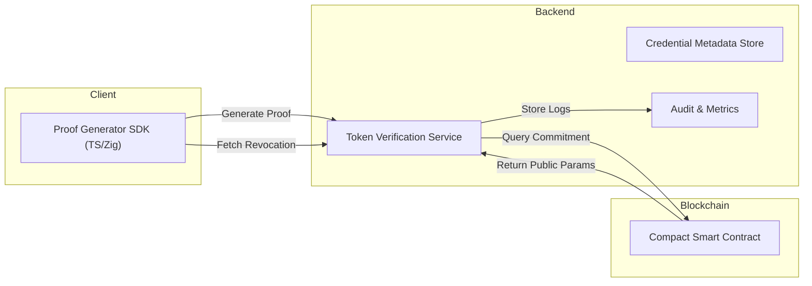
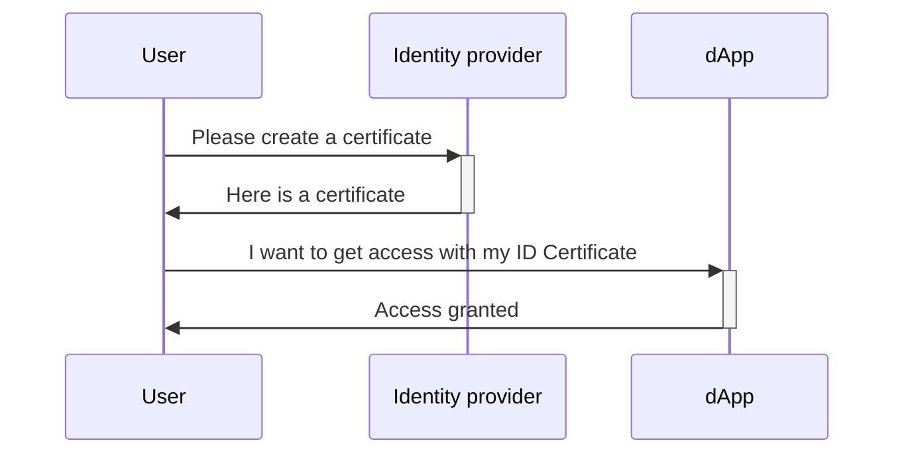
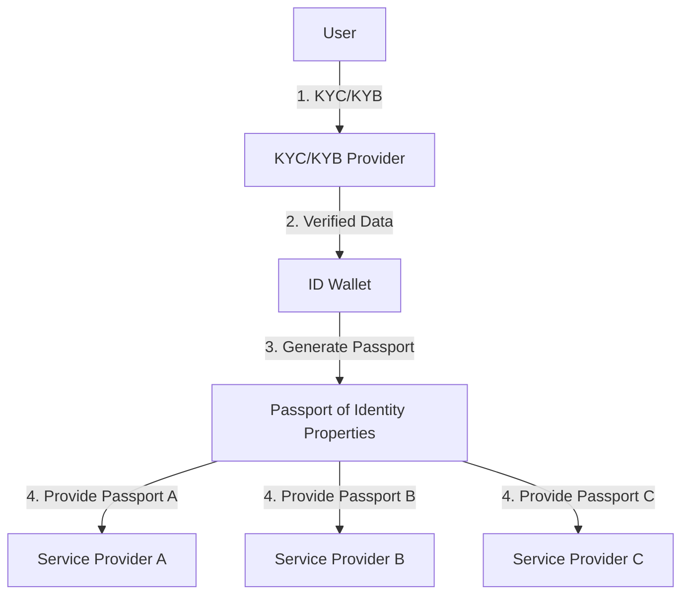
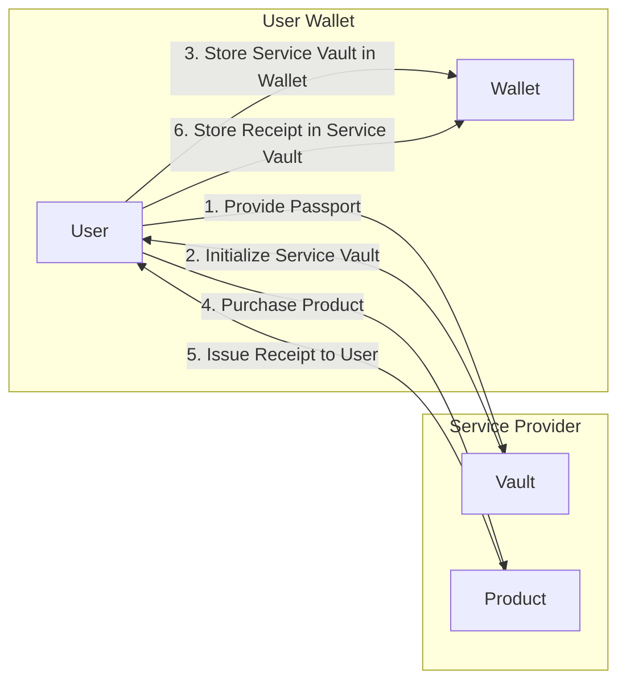
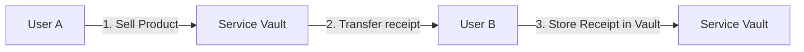
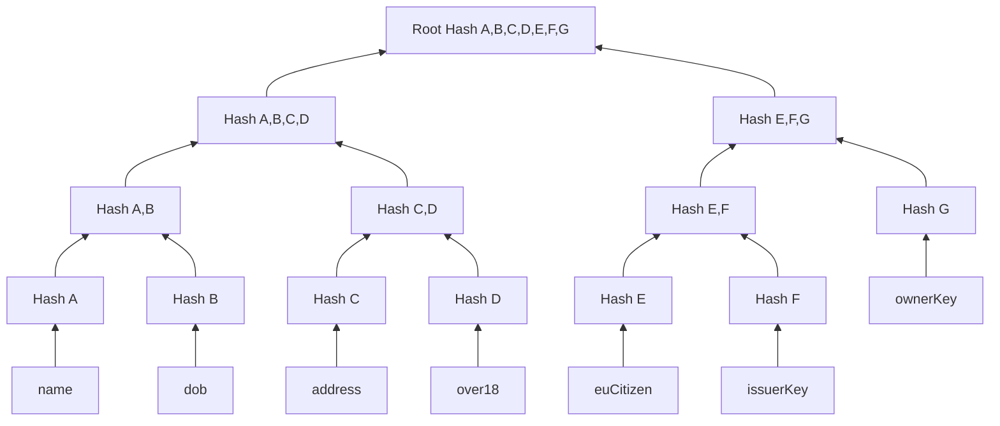
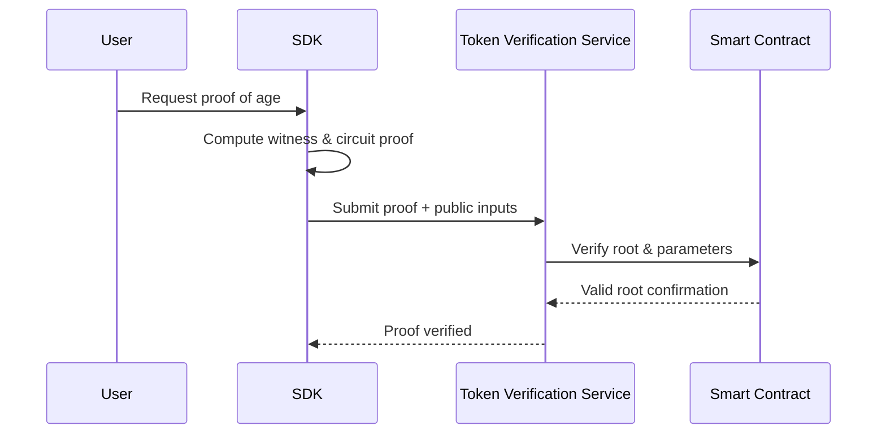
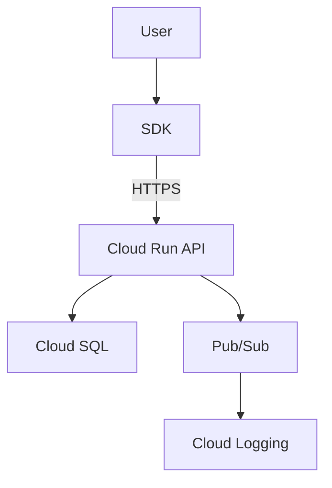

# TODO

Setup according to the IEEE 1471 / C4 Model

## Mission

To empower individuals and organizations with a privacy-preserving digital identity framework that enables verifiable trust without compromising personal data.
Our system allows anyone to prove facts about themselves not reveal themselves, using advanced zero-knowledge cryptography and verifiable credentials that are secure, compliant, and portable across ecosystems.

Through transparent design, open standards, and strong cryptographic guarantees, we aim to make confidential identity verification accessible, auditable, and developer-friendly on the Midnight network.

## Vision

To redefine digital trust in a decentralized world where identity is verified, not exposed, and privacy becomes a default right, not an optional feature.

We envision a future where:

- Every user controls their identity data end-to-end.
- Every verifier can trust cryptographic proofs without storing or handling sensitive information.
- Every organization can build compliant, privacy-first applications without technical or legal friction.
- Ultimately, this product will become the core privacy identity layer for the Midnight ecosystem, setting a new global standard for confidential, GDPR-aligned digital verification.

# Table of Contents

1. **Introduction**  
   1.1 Background  
   1.2 Problem Definition and Context  
   1.3 Purpose of This Document  
   1.4 Audience  
   1.5 Scope and Assumptions

2. **System Overview**  
   2.1 System Summary  
   2.2 Objectives and Use Cases  
   2.3 Core Functionalities  
   2.4 Design Principles  
   2.5 High-Level Architecture Diagram

3. **Architecture Principles and Style**  
   3.1 Architecture Style  
   3.2 Rationale  
   3.3 Design Patterns Used  
   3.4 Conventions and Guidelines

4. **Component Architecture (C4 Level 2–3)**  
   4.1 Component Responsibilities  
   4.2 Interfaces and Data Flows  
   4.3 API Endpoints  
   4.4 Sequence Diagram

5. **Data Architecture**  
   5.1 Conceptual Model  
   5.2 Storage Design  
   5.3 Data Lifecycle (GDPR)  
   5.4 Compact Code Example

6. **Integrations and External Systems**  
   6.1 External Interfaces  
   6.2 Protocols  
   6.3 Authentication and Authorization

7. **Security Architecture**  
   7.1 Security Objectives  
   7.2 Threat Model and Mitigation  
   7.3 Encryption  
   7.4 Monitoring and Incident Response

8. **Infrastructure Architecture**  
   8.1 Hosting on Google Cloud  
   8.2 CI/CD Pipeline  
   8.3 Logical Network Diagram

9. **Non-Functional Requirements**  
   9.1 Performance  
   9.2 Availability  
   9.3 Scalability  
   9.4 Maintainability  
   9.5 Compliance and Security

10. **Deployment & DevOps**  
    10.1 CI/CD Flow  
    10.2 Testing Strategy  
    10.3 Rollback & Blue/Green Deployment  
    10.4 Monitoring and Observability

11. **Technology Choices**  
    11.1 Language and Frameworks  
    11.2 Architecture Tools and Standards  
    11.3 Design Trade-offs

12. **Risk Analysis**  
    12.1 Technical Risks  
    12.2 Operational Risks  
    12.3 Security Risks  
    12.4 Compliance and Legal Risks

13. **Roadmap and Future Vision**  
    13.1 Phase 1 – MVP  
    13.2 Phase 2 – Extended Capabilities  
    13.3 Phase 3 – Enterprise and Interoperability

14. **Conclusion**  
    14.1 Summary of Design  
    14.2 Expected Benefits  
    14.3 Limitations and Next Steps

15. **Appendices**  
    15.1 Terminology and Definitions  
    15.2 System Schemas and Pseudocode  
    15.3 Relevant RFCs and Standards

## 1 Introduction

### 1.1 Background

Modern digital identity systems rely heavily on centralized authorities that store and process sensitive personal information. This centralization introduces privacy risks, legal compliance burdens, and single points of failure. The Midnight Network — a privacy-focused blockchain built on the Cardano ecosystem — provides cryptographic foundations that enable private smart contracts and confidential transactions.

This project delivers a client-side, privacy-preserving Verifiable Credential (VC) and Zero-Knowledge Proof (ZKP) system, enabling users to prove facts about themselves without revealing the underlying data. The platform uses Merkle-root commitments, zero-knowledge circuits, and a Token Verification Service that validates ZK proofs both on-chain and offline.

### 1.2 Problem Definition and Context

Current identity and KYC solutions require users to disclose entire documents or datasets to prove simple attributes. Even “decentralized identity” frameworks often leak metadata or depend on online verification with issuers. Our challenge is to create a GDPR-compliant, offline-verifiable, and developer-friendly architecture that integrates seamlessly with the Midnight blockchain.

### 1.3 Purpose of This Document

This document defines the full technical architecture of the system — structure, components, interfaces, data models, and non-functional requirements — in line with IEEE 1471 and C4 Model practices. It provides engineers, auditors, and partners with a common reference for implementation and review.

### 1.4 Audience

- Developers: implementation details and SDK interfaces
- Architects: component interactions, system boundaries
- Compliance & Security Teams: GDPR controls, threat mitigation
- Project Stakeholders: rationale and roadmap

### 1.5 Scope and Assumptions

In Scope

- Proof Generator SDK (TypeScript + Zig)
- Token Verification Service (REST / gRPC)
- VC integration and ZKP predicate proofs
- Compact-based smart contract interactions
- Google Cloud deployment architecture
- GDPR privacy and security compliance

Out of Scope

- DID Registry implementation (it is consumed only)
- TEE Cloud Proof Server (modality handled elsewhere)
- Native mobile apps and UI design

## 2 System Overview

### 2.1 System Summary

- The system provides a complete privacy-preserving credential lifecycle:
- Credential Issuance: Users receive signed verifiable credentials from trusted issuers.
- Proof Generation: Using the local SDK, users create zero-knowledge proofs of specific credential predicates (e.g., over 18, citizen of EU).
- Verification: Verifiers or smart contracts validate proofs using the Token Verification Service and on-chain public data.
- Audit & Compliance: Only non-identifying commitments and logs are stored; personal data remains local to the user.

### 2.2 Objectives and Use Cases

| ID    | Use Case              | Description                                            |
| ----- | --------------------- | ------------------------------------------------------ |
| UC-01 | Age Proof             | User proves being over 18 without revealing DOB        |
| UC-02 | Residency Proof       | User proves residence in EU country                    |
| UC-03 | Credential Revocation | Issuer revokes credential; updated proof invalid       |
| UC-04 | Offline Verification  | Verifier checks proof validity without reaching issuer |
| UC-05 | Developer Integration | dApp uses SDK API to request local proof               |

### 2.3 Core Functionalities

- VC management and revocation tracking
- ZKP circuit execution and proof serialization
- Token Verification Service for proof validation
- Secure storage of local keys and secrets
- Google Cloud-hosted backend services (API + audit)

### 2.4 Design Principles

- Privacy by Design: Minimize data disclosure and retain control at user side.
- Modularity: Clear separation between SDK, services, and chain logic.
- Extensibility: Plug-in new ZK schemes or circuits (Plonk, Groth16).
- Compliance: GDPR alignment through data minimization and erasure flows.
- Security: Zero-trust posture and cryptographic integrity validation.

### 2.5 High-Level Architecture Diagram



## Certificates

The following sequence diagram illustrates the process of creating a certificte (POI). It highlights the interactions between the user, the system,
and any external entities involved. The key steps include:

1. **User Initiation**: The user initiates the account creation process by
   providing the required details.
2. **System Validation**: The system validates the provided information against
   our on chain registry.
3. **Account Setup**: Upon successful validation, the system sets up the account
   and links it to the user's identity.
4. **Confirmation**: The user receives a confirmation that the account has been
   successfully created.

Refer to the diagram below for a detailed visualization of the process.



The rising need for verifiable digital identity

**Leagle ID Allows businesses to easily verify digital identities with no
compromise on privacy and security.**

| Today                                                                    | Solution                                                                                                                                                                                                                           |
| ------------------------------------------------------------------------ | ---------------------------------------------------------------------------------------------------------------------------------------------------------------------------------------------------------------------------------- |
| _Data Breaches_: Businesses lack the expertise on securing personal data | _Passports_: Our Identity solution does not provide any personal data, removing the risk of data breaches, instead our Identity creates identity property _Passports_, proving the derrived identity rather than raw personal data |
| _Data Duplication_: Users need to prove their identity multiple times    | _Wallet_: Users store their Passports in a secure digital wallet, allowing them to prove their identity properties multiple times without the need to go through multiple KYC/KYB processes again.                                 |
| _Data Sharing_: Users have no control over their personal data           | _Service Vaults_: Users can share data received from services in a verifiable and privacy preserving way with anyone.                                                                                                              |
| _High Drop-off Rates_: Lengthy KYC/KYB processes deter users             | _Seamless Onboarding_: Users can select a KYC/KYB provider of choice and reuse their KYC/KYB across multiple services, reducing friction and drop-off rates.                                                                       |

---

## ID - Passports & Wallet



---

## ID Data - Proving Existence of Data



---

## ID Exchange - Sharing Data Securely



## 3 Architecture Principles and Style

### 3.1 Architecture Style

A hybrid architecture combining:

- Client-side monolith (SDK) for offline proof generation.
- Microservice-based backend for verification and credential metadata.
- Event-driven audit logging for compliance.

### 3.2 Rationale

This separation balances user privacy (local proofs) with maintainability and scalability of verification logic. Microservices allow independent scaling of verification workloads and compliance modules.

### 3.3 Design Patterns Used

- Adapter Pattern: Abstract different proof back-ends.
- Strategy Pattern: Switch between ZK schemes (Plonk, Groth16).
- Builder: Construct proof requests incrementally.
- Observer: Emit audit events to monitoring services.

### 3.4 Conventions and Guidelines

- All inter-service calls over HTTPS.
- JSON for API requests, CBOR for binary proof payloads.
- Deterministic builds and semantic versioning.

# Guard Open Data Proof System

The Guard Open Data Proof System is a framework for ensuring the verifiability,
privacy preservation, and accountability of data processing activities. This
system is designed to provide transparency in data handling while safeguarding
individual privacy. The Proof System utilizes Merkle trees, zero-knowledge
proofs, and cryptographic signatures to enable participants to verify the
integrity, authenticity, and correctness of data operations without revealing
sensitive information.

## Glossary

- **Proof System (PS):** The overarching framework that encompasses the Guard
  Open Data Proof System and related tools for privacy-preserving transparency.
- **Merkle Tree (MT):** A tree data structure that enables efficient
  verification of data integrity and consistency. Merkle trees are used in the
  Proof System to provide a tamper-evident log of data operations.
- **Proof of Inclusion (PoI):** A cryptographic proof that demonstrates the
  presence of one or more specific data elements within a Merkle tree. PoI is
  used in the Proof System to verify the existence of data without revealing the
  entire contents of the tree.
- **Zero-Knowledge Proof (ZKP):** A cryptographic method that allows one party
  (the prover) to prove to another party (the verifier) that a statement is true
  without revealing any information beyond the validity of the statement.
- **Cryptographic Signature:** A digital signature that authenticates the origin
  and integrity of a message or document. Signatures are used in the Proof
  System to verify the authenticity of data operations.
- **Document:** A data object that represents a specific data processing
  activity within the Proof System. Documents are stored in the Merkle tree and
  can be verified using cryptographic proofs.
- **Attributes:** The attributes of a document that captures information that
  can be revealed to auditors or verifiers. Includes issuer and owner
  information, to allow for offline verifications and proof generations.
- **Zero Trust Proof (ZTP):** A proof that can be verified without trusting the
  prover. Zero trust proofs are used in the Proof System to enable independent
  verification of data operations.
- **Trusted Registar (TR):** An registar that keeps a list of trusted issuer
  public keys. This list is used to verify the authenticity of documents and
  signatures.
- **Proof Document:** A document that allows a token to be generated, that
  includes a selection of the document's attributes.
- **Token:** A **Zero Trust Proof (ZTP)** that includes a selection of the
  document's attributes.

# Create Document

A document is a representation of data stored in a Merkle Tree. The form of the
document attributes is defined by the issuer. The values of the attributes are
expected to be in the form of a `JSON` object string. The document will be most
flexible when the granularity of the attributes is kept to a minimum. This
allows the owner of the document to reveal only the necessary information to the
verifier.

## Document Attributes

The attributes of a document are defined by the issuer and can be any
information that the issuer wants to make verifiable. The attributes can has as
many attributes as the issuer wants, but there are 2 mandatory attributes that
must be present in the document:

- **issuerKey:** The public key of the issuer that signed the document.
- **ownerKey:** The public key of the owner of the document.

The `issuerKey` and `ownerKey` are used to verify the authenticity of the
document and the signature. The `issuerKey` is used to verify the signature of
the document, while the `ownerKey` is used to verify the signature of the token.
With the presence of the `issuerKey` and `ownerKey`, the verifier can verify the
authenticity of a token without relying on network connections.

## Document Issueing

To issue a document, the issuer must compute the roothash of the document. Each
attribute of the document is, first JSON stringified along side it's key and
then hashed using the `SHA-256` algorithm. To illustrate, take the following
document attributes:

```json
{
  "issuerKey": "issuerKey",
  "ownerKey": "ownerKey",
  "name": "John Doe",
  "dob": "1990-01-01",
  "address": "123 Main St",
  "over18": true,
  "euCitizen": true
}
```

Each attribute will first be computed into a string value, resulting in a `JSON`
representation like:

```json
[
  `{"issuerKey":"issuerKey"}`,
  `{"ownerKey":"ownerKey"}`,
  `{"name":"John Doe"}`,
  `{"dob":"1990-01-01"}`,
  `{"address":"123 Main St"}`,
  `{"over18":true}`,
  `{"euCitizen":true}`
]
```

**Note:** The string format is simplified without `"` escapes for readability.

The document attributes will be hashed as follows:



The issuer will then sign the `Root Hash` of the document and store the
signature alongside the `Root Hash` and the `Document Attributes`, resulting in
a `Proof Document`:

```typescript
type ProofDocument = {
  rootHash: string
  attributes: Record<string, any>
  signature: string
}
```

## Proof Document

A `Proof Document` is a document that allows a `token` to be generated, that
includes a selection of the document's attributes. The order of the attributes
in the `Proof Document` is defined by the issuer, and if tempered with, will
result in a different `Root Hash`. The `Proof Document` should be stored by the
document owner on a secure location of their choice. This truely allows the user
to take ownership of their data.

In most cases the `Issuer` will store a copy of the `Proof Document`, but this
opens up the avenue for use cases where the `Issuer` can immediately forget the
`Proof Document`, which allows `Issuers` to not store any private data and be
GDPR compliant without any effort.

## 4 Component Architecture (C4 Level 2–3)

| Component                      | Responsibilities                                 | Interfaces                                       |
| ------------------------------ | ------------------------------------------------ | ------------------------------------------------ |
| **Proof Generator SDK**        | Generates ZK proofs from VCs; manages local keys | TS API (`generateProof()`, `verifyLocal()`)      |
| **Token Verification Service** | Verifies proofs; checks revocation; logs results | REST/gRPC (`/verify`, `/revocations`)            |
| **Compact Smart Contract**     | Stores Merkle roots and verification parameters  | On-chain functions `commitRoot()`, `getRoot()`   |
| **Audit Service**              | GDPR logging and retention management            | Pub/Sub topics `proof.validated`, `data.deleted` |

### 4.1 Data Flow Example — Proof Generation and Verification



### 4.2 API Endpoints (Token Verification Service)

| Endpoint            | Method | Description                            |
| ------------------- | ------ | -------------------------------------- |
| `/verify`           | POST   | Verify ZK proof payload                |
| `/revocations/{id}` | GET    | Check credential revocation status     |
| `/audit`            | GET    | Retrieve proof validation audit events |

# Token generation

Token generation is a process that involves two parties: the prover and the
verifier. The process will involve multiple steps, but should be simple and
straightforward from a user perspective. On a high level, the process will
involve the following steps:

- **Information Request:** The verifier requests information from the prover.
- **Document Selection:** The prover selects a document to generate a token for.
- **Token Generation:** The prover generates a token based on the selected
  document.
- **Token Presentation:** The prover presents the token to the verifier.
- **Token Verification:** The verifier verifies the token.

## Information Request

The flow starts with the verifier requesting information from the prover. The
information requested will always be paired with a `challenge` that the prover
has to include in the `token`. The `challenge` is a random string generated by
the verifier and is used to prevent replay attacks.

The information requested should have mandatory fields and optional fields. The
fields should be provided in an array of strings. Additionally the verifier
should provide a list of trusted issuers that the prover can use to generate the
token.

```json
{
  "mandatory": ["isOlderThan18", "isOlderThan65"],
  "optional": ["name", "date_of_birth", "address"],
  "trusted_issuers": ["issuer1", "issuer2"],
  "challenge": "random_string"
}
```

## Document Selection

The prover selects a document to generate a token for. The prover is free to
select any document from the list of trusted issuers provided by the verifier
and include any fields from the document in the token. The prover can then
create a token based on the selected document.

### Token Payload

The token payload should include the following fields:

- **challenge:** The challenge provided by the verifier.
- **rootHash:** The root hash of the document.
- **signature:** The signature of the document.
- **proofLeaves:** The proof leaves of the document.
- **subjects:** The fields from the document that the prover wants to include in
  the token.
- **signers:** The list of signers that will sign the token.
- **ttl:**: The time-to-live of the token.
- **activationTime:** The time when the token was generated.
- **data:** Optional additional data to be included in the token.

Building a token payload serve to prepare for a token that will represent a
portion of the document. Since the token will be handed out to the verifier, the
token should have a time-to-live (ttl) and an activation time. This allows the
prover to scope the token's lifetime. The challenge is included in the token to
prove to the verifier that only the prover could have generated the token.

### Proof of Inclusion

To include document attributes in the token, the prover must provide a proof of
inclusion. The proof of inclusion is a cryptographic proof that the document
contains the attributes that the prover wants to include in the token. There are
2 attributes that the prover should include in the token to prove that the
issuer has issued the document to the prover:

- **issuerKey:** The public key of the issuer.
- **ownerKey:** The public key of the prover.

The verifier can use this information to verify the issuer, by matching the
public key of the issuer with known public keys of trusted issuers. Once that is
verified, the verifier can verify the signature of using the **roothash** as
message. If the **roothash** has been confirmed to be signed by the issuer, the
the verifier can now assume the document is valid.

This allows the content of the document to be holding value that the verifier
can trust. The proof of inclusion can now disclose the content included in the
token to the verifier and the verifier can trust the content to have been
granted by the trusted authority.

## Token Verification

The verifier can now verify the token by checking the following:

- **Challenge:** The challenge in the token should match the challenge provided
  by the verifier.
- **Proof of Inclusion:** The proof of inclusion should be valid.
- **Data integrity:** The payload should match the hash of the token.
- **Signature:** The signature of the document should be valid.
- **Time-to-live:** The token should not be expired.
- **Activation time:** The token should not be activated before the current
  time.
- **Issuer:** The issuer should be a trusted issuer.
- **Owner:** The owner should be proven in the proof of inclusion

## 5 Data Architecture

### 5.1 Conceptual Model

- Credential → claims, issuer, signature, revocation reference
- Proof → public inputs, proof blob, circuit id, timestamp
- Merkle Root → commitment anchor on chain

### 5.2 Storage Design

- Google Cloud SQL (PostgreSQL) for metadata
- Google Cloud Storage for encrypted proof logs
- Redis cache for revocation status

### 5.3 Data Lifecycle (GDPR)

| Phase      | Handling                                   |
| ---------- | ------------------------------------------ |
| Collection | Minimal data from proof requests           |
| Processing | In-memory only, cleared after response     |
| Storage    | Hashed identifiers, encrypted proof hashes |
| Deletion   | Automatic erasure via Pub/Sub trigger      |
| Audit      | Immutable hashes of events for compliance  |

### 5.4 Compact Code Example

```javascript
program VerifyAge {
  input:
    proof_commit : Field,
    min_age : Field

  logic:
    // Validate that user age >= required minimum
    assert proof_commit >= min_age
}
```

## 6 Integrations and External Systems

### 6.1 External Interfaces

- Identity Providers: supply initial VCs (via W3C VC format)
- Midnight Node API: read smart contract states for roots and parameters
- Observability Stack: Prometheus / Grafana / OpenTelemetry

### 6.2 Protocols

- REST (HTTPS) for standard integration
- gRPC for high-volume verifications
- WebSockets for revocation push notifications

### 6.3 Authentication / Authorization

- Mutual TLS between services
- OAuth 2.1 client credentials for issuers and verifiers
- HMAC signatures on proof payloads

## 7 Security Architecture

### 7.1 Security Objectives

- Protect confidential data in transit and at rest.
- Guarantee proof integrity and non-repudiation.
- Enforce least-privilege access.

### 7.2 Threat Model & Mitigation

| Threat                     | Mitigation                                      |
| -------------------------- | ----------------------------------------------- |
| Data leak from SDK storage | Ephemeral buffers, encrypted local storage      |
| Replay attacks             | Nonce and timestamp in proof payload            |
| Malicious verifier         | Zero-knowledge protocol ensures no private leak |
| Insider access to logs     | End-to-end encryption and separation of duties  |

### 7.3 Encryption

- AES-GCM for data at rest.
- TLS 1.3 for all transit.
- Hashing with BLAKE2b / SHA-256 for Merkle leaves.

### 7.4 Monitoring and Incident Response

- Centralized alerting in Google Cloud Operations Suite.
- Automated data erasure on breach detection.

## 8 Infrastructure Architecture

### 8.1 Hosting on Google Cloud

| Service              | Purpose                            |
| -------------------- | ---------------------------------- |
| Cloud Run            | Stateless microservices deployment |
| Cloud SQL (Postgres) | Credential metadata                |
| Pub/Sub              | Event bus for audit and erasure    |
| Secret Manager       | Key and credential storage         |
| Cloud Storage        | Encrypted proof archive            |

### 8.2 CI/CD Pipeline

- GitHub → Cloud Build → Cloud Run deployments.

- Automated integration tests in CI.

- Security scans before release.

### 8.3 Logical Network Diagram



## 9 Non-Functional Requirements

| Category        | Requirement                                   |
| --------------- | --------------------------------------------- |
| Performance     | Proof generation < 500 ms for simple circuits |
| Availability    | 99.9 % service uptime on Cloud Run            |
| Scalability     | Auto-scale verification instances             |
| Maintainability | Microservice isolation and typed interfaces   |
| Compliance      | GDPR Articles 5, 6, 17 supported              |
| Security        | OWASP ASVS Level 2 compliance                 |

## 10 Deployment & DevOps

- Continuous integration with unit + ZKP integration tests.
- Canary deployments using traffic splitting in Cloud Run.
- Observability via OpenTelemetry spans and Prometheus metrics.
- Blue/green rollback procedures defined per service.

## 11 Technology Choices

| Layer        | Technology                       | Reason                          |
| ------------ | -------------------------------- | ------------------------------- |
| Frontend/SDK | TypeScript + Zig                 | TS ergonomics + Zig performance |
| Backend      | Node.js (Fastify)                | Speed and ecosystem             |
| ZK Library   | circom/halo2 compatible bindings | Mature ZK framework             |
| Database     | PostgreSQL                       | Relational integrity            |
| Cloud        | Google Cloud Run                 | Serverless scaling              |

## 12 Risk Analysis

| Risk                | Likelihood | Impact | Mitigation                            |
| ------------------- | ---------- | ------ | ------------------------------------- |
| ZK circuit bugs     | Medium     | High   | Formal verification & tests           |
| Key loss by user    | Medium     | Medium | Backup protocol with user consent     |
| Cloud outage        | Low        | High   | Multi-region deployment               |
| GDPR non-compliance | Low        | High   | Regular audits & retention automation |

## 13 Roadmap & Future Vision

Phase 1 (MVP)

- Proof SDK + Token Verification Service basic flows.
- Google Cloud deployment and CI/CD pipeline.

Phase 2

- Advanced predicate proofs (range, set membership).
- Extended audit and analytics dashboards.

Phase 3

- Multi-issuer credentials and cross-chain interop.
- Optional TEE integration for high-assurance environments.

## 14 Conclusion

This architecture establishes a robust, privacy-preserving identity foundation for the Midnight ecosystem. It minimizes personal-data exposure, ensures GDPR compliance, and supports both decentralized and enterprise use cases. By combining TypeScript ergonomics, Zig performance, and Google Cloud scalability, the system provides developers
