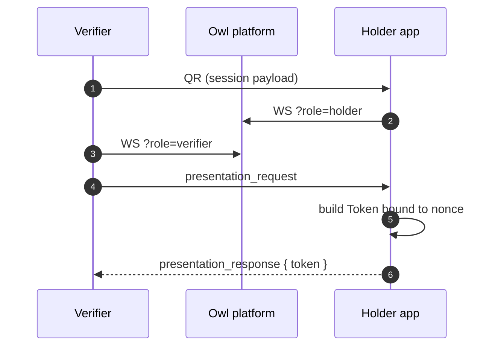

# Holder app integration

You're building a wallet — the app the user opens to approve credential issuance, store credentials, and present proofs to verifiers. Or you don't want to build one at all and instead point users to the [official OwlID Wallet](/apps#owlid-wallet--for-holders).

## Setup

```bash
bun add @owlid/sdk
```

The SDK runs the same in browsers, Node, and React Native shells. WebAuthn passkey support requires a browser context (or a native bridge that exposes the WebAuthn API).

## WebAuthn / passkey lifecycle

```ts
import { registerCredential, signChallenge, isWebAuthnSupported } from '@owlid/sdk'

if (!isWebAuthnSupported()) throw new Error('WebAuthn not available')

// Register a new passkey
const cred = await registerCredential({
  rpName: 'My Wallet',
  rpId: 'wallet.example.com',
  userName: user.email,
  userVerification: 'required',
})

// Later: sign a challenge from a verifier
const sig = await signChallenge(cred.credentialId, challengeBytes)
```

## Local credential storage

```ts
import { storage, proofStorage } from '@owlid/sdk'

await storage.saveCredential(proofDocumentJson)
const list = await storage.listCredentials()

// IndexedDB-backed proof history (for "recent proofs" UI)
await proofStorage.put({ id, tokenJson, createdAt })
```

`storage` is a singleton backed by `localStorage` by default. For custom backends (mobile, encrypted-at-rest), instantiate `CredentialStorageManager` with your own `StorageAdapter`.

## Sign a token with a passkey (one call)

For the common case "build a proof token signed by the user's passkey":

```ts
import { signTokenWithPasskey } from '@owlid/sdk'

const token = await signTokenWithPasskey({
  credential, // Credential instance
  request: proofRequest, // ProofRequest from the verifier
  ttlSeconds: 300,
  passkey: {
    credentialId: storedCred.credentialId,
    publicKeyHex: storedCred.publicKeyHex,
  },
})

const compact = token.toCompact() // "OID1:..."
```

This wraps the three-step prepare → enclave-sign → finalize flow into one call. The browser shows the OS biometric / PIN prompt automatically.

## Respond to a verifier QR (one call)

Scan a verifier QR, prompt the user for consent, sign, and respond — all in one call:

```ts
import { respondToPresentation } from '@owlid/sdk'

await respondToPresentation(qrPayload, {
  credential,
  signer: { type: 'passkey', credentialId, publicKeyHex },
  // or signer: { type: 'keypair', keyPair: ownerKeyPair }
  buildProofRequest: (consent) => ({
    disclose: consent.requestedDisclosures,
    predicates: consent.requestedPredicates.map((p) => ({
      attribute: 'dateOfBirth',
      op: 'GreaterOrEqual',
      value: '18',
    })),
    trustedIssuers: [issuerPublicKeyHex],
    challenge: consent.nonce,
  }),
  onConsent: async (req) => {
    return await ui.askApprove(req.verifierName, req.requestedPredicates)
  },
})
```

The helper handles the WebSocket lifecycle, consent prompt, token signing, and response — you only supply the building blocks.

## Token generation (manual)

Tokens are built locally — neither the issuer nor verifier ever sees the holder's full credential. Use the native primitives:

```ts
import { Credential, KeyPair } from '@owlid/sdk'

const credential = Credential.fromJson(storedJson)
const ownerKey = KeyPair.fromHex(privateKeyHex)

const token = credential.prove(
  {
    disclose: ['firstName'],
    predicates: [{ attribute: 'dateOfBirth', op: 'GreaterOrEqual', value: '18' }],
    trustedIssuers: [issuerPublicKeyHex],
    challenge: verifierChallenge,
  },
  ownerKey,
  /* ttlSeconds */ 300,
)

const compact = token.toCompact() // "OID1:..." — fits a QR code
```

For WebAuthn-backed signing use the two-phase flow:

```ts
import { Credential, Token } from '@owlid/sdk'

const prepared  = credential.prepare(proofRequest, /* ttlSeconds */ 300)
const challenge = prepared.challenge()

const assertion = await navigator.credentials.get({
  publicKey: { challenge: base64urlToBuffer(challenge), allowCredentials: [...] },
})

const token = Token.finalizeWebauthn(prepared, {
  authenticatorData: bufferToBase64(assertion.response.authenticatorData),
  clientDataJson:    bufferToBase64(assertion.response.clientDataJSON),
  signature:         bufferToBase64(assertion.response.signature),
}, credentialPublicKeyHex)
```

The private key never leaves the authenticator.

## Presentation protocol (QR scanning)

The holder receives a QR encoding the verifier's session. Decode and connect:

```ts
import { decodeSessionEngagement, resolveWsUrl, isPresentationEngagement } from '@owlid/sdk'

if (isPresentationEngagement(qrPayload)) {
  const engagement = decodeSessionEngagement(qrPayload)
  const ws = new WebSocket(resolveWsUrl(engagement.wsUrl) + '?role=holder')

  ws.onmessage = async (e) => {
    const req = JSON.parse(e.data)
    const token = credential.prove(
      { ...req.proofRequest, challenge: engagement.nonce },
      ownerKey,
      300,
    )
    ws.send(JSON.stringify({ type: 'presentation_response', token: token.toCompact() }))
  }
}
```



## Proving keys (WASM only)

ZK predicate proofs need Groth16 proving keys. Native (Node) builds embed them; browser/WASM builds fetch them lazily from the verification service on first proof and cache in IndexedDB.

You don't need to do anything — `signTokenWithPasskey`, `signToken`, and `respondToPresentation` all `await` the right keys before proving. To override where keys come from (custom CDN, bundled bytes, alternate transport):

```ts
import { configureProvingKeys } from '@owlid/sdk/native'

// Self-host
configureProvingKeys({ baseUrl: 'https://cdn.mine.com/zk' })

// Bundled bytes
import ageBytes from './age_range.pk.bin?url'
configureProvingKeys({
  bytes: { age_range: new Uint8Array(await (await fetch(ageBytes)).arrayBuffer()) },
})

// Optional: warm cache during splash
import { ensureProvingKeys } from '@owlid/sdk/native'
ensureProvingKeys() // fire-and-forget
```

See [Token primitives → Groth16 proving keys](/sdk/native#groth16-proving-keys) for the full API and the trusted-setup notes.

## Reference

- [Token primitives](/sdk/native) — `Credential`, `Token`, `KeyPair`, proving-key delivery
- [Verifier integration](/integration/verifier) — what your token gets verified against
- [Issuer integration](/integration/issuer) — where your credentials come from
