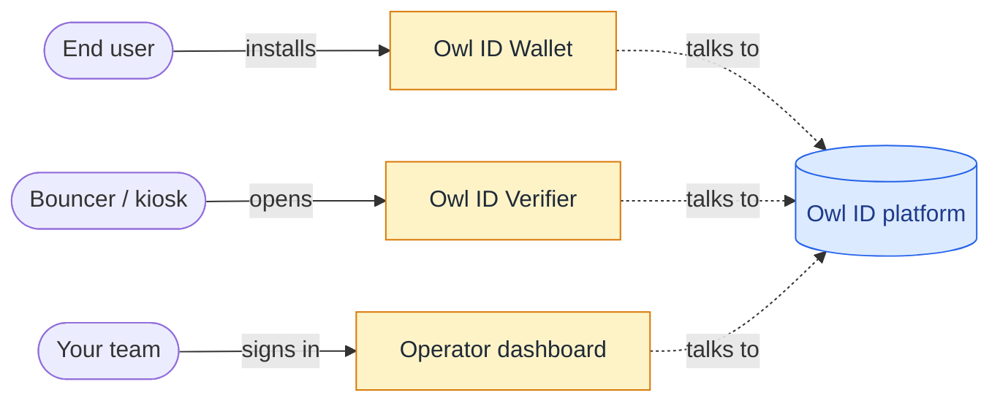

# Owl ID apps

Owl ID ships three apps alongside the platform — a wallet and a verifier scanner for end users, plus an operator dashboard for your team. Use them out of the box — no custom client or scanner UI required.

## Owl ID Wallet — for holders

Where users keep their credentials and present proofs. Issuers point customers to the wallet during signup; verifiers point people there when they scan a QR.

- **Live**: https://wallet.owlid.app
- **What it does**: passkey registration + PRF-wrapped wallet key, runs the issuance flow (OpenID4VCI) with your provider of choice, stores SD-JWT VCs locally, scans verifier QRs, builds + signs SD-JWT VC presentations (KB-JWT).
- **Settings**: a `/settings` page exposes the proving backend (in-process WASM by default, or opt into a hosted proof server at `proofs.owlid.app` for faster proofs on low-power devices), plus storage and identity inspection.
- **Cross-platform**: PWA — installs to iOS / Android home screen, runs the same in any browser. Native shells planned.
- **Build your own**: need a branded wallet? Build one on [`@owlid/sdk`](/integration/holder) — the holder helpers, `OwlWallet`, and WebAuthn primitives are the same ones the hosted wallet runs on.

When you set up issuance, the redirect URL after KYC sends the user back into the wallet — they install it once and reuse it across every issuer that uses Owl ID.

## Owl ID Verifier — for relying parties

Browser-based scanner you can deploy in minutes for low-volume or kiosk use cases. Generate a QR for a request, watch the result come in. No code required for the basic flow.

- **Live**: https://verifier.owlid.app
- **What it does**: pick claims ("age_over_18", "nationalities", custom), render the QR full-screen, get a green/red result. Backed by your account's API key. Speaks OpenID4VP under the hood.
- **When to use it**: bouncer at the door, conference check-in desk, kiosk, internal manual checks, smoke tests during integration.
- **When to build your own**: high-volume programmatic flows, deep integration with your existing checkout / sign-in, custom branding. Use [`OwlVerifier`](/sdk/verifier) directly.

## Operator dashboard — for you

The control panel for your account. Mint API keys, register trusted issuers, view metrics, push revocations, run GDPR erasure. Every team gets one when they sign up.

- **Live**: https://admin.owlid.app

## How they fit together

The platform handles the back-end — issuance HTTP API, verification API, on-chain trust anchors, revocation pubsub. Apps are thin clients that drive those APIs through the SDK.
