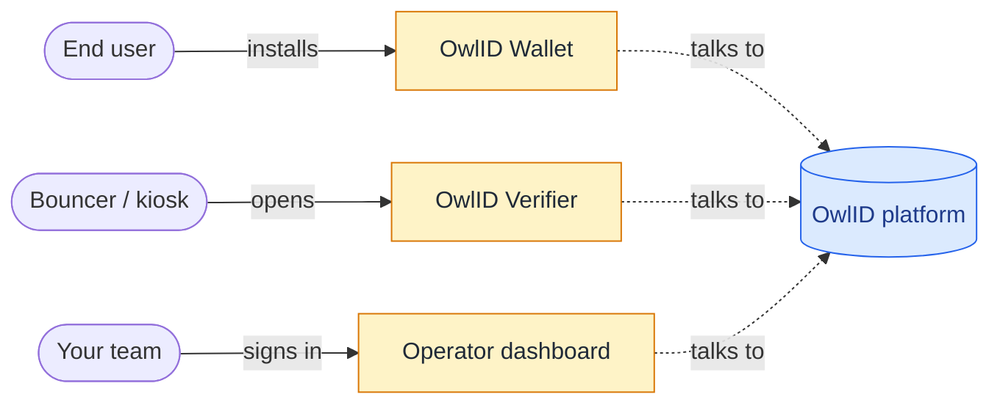

# OwlID apps

OwlID ships two end-user apps alongside the platform. Your customers can use them out of the box — no custom client or scanner UI required.

## OwlID Wallet — for holders

Where users keep their credentials and present proofs. Issuers point customers to the wallet during signup; verifiers point people there when they scan a QR.

- **Live**: https://wallet.owlid.dev
- **What it does**: passkey registration, runs the issuance flow with your provider of choice, stores ProofDocuments locally, scans verifier QRs, signs and presents tokens.
- **Cross-platform**: PWA — installs to iOS / Android home screen, runs the same in any browser. Native shells planned.
- **Build your own**: source at [`packages/app/`](https://github.com/owlid/owlid/tree/main/packages/app) (MIT). Fork it if you need a branded wallet.

When you set up issuance, the redirect URL after KYC sends the user back into the wallet — they install it once and reuse it across every issuer that uses OwlID.

## OwlID Verifier — for relying parties

Browser-based scanner you can deploy in minutes for low-volume or kiosk use cases. Generate a QR for a request, watch the result come in. No code required for the basic flow.

- **Live**: https://verify.owlid.dev
- **What it does**: pick predicates ("over 18", "EU resident", custom), render the QR full-screen, get a green/red result. Backed by your account's API key.
- **When to use it**: bouncer at the door, conference check-in desk, kiosk, internal manual checks, smoke tests during integration.
- **When to build your own**: high-volume programmatic flows, deep integration with your existing checkout / sign-in, custom branding. Use [`OwlVerifier`](/sdk/verifier) directly.
- **Source**: [`packages/verifier-app/`](https://github.com/owlid/owlid/tree/main/packages/verifier-app).

## Operator dashboard — for you

The control panel for your account. Mint API keys, register trusted issuers, view metrics, push revocations, run GDPR erasure. Every team gets one when they sign up.

- **Live**: linked from your account sign-in
- **Source**: [`packages/admin/`](https://github.com/owlid/owlid/tree/main/packages/admin)

## How they fit together

The platform handles the back-end — issuance HTTP API, verification API, on-chain trust anchors, revocation pubsub. Apps are thin clients that drive those APIs through the SDK.
