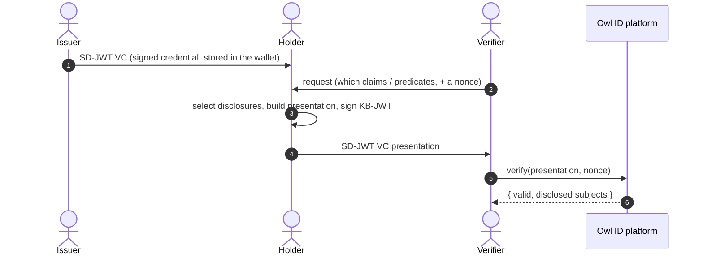
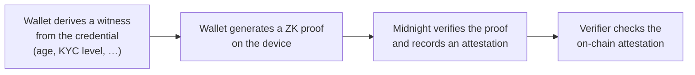

# How Owl ID works

A design-level tour of Owl ID's privacy model, trust anchoring, and data flow.
For exact function signatures use the [SDK reference](/sdk/verifier); for raw
routes see the [HTTP API](/api).

Owl ID lets a **holder** prove facts about themselves to a **verifier** without
revealing the underlying documents. An **issuer** vouches for the holder's
identity once; from then on the holder presents privacy-preserving proofs as
often as they like, and the verifier confirms them against trust state
anchored on the **Midnight** blockchain.

The verifier never sees hidden claims. The issuer never sees which claims the
holder later discloses, or to whom. The holder controls every presentation.

## The credential — SD-JWT VC

Owl ID issues credentials as **SD-JWT VC** (`application/dc+sd-jwt`), an IETF
standard. A credential is:

- an **issuer-signed JWT** carrying salted SHA-256 hashes of each claim, the
  holder's confirmation key (`cnf`), and a revocation pointer (`status`);
- a set of **disclosures** — one `[salt, name, value]` triple per claim, held
  by the wallet;
- on presentation, a **key-binding JWT (KB-JWT)** the holder signs over the
  verifier's nonce.

Because the credential is a published standard, any conformant verifier can
read an Owl ID presentation — Owl ID is not a walled garden.

## Selective disclosure

The holder reveals only the claims a verifier asks for. Every other claim stays
in the wallet as a salted hash inside the signed JWT — the verifier sees it
exists but learns nothing about its value. Disclose `given_name` without
`birthdate`, `nationalities` without `given_name`; each combination is the
holder's choice, made fresh per presentation.

## Predicates — proven on the device, in zero knowledge

A **predicate** is a fact derived from a credential attribute without revealing
the attribute: `age ≥ 18`, `kyc ≥ 2`, `nationality ∈ EU set`, verified
residency or email, unique personhood.

Predicates are **proven by the holder's wallet, on the device, in zero
knowledge** — not asserted by the issuer and not recomputed by the verifier:

The witness — the actual birthdate, KYC level, nationality — is consumed inside
the proof on the device and never leaves it. Only the proof and a one-way
attestation key reach the chain. The wallet runs this transparently the first
time a predicate is needed; the attestation is recorded once and reused across
every later presentation, so there is no per-verification chain wait.

Unique personhood adds sybil resistance: a per-campaign nullifier lets a
verifier confirm "one human, one claim" without learning the holder's identity
or linking them across campaigns.

## Holder binding — passkey + wallet key

The wallet holds an Ed25519 or P-256 **confirmation key** that signs each
KB-JWT. A WebAuthn **passkey** is the unlock and user-verification gate and
PRF-wraps the confirmation key at rest — the key is never exported and the
passkey itself is never the JWS signer. A presentation is therefore bound both
to the credential (`cnf`) and to a fresh per-request nonce, so a captured
presentation cannot be replayed.

## Trust anchored on Midnight

Midnight is Owl ID's **required trust core** — there is no version of Owl ID that
runs without it. Owl ID deploys ten Compact contracts. Three of them are
registries holding the trust state, and the standards-shaped formats verifiers
consume are projections of that state:

| On-chain registry   | Holds                                | Projected to verifiers as           |
| ------------------- | ------------------------------------ | ----------------------------------- |
| Issuer registry     | Trusted issuer key set + status.     | `did:web` issuer identity.          |
| Revocation registry | Per-credential revocation status.    | IETF Token Status List + live feed. |
| Identity registry   | `sha-256(did.json)` document anchor. | did:webs tamper-evidence.           |

The other seven are the predicate contracts described above — `predicate_age`,
`predicate_age_range`, `predicate_kyc`, `predicate_nationality`,
`predicate_residency`, `predicate_email`, and `predicate_personhood`. Each
verifies one circuit and appends an attestation key to its own on-chain set.
They hold no trust state and no PII; a verifier only ever asks them "is this
attestation key present?".

A verification never depends on the issuer being online or on a central
directory. The platform mirrors the on-chain registries and resolves every
issuer `did:web` identifier against them: a presentation from an issuer whose
key is not active on-chain is rejected, and a tampered DID document is
rejected.

## Revocation

An issuer (or operator) can revoke, suspend, or reactivate a credential. The
change is written to the on-chain revocation registry and projected as an IETF
Token Status List. Verifiers can subscribe to a live feed and invalidate cached
results the instant a credential's status changes. A verify call cross-checks
the local mirror, the on-chain registry, and the signed status list.

## Standards

Owl ID's whole public surface is built from published standards, so credentials
and presentations interoperate beyond Owl ID:

- **SD-JWT VC** — the credential format.
- **OpenID4VCI** — issuance, including Batch Credential issuance (one-time-use
  credentials so colluding verifiers cannot correlate presentations).
- **OpenID4VP** — presentation, with DCQL queries and `direct_post`.
- **IETF Token Status List** — revocation.
- **did:web / did:webs** — issuer identity and document-hash anchoring.

Not in scope today: BBS-2023 unlinkable signatures, ISO mdoc, and
eIDAS LoA-high / Trusted-List infrastructure.

## What each party sees

| Party    | Sees                                                                | Never sees                                               |
| -------- | ------------------------------------------------------------------- | -------------------------------------------------------- |
| Issuer   | The holder's verified identity, once, at issuance.                  | Which claims the holder later discloses, or to whom.     |
| Holder   | Their own full credential and every claim in it.                    | —                                                        |
| Verifier | Exactly the claims disclosed + the predicate results requested.     | Hidden claims; predicate witnesses; other presentations. |
| Platform | Hashed identifiers, trust/revocation mirrors, non-PII audit events. | Raw claim values (not retained past the session TTL).    |

## Data & privacy

- **In the wallet** — the full SD-JWT VCs, disclosure salts, the PRF-wrapped
  holder key, and predicate witnesses. Rich personal data lives only here.
- **On the platform** — hashed credential identifiers, the trust/revocation
  mirrors, non-PII audit events. No raw claim values; encrypted at rest.
- **On Midnight** — cryptographic commitments only: issuer keys, revocation
  slots, document hashes, predicate attestation keys. No PII ever reaches the
  chain.

Owl ID is built for data minimization: there is very little personal data to
erase because the platform mostly stores hashes. Right-to-erasure is primarily
a local wallet delete; server-side records are erasable on request.

## Next

- [Quickstart](/quickstart) — issue, hold, and verify in a few snippets.
- [SDK reference](/sdk/verifier) — every class and method.
- [Real-world scenarios](/examples/scenarios) — age gates, KYC, ticketing, and more.
