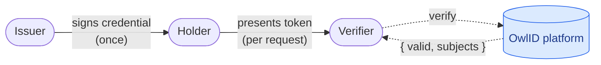
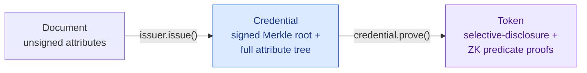
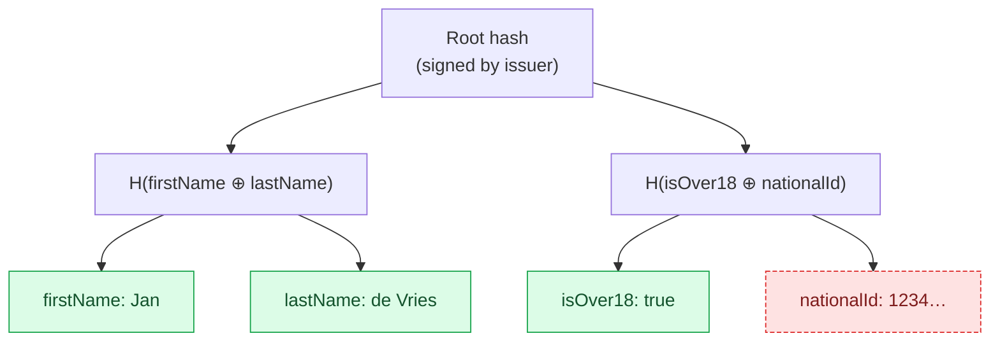
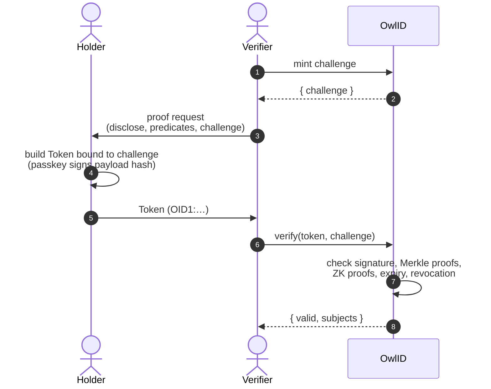

# How OwlID works

A short tour of the moving parts. Read this once before integrating — it makes the API choices in the SDK make sense.

## The problem

Most identity systems force the user to disclose an entire document (passport, driver's license, KYC report) just to prove a single fact (over 18, EU resident, KYC-verified). The verifier ends up holding sensitive data they don't need; the user loses control of who sees what.

OwlID lets a user prove specific facts about themselves without revealing the underlying document. Think "show me a green check that says 'over 18'", not "send me a photo of your passport".

## Three actors

- **Issuer** — vouches for facts about a user. Runs through OwlID's hosted issuance API after their KYC / IdP flow. Signs the user's credential once with an Ed25519 key registered on Midnight.
- **Holder** — the end user, on their phone or browser. Stores credentials locally, signs proof tokens with a passkey for each verifier interaction. Hidden attributes never leave the device.
- **Verifier** — any service that needs to confirm a fact. Calls one SDK method, receives `{ valid, subjects }`.

## Three primitives

- **Document** — a flat object of attributes (`firstName`, `dateOfBirth`, `nationality`, …) the issuer wants to vouch for. Lives in memory only during issuance.
- **Credential** — what the holder stores. The full attribute set, structured as a salted Merkle tree, with the issuer's signature over the root. One credential per (issuer, user) pair.
- **Token** — a single-use proof built from a credential for one specific verifier request. Discloses some attributes and proves predicates over others. Bound to a verifier-supplied challenge.

## Selective disclosure

The credential's Merkle tree lets the holder reveal _some_ attributes while keeping the rest hashed.

Each leaf is salted at issuance, so the same attribute value across two different credentials produces unrelated leaves — proofs cannot be correlated.

## Zero-knowledge predicates

For "is over 18" or "nationality is in {NL, DE, FR}", the holder doesn't even need to disclose the leaf — they attach a Groth16 proof that the hidden value satisfies the predicate.

| Predicate         | Operator         | Example                               |
| ----------------- | ---------------- | ------------------------------------- |
| Numeric threshold | `GreaterOrEqual` | `dateOfBirth ≥ 2008-01-01`            |
| Set membership    | `InSet`          | `nationality ∈ "eu"` (registered set) |
| KYC tier          | `GreaterOrEqual` | `kycLevel ≥ 2`                        |

Set-membership predicates name a registered dataset (e.g. `"eu"`) instead of carrying a list. The verifier recomputes the canonical Merkle root of that dataset and pins the proof's public input against it — a holder cannot ship a hand-picked subset.

The verifier learns whether the predicate holds. They never learn the actual value.

## Token lifecycle

The challenge prevents replay. The token's TTL prevents long-tail reuse. The platform's revocation registry prevents using a credential that's been pulled.

## Trust model

The verifier needs to know which issuers it trusts. OwlID anchors that on-chain so it works without a central directory:

- **Issuer registry** — every issuer's public key is published on Midnight when they sign up.
- **Revocation registry** — credential root-hashes go on-chain when revoked. Verifiers see the change in real time.
- **Identity registry** — issuer and verifier identities are addressable as `did:midnight:…`.

Verifiers consume this through a single SDK call — they never run their own chain node.

## What each party sees

| Party    | Sees                                              | Doesn't see                                  |
| -------- | ------------------------------------------------- | -------------------------------------------- |
| Issuer   | Full claim set at issuance time                   | Which verifiers the holder later presents to |
| Holder   | Their own credential, every proof they generate   | n/a                                          |
| Verifier | Disclosed attributes + predicate verdicts         | Hidden attributes; the credential itself     |
| Platform | Hashed tokenIds, revocation state, audit metadata | Plaintext attributes                         |

PII never crosses the holder's device boundary. The platform stores hashes, not values.

## What the SDK gives you

- `OwlVerifier` — server-side: `verify`, `mintChallenge`, `requestPresentation` (one-call QR flow), `subscribeRevocations`.
- `OwlIssuer` — server-side: `startSession`, `submitClaims`, `issue`.
- Token primitives — holder-side: `Credential`, `Token`, `KeyPair`. Token generation runs entirely on the holder's device.
- WebAuthn helpers — `registerCredential`, `signTokenWithPasskey`. The private key never leaves the secure enclave.
- Presentation helpers — `respondToPresentation` for one-call QR scan flows.

[Quickstart](/quickstart) shows the smallest working example for each persona. The [SDK reference](/sdk/verifier) has every method.
