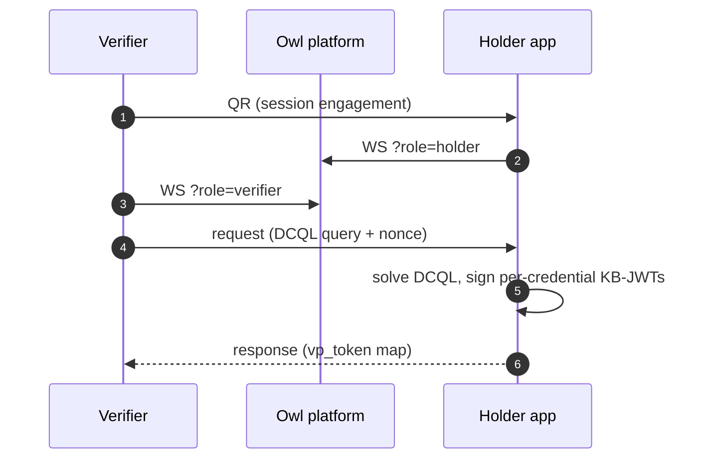

# Holder app integration

You're building a wallet — the app the user opens to approve credential issuance, store SD-JWT VC credentials, and present them to verifiers. Or you don't want to build one at all and instead point users to the [official OwlID Wallet](/apps#owlid-wallet--for-holders).

## Setup

```bash
bun add @owlid/sdk
```

Pure TypeScript — runs in browsers, Node, and React Native shells. WebAuthn passkey support requires a browser context (or a native bridge that exposes the WebAuthn API).

## WebAuthn / passkey lifecycle

WebAuthn is the **unlock + user-verification gate** for the wallet's holder key — never the JWS signer. KB-JWTs are signed by a wallet-held Ed25519 or P-256 key (standard EdDSA / ES256 JWS).

```ts
import {
  registerCredential,
  authenticate,
  isWebAuthnSupported,
  wrapHolderKey,
  unwrapHolderKey,
  KeyPair,
} from '@owlid/sdk'

if (!isWebAuthnSupported()) throw new Error('WebAuthn not available')

// 1. Register a passkey.
const cred = await registerCredential({
  rpName: 'My Wallet',
  rpId: 'wallet.example.com',
  userName: user.email,
  userVerification: 'required',
})

// 2. Mint the wallet's holder signing key + wrap its 32-byte seed with the
//    passkey PRF. wrapHolderKey(credentialId, seedHex) → wrapped blob string.
const holderKey = KeyPair.generate()
const wrapped = await wrapHolderKey(cred.credentialId, holderKey.toHex())

// 3. Later — UV gate then unwrap. unwrapHolderKey returns the seed hex string.
await authenticate({
  rpId: 'wallet.example.com',
  credentialId: cred.credentialId,
  userVerification: 'required',
})
const holderKeyHex = await unwrapHolderKey(cred.credentialId, wrapped)
```

## Local credential storage

```ts
import { storage, proofStorage, SdJwtVc, buildCardShape } from '@owlid/sdk'

// addCredential(credential, wrappedKey) stores the SD-JWT VC and the
// PRF-wrapped holder key together, keyed by credentialId. credentialId
// and issuer are derived from the SD-JWT VC string itself.
const parsed = SdJwtVc.parse(sdJwtVc)
await storage.addCredential(
  {
    credentialId: parsed.credentialId(), // stable id used for revocation lookups
    sdJwtVc, // application/dc+sd-jwt string
    issuer: parsed.peekIssuer(), // did:web identifier
    providerId, // IdP that drove the flow ('didit', 'google', …)
    issuedAt: new Date().toISOString(),
    holderPublicKeyHex: holderKey.publicKeyHex(), // per-credential cnf key
    verifiedClaims, // disclosed claims kept locally for the wallet UI
    cardShape: buildCardShape(providerId, verifiedClaims), // per-IdP card UI
  },
  wrapped, // from wrapHolderKey() — see above
)

const list = await storage.listCredentials()
const keyBlob = await storage.getCredentialKeyWrapped(parsed.credentialId())

// IndexedDB-backed proof history for the "recent proofs" UI.
await proofStorage.saveProof({
  id,
  name,
  claim, // the claim proven, e.g. 'age_over_18'
  result, // boolean outcome
  presentation, // the SD-JWT VC presentation string
  createdAt: new Date().toISOString(),
})
```

`storage` is a singleton. For custom backends (mobile, encrypted-at-rest), instantiate `CredentialStorageManager` with your own `StorageAdapter`.

## Build a presentation

```ts
import { presentSdJwtVc } from '@owlid/sdk'

// presentSdJwtVc(sdJwtVc, holderKeyHex, disclose, { aud, nonce }) — synchronous.
// holderKeyHex is the seed hex returned by unwrapHolderKey().
const presentation = presentSdJwtVc(
  storedCredential.sdJwtVc,
  holderKeyHex,
  ['given_name', 'age_over_18'],
  { aud: verifierOrigin, nonce: verifierNonce }, // bound into the KB-JWT
)
```

The resulting string is the full SD-JWT VC presentation: issuer JWT + selected disclosures + KB-JWT. Wire-shape: `<jwt>~<disc>~<disc>~...~<kb-jwt>`.

## Respond to a verifier QR (one call)

Scan a verifier QR, prompt the user for consent, and respond — all in one call:

```ts
import { respondToPresentation, OwlWallet, unwrapHolderKey, storage } from '@owlid/sdk'

// An OwlWallet wraps your local storage + key-unwrap + passkey resolution.
// It solves the verifier's DCQL query and signs the KB-JWTs.
const wallet = new OwlWallet(
  storage,
  (credentialId, wrapped) => unwrapHolderKey(credentialId, wrapped),
  async () => (await storage.loadWebAuthnCredential())?.credentialId ?? null,
)

await respondToPresentation(qrPayload, {
  wallet,
  // `request` is a PresentationRequest: { verifierName, dcql, nonce, … }
  onConsent: async (request) => ui.askApprove(request.verifierName, request.dcql),
})
```

The helper handles the WebSocket lifecycle, consent prompt, DCQL match, presentation build, and response — `OwlWallet` is the only building block you supply.

## Presentation protocol (driving the WebSocket yourself)

If you need control over the WebSocket (custom retry, native transport), decode the QR, connect, and answer the verifier's DCQL request with `OwlWallet.present()`:

```ts
import { decodeSessionEngagement, isPresentationEngagement, resolveWsUrl } from '@owlid/sdk'
import type { WsMessage, PresentationRequest, PresentationResponse } from '@owlid/sdk'

if (isPresentationEngagement(qrPayload)) {
  const engagement = decodeSessionEngagement(qrPayload)
  const ws = new WebSocket(`${resolveWsUrl(engagement!.ws!.url)}?role=holder`)

  ws.onmessage = async (e) => {
    const msg: WsMessage = JSON.parse(e.data)
    if (msg.type !== 'request') return
    const request = msg.payload as PresentationRequest

    // The wallet solves the DCQL query and signs one KB-JWT per
    // credential, all bound to the verifier's audience + nonce.
    const { vpToken, used } = await wallet.present({
      dcql: request.dcql,
      aud: request.verifierName,
      nonce: request.nonce,
    })

    const response: PresentationResponse = { sessionId: request.sessionId, vpToken, used }
    ws.send(JSON.stringify({ type: 'response', payload: response } satisfies WsMessage))
  }
}
```



## OpenID4VP

Alternatively the verifier can be a plain HTTPS service that supports OpenID4VP `direct_post`. Post the presentation to `POST /openid4vp/response`:

```ts
await fetch(`${verificationUrl}/openid4vp/response`, {
  method: 'POST',
  headers: { 'Content-Type': 'application/x-www-form-urlencoded' },
  body: new URLSearchParams({ vp_token: presentation, state: requestState }),
})
```

## Proving backend (WASM vs hosted proof server)

When the holder presents a credential, Owl ID generates a zero-knowledge proof for every predicate the verifier's DCQL request asks for. The SDK supports two backends:

| Mode             | Where the prover runs                     | Trade-off                                                                                                                                                              |
| ---------------- | ----------------------------------------- | ---------------------------------------------------------------------------------------------------------------------------------------------------------------------- |
| `wasm` (default) | In-process `@midnight-ntwrk/zkir-v2` WASM | Witness never leaves the device. Slower on low-end mobile (proving keys load into WASM memory each session).                                                           |
| `proof-server`   | Remote `midnightntwrk/proof-server`       | Faster on phones/tablets. The witness is consumed by `createUnprovenCallTx` before this step, so only the unproven preimage and the resulting proof cross the network. |

Configure at build time, at runtime, or per-`OwlWallet`:

```ts
import { configure } from '@owlid/sdk'

configure({
  verificationUrl: 'https://api.owlid.app',
  issuerUrl: 'https://issuer.owlid.app',
  // Opt into a hosted proof server. Without `proofServerUrl` the SDK
  // falls back to in-process WASM regardless of `provingMode`.
  provingMode: 'proof-server',
  proofServerUrl: 'https://proofs.owlid.app',
})
```

Equivalently per-wallet:

```ts
const wallet = new OwlWallet(storage, unwrap, resolvePasskey, {
  provingConfig: {
    mode: 'proof-server',
    url: 'https://proofs.owlid.app',
    timeout: 60_000,
  },
})
```

The OwlID holder app exposes a `/settings` page where the end user picks between the two — operators ship `OWLID_PROOF_SERVER_URL` (Cloud Run) or `VITE_PROOF_SERVER_URL` (Vite) to suggest a default endpoint.

If you self-host the proof server, the upstream `midnightntwrk/proof-server` image does **not** set CORS headers. Front it with a reverse proxy that injects `Access-Control-Allow-Origin` for your wallet's Origin — see `Dockerfile.proof-server` + `docker/proof-server/Caddyfile` in the OwlID repo for a working example.

## Reference

- [SD-JWT VC primitives](/sdk/primitives) — `KeyPair`, `SdJwtVc`, `presentSdJwtVc`, `verifySdJwt`
- [Verifier integration](/integration/verifier) — what your presentation gets verified against
- [Issuer integration](/integration/issuer) — where your credentials come from
