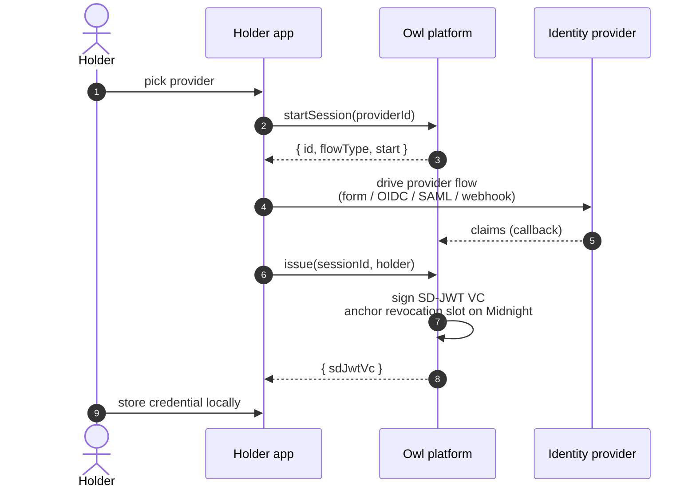

# Issuer integration

You have an existing identity verification flow (DigiD, BankID, OIDC, your own KYC) and want to mint OwlID SD-JWT VC credentials for verified users.

## Setup

```bash
bun add @owlid/sdk
```

```ts
import { OwlIssuer } from '@owlid/sdk'

const issuer = new OwlIssuer({ apiKey: process.env.OWLID_API_KEY! })
```

## Issuance flow



## Code

```ts
// 1. Open a session.
const session = await issuer.startSession('didit')
// session.start tells you what to render:
//   { type: 'form', fields: [...] }
//   { type: 'redirect', url, relayState? }
//   { type: 'qr', qrData, orderRef, autoStartUrl? }
//   { type: 'webhook', url }

// 2. Drive the provider flow.
//    For form-based providers, submit the verified claims directly:
await issuer.submitClaims(session.id, {
  given_name: 'Jan',
  family_name: 'de Vries',
  birthdate: '1985-03-15',
  nationalities: ['NL'],
})

// 3. Issue — bound to the holder's confirmation key (`cnf`).
const issued = await issuer.issue(session.id, {
  publicKey: holderPublicKeyHex,
  algorithm: 'ed25519', // 'ed25519' for wallet keys, 'p256' for ES256 cnf
})

// issued.sdJwtVc → application/dc+sd-jwt string (issuer JWT + disclosures).
// Hand this to the holder's wallet. The wallet derives the stable
// credentialId and did:web issuer from the string itself via
// SdJwtVc.parse() — see the holder guide.
```

The platform does not retain unhashed claims past the session TTL. Once issued, only the issuer-signed JWT (carrying SHA-256 hashes of each `[salt, name, value]` disclosure) and audit-event hashes remain.

## OpenID4VCI (Batch Credential issuance)

To defeat multi-show linkability, ask the issuer for a batch of one-time-use credentials. Each has a distinct `credential_id` and is independently revocable on Midnight:

```ts
const batch = await issuer.issueBatch(
  session.id,
  { publicKey: holderPublicKeyHex, algorithm: 'ed25519' },
  8, // batchSize, 1..=64
)
// batch: IssuedCredential[] — each { sdJwtVc }, a distinct one-time-use VC
```

This is the OpenID4VCI Batch Credential endpoint. The verifier sees no correlation between batched presentations.

## Provider flow types

| `start.type` | Meaning                                     | What you render          |
| ------------ | ------------------------------------------- | ------------------------ |
| `form`       | Form-based providers                        | Render `start.fields`    |
| `redirect`   | OIDC / SAML redirect                        | Navigate to `start.url`  |
| `qr`         | QR-based mobile-app providers (e.g. BankID) | Render `start.qrData`    |
| `webhook`    | Async KYC providers (e.g. Didit, Onfido)    | Send user to `start.url` |

## Polling async sessions

For QR or webhook flows, poll until the session reaches `verified`:

```ts
let snapshot = await issuer.poll(session.id)
while (snapshot.status === 'pending') {
  await new Promise((r) => setTimeout(r, 1500))
  snapshot = await issuer.poll(session.id)
}
if (snapshot.status === 'verified') {
  const issued = await issuer.issue(session.id, { publicKey, algorithm: 'ed25519' })
}
```

## Issuer identifier — did:web

The issuer publishes a DID document at `https://<issuer-host>/.well-known/did.json` (CORS public). The document's SHA-256 hash is anchored on Midnight's `identity_registry` (the `did:webs` pattern); the verifier resolves the did:web URL, re-hashes, and rejects any document substitution.

## Issuer key management

Your account's signing key is generated by OwlID on signup and its public key is registered into the on-chain `issuer_registry` automatically. Verifiers connecting to OwlID trust your credentials without any extra setup on their side.

## Reference

- [`OwlIssuer`](/sdk/issuer) — every method
- [Verifier integration](/integration/verifier) — the other side of the flow
