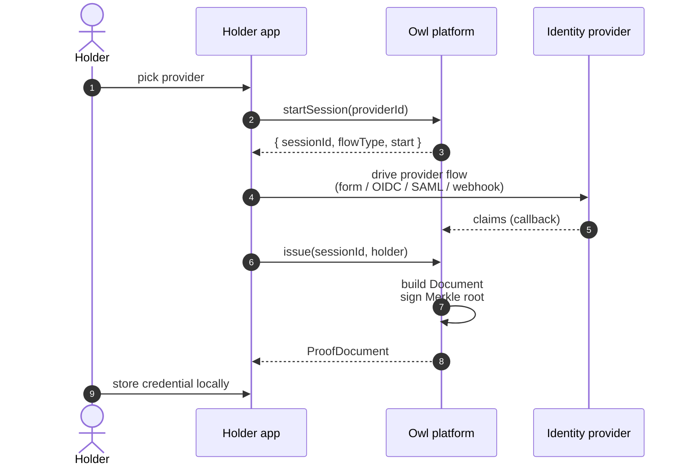

<!-- AUTO-GENERATED — do not edit. Source: docs/integration/issuer.md -->

# Issuer integration

You have an existing identity verification flow (DigiD, BankID, OIDC, your own KYC) and want to mint OwlID credentials for verified users.

## Setup

```bash
bun add @owlid/sdk
```

```ts
import { OwlIssuer } from '@owlid/sdk'

const issuer = new OwlIssuer({ apiKey: process.env.OWLID_API_KEY! })
```

## Issuance flow



## Code

```ts
// 1. Open a session
const session = await issuer.startSession('didit')
// session.start tells you what to render:
//   { type: 'form', fields: [...] }
//   { type: 'redirect', url, relayState? }
//   { type: 'qr', qrData, orderRef, autoStartUrl? }
//   { type: 'webhook', url }

// 2. Drive the provider flow.
//    For form-based providers, submit the verified claims directly:
await issuer.submitClaims(session.id, {
  firstName: 'Jan',
  lastName: 'de Vries',
  dateOfBirth: '1985-03-15',
  nationality: 'NL',
})

// 3. Issue — bound to the holder's public key.
const issued = await issuer.issue(session.id, {
  publicKey: holderPublicKey,
  algorithm: 'p256', // 'p256' for WebAuthn passkeys, 'ed25519' for raw keys
})

// issued.document — ProofDocument JSON, send to the holder app.
```

The platform does not retain the unhashed claims past the session TTL. Once issued, only the signed Merkle root and audit-event hashes remain.

## Provider flow types

| `start.type` | Meaning                                     | What you render          |
| ------------ | ------------------------------------------- | ------------------------ |
| `form`       | Form-based providers                        | Render `start.fields`    |
| `redirect`   | OIDC / SAML redirect                        | Navigate to `start.url`  |
| `qr`         | QR-based mobile-app providers (e.g. BankID) | Render `start.qrData`    |
| `webhook`    | Async KYC providers (e.g. Didit, Onfido)    | Send user to `start.url` |

## Polling async sessions

For QR or webhook flows, poll until the session reaches `verified`:

```ts
let snapshot = await issuer.poll(session.id)
while (snapshot.status === 'pending') {
  await new Promise((r) => setTimeout(r, 1500))
  snapshot = await issuer.poll(session.id)
}
if (snapshot.status === 'verified') {
  const issued = await issuer.issue(session.id, { publicKey, algorithm: 'p256' })
}
```

## Issuer key management

Your account's signing key is generated by OwlID on signup and registered automatically with the on-chain `IssuerRegistry`. Verifiers connecting to OwlID trust your credentials with no per-customer setup.

## Reference

- [`OwlIssuer`](/sdk/issuer) — every method
- [Verifier integration](/integration/verifier) — the other side of the flow
