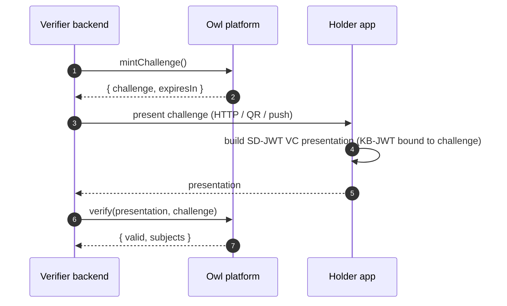
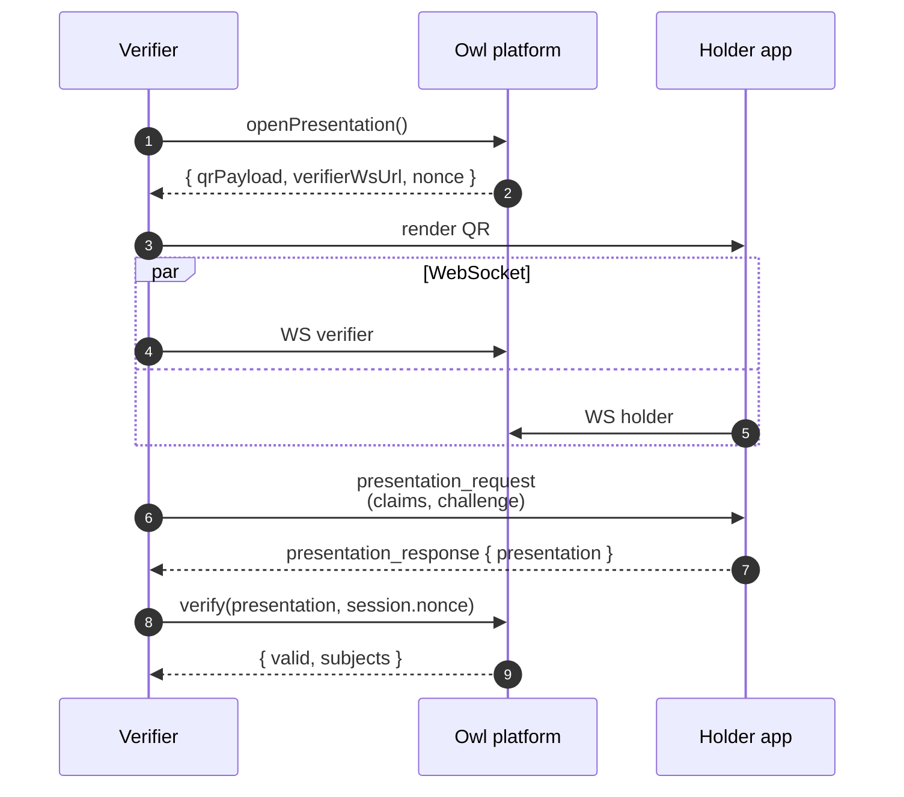

# Verifier integration

You receive an SD-JWT VC presentation from a holder and need to confirm it. Two flows: direct verification (you already hold the presentation string) and presentation (you show a QR and the holder pushes one to you).

If you don't need a custom UI, the [Owl ID Verifier](/apps#owl-id-verifier--for-relying-parties) is a hosted browser scanner that does this end-to-end — useful for kiosks, door checks, and one-off verifications.

## Setup

```bash
bun add @owlid/sdk
```

```ts
import { OwlVerifier } from '@owlid/sdk'

const verifier = new OwlVerifier({ apiKey: process.env.OWLID_API_KEY! })
```

API keys go server-side — never bundle them into a browser build. Use a publishable key (`owlid_pk_…`) if you need to verify from the browser; secret keys (`owlid_sk_…`) stay on the server.

## Flow A — direct presentation verification

```ts
const challenge = await verifier.mintChallenge()
const result = await verifier.verify(presentation, challenge.challenge)

if (result.valid) {
  console.log(result.subjects)
  // { given_name: "Jan", age_over_18: true }
}
```

`challenge` must match the random nonce the holder bound into the KB-JWT. Either mint a server-managed single-use challenge with `verifier.mintChallenge()` or pass your own cryptographically random string.



## Flow B — QR presentation session (one call)

Use `requestPredicates` — declarative, typed, autocomplete-friendly. Helper opens a session, renders the QR via your callback, manages the WebSocket, awaits the holder's response, runs verification, and returns the result.

```ts
import { OwlVerifier, Predicates } from '@owlid/sdk'

const result = await verifier.requestPredicates({
  verifierName: 'Acme Bar',
  predicates: [Predicates.ageOver(18), Predicates.residencyIn(['NL', 'BE', 'DE'])],
  onQr: (qrPayload) => showQr(qrPayload),
  timeoutMs: 60_000,
})

if (result.valid) {
  console.log(result.perCredential.cred0?.subjects)
}
```

`requestPredicates` returns a `VerifyDcqlResponse` — `valid`, plus a `perCredential` map keyed by the DCQL `credentials[].id` with each entry's `subjects` and `error`.

If you need the raw DCQL (external wallets via `request_uri`, custom `credential_sets`), use `verifier.buildDcqlRequest(predicates)` to compile the predicates, then hand the result to `requestPresentation`.

If you need to manage the WebSocket yourself (e.g. server-side flow, custom retry logic), drop down to `openPresentation()` + raw WS:

```ts
const session = await verifier.openPresentation()
// session.qrPayload, session.verifierWsUrl, session.nonce
```



The platform consumes `nonce` atomically when you call `verify()` — replays fail.

## Flow C — OpenID4VP `direct_post`

Plain HTTPS verifier-side: holders push the presentation via OpenID4VP `direct_post`:

```
POST /openid4vp/response
Content-Type: application/x-www-form-urlencoded

vp_token=<sd-jwt-vc presentation>&state=<verifier-managed state>
```

The verification service decodes, runs the full verify path (issuer trust, key binding, audience, nonce, status list, on-chain revocation), and returns `{ valid, subjects }` keyed off `state` on the next session poll.

## Status list (revocation)

The issuer publishes an IETF Token Status List at `/status/<id>`. The verification service:

1. Checks the local revocation cache (SSE-mirrored from the Midnight `revocation_registry`).
2. Cross-checks the credential's `status.uri` + `statusIdx` against the live signed `statuslist+jwt`.
3. Confirms the on-chain `is_credential_revoked` projection.

All three must agree.

## Live revocation feed

Subscribe to revocation events to invalidate cached verification results immediately:

```ts
const unsubscribe = verifier.subscribeRevocations((event) => {
  // event: { credentialId, status: 'revoked' | 'suspended' | 'reactivated', reason? }
})

// later
unsubscribe()
```

In Node, use `verifier.revocationFeedUrl()` with your own WebSocket client (`node:ws`).

## Trusted issuers

Owl ID anchors issuer keys on-chain via the Midnight `issuer_registry` Compact contract; the verification service mirrors that state and resolves `did:web` issuer identifiers against it. Your verification calls automatically consult both. List the issuers visible to your account:

```ts
const issuers = await verifier.listIssuers()
// [{ publicKey, name, description, isActive }]
```

## Predicates

A predicate (`age over 18`, `residency in {NL, BE, DE}`, `verification level >= substantial`, `unique person per campaign`, …) is a fact the holder proves without revealing the underlying attribute. The holder's wallet generates a zero-knowledge proof on-device and Midnight records an attestation; your verify call confirms that attestation. You do nothing extra — list the predicates you want and `requestPredicates` enforces them. There are no proving keys to download verifier-side.

```ts
import { Predicates } from '@owlid/sdk'

const result = await verifier.requestPredicates({
  verifierName: 'Acme Bar',
  predicates: [
    Predicates.ageOver(21),
    Predicates.residencyIn(['NL', 'BE', 'DE']),
    Predicates.kycLevel('substantial'),
  ],
  onQr,
})
```

Full factory:

| Factory                                               | What it proves                                                                                                            |
| ----------------------------------------------------- | ------------------------------------------------------------------------------------------------------------------------- |
| `Predicates.ageOver(threshold)`                       | Holder's age ≥ `threshold` years. Actual age never disclosed.                                                             |
| `Predicates.ageRange(min, max)`                       | `min ≤ holder_age ≤ max`.                                                                                                 |
| `Predicates.kycLevel('basic'\|'substantial'\|'high')` | eIDAS-style identity verification tier the issuer attested.                                                               |
| `Predicates.residencyIn(['NL', …])`                   | Holder's residence country is in the set you supplied. Set is private to (verifier, holder), only a hash lands on chain.  |
| `Predicates.nationalityIn(['NL', …])`                 | Same for nationality.                                                                                                     |
| `Predicates.emailVerified()`                          | Holder's email was provider-verified at issuance.                                                                         |
| `Predicates.uniquePerson({ epoch, appId })`           | Sybil-resistant per-campaign nullifier; same human → same nullifier per `(epoch, appId)`, unlinkable across other scopes. |

`residencyIn` / `nationalityIn` are per-verifier salted: two verifiers asking for the same allowed-set produce distinct on-chain attestation keys, so a third party watching the chain can't link credentials across verifiers based on which policy they satisfied.

You can also discover the predicates the platform can prove at runtime and render your proof selector / consent UI from the list rather than hard-coding:

```ts
const predicates = await verifier.listPredicates()
// [{ id, attribute, label, op, value }]
```

### Verifier dashboards — recompute the on-chain key

If you build a dashboard that counts attestations under your own policy without round-tripping the verification-service:

```ts
const key = await verifier.attestationKeyFor(
  credentialId, // 32-byte hex from the SD-JWT VC
  Predicates.residencyIn(['NL', 'BE', 'DE']),
)
// '06d8de25a0...' — the attestation set membership key

const setHash = await verifier.computeAllowedSetHash(['NL', 'BE', 'DE'])
// '8f12...' — the off-chain commitment your policy maps to
```

Both helpers automatically fold your `verifier.verifierId()` into per-verifier salts.

## Reference

- [`OwlVerifier`](/sdk/verifier) — every method
- [Issuer integration](/integration/issuer) — if you also issue credentials
