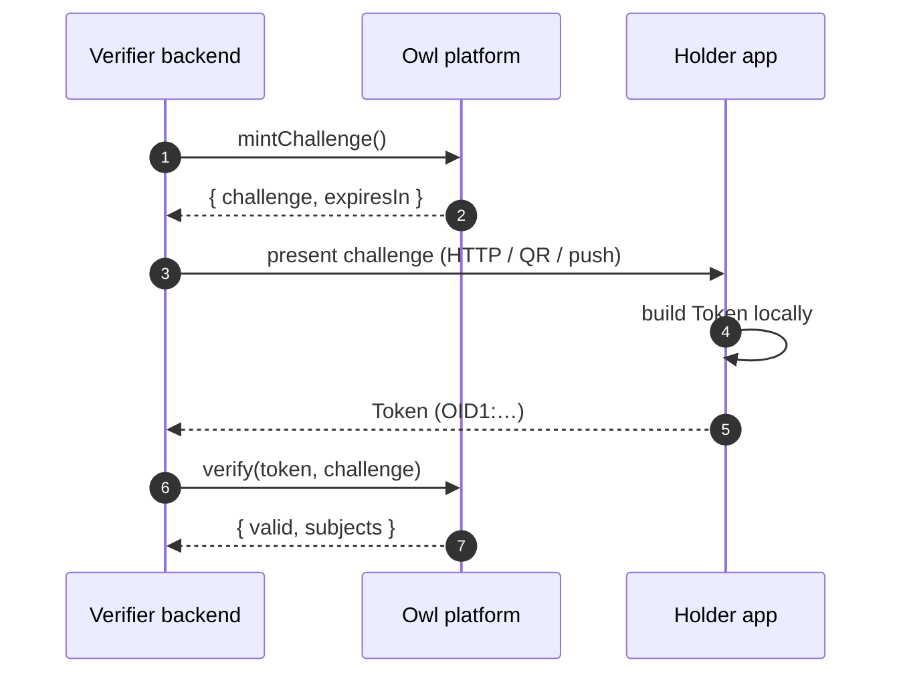
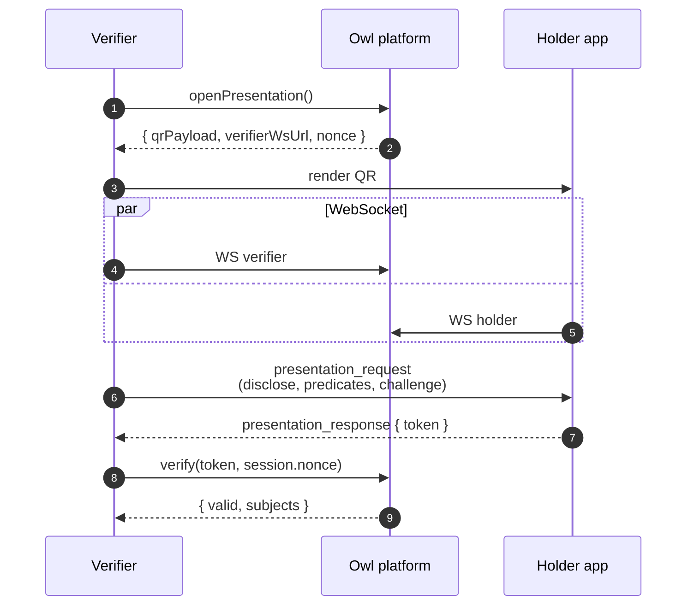

<!-- AUTO-GENERATED — do not edit. Source: docs/integration/verifier.md -->

# Verifier integration

You receive a token from a holder and need to confirm it. Two flows: direct verification (you already hold the token) and presentation (you show a QR and the holder pushes a token to you).

If you don't need a custom UI, the [OwlID Verifier](/apps#owlid-verifier--for-relying-parties) is a hosted browser scanner that does this end-to-end — useful for kiosks, door checks, and one-off verifications.

## Setup

```bash
bun add @owlid/sdk
```

```ts
import { OwlVerifier } from '@owlid/sdk'

const verifier = new OwlVerifier({ apiKey: process.env.OWLID_API_KEY! })
```

API keys go server-side — never bundle them into a browser build. Use a publishable key (`owlid_pk_…`) if you need to verify from the browser; secret keys (`owlid_sk_…`) stay on the server.

## Flow A — direct token verification

```ts
const result = await verifier.verify(token, challenge)

if (result.valid) {
  console.log(result.subjects)
  // { firstName: "Jan", isOver18: true }
}
```

`challenge` must match the random string the holder bound into the token. Either mint a server-managed single-use challenge with `verifier.mintChallenge()` or pass your own cryptographically random string.



## Flow B — QR presentation session (one call)

For the common case, use `requestPresentation` — the helper opens a session, renders the QR via your callback, manages the WebSocket, awaits the holder's response, runs verification, and returns the result.

```ts
const result = await verifier.requestPresentation({
  verifierName: 'Acme Bar',
  predicates: [{ id: 'isOver18', label: 'Over 18' }],
  onQr: (qrPayload) => showQr(qrPayload),
  timeoutMs: 60_000,
})

if (result.valid) {
  console.log(result.subjects)
}
```

If you need to manage the WebSocket yourself (e.g. server-side flow, custom retry logic), drop down to `openPresentation()` + raw WS:

```ts
const session = await verifier.openPresentation()
// session.qrPayload, session.verifierWsUrl, session.nonce
```



The platform consumes `nonce` atomically when you call `verify()` — replays fail.

## Live revocation feed

Subscribe to revocation events to invalidate cached verification results immediately:

```ts
const unsubscribe = verifier.subscribeRevocations((event) => {
  // event: { credentialId, status: 'revoked' | 'suspended' | 'reactivated', reason? }
})

// later
unsubscribe()
```

In Node, use `verifier.revocationFeedUrl()` with your own WebSocket client (`node:ws`).

## Trusted issuers

OwlID's hosted platform manages the trusted issuer registry for you — issuer keys are anchored on-chain via the Midnight `IssuerRegistry` contract and your verification calls automatically consult it. List the issuers visible to your account:

```ts
const issuers = await verifier.listIssuers()
// [{ publicKey, name, description, isActive }]
```

## Serving Groth16 proving keys to wallets

The verification service exposes the Groth16 proving keys at:

```
GET /zk-keys                      → ["age_range", "kyc_status", "nationality"]
GET /zk-keys/<circuit>.pk.bin     → key bytes (ark-serialize compressed)
                                    Cache-Control: public, immutable
```

Wallet builds that ship as WASM (browser PWAs, embedded webviews) don't bundle the proving keys — they fetch them from this endpoint on first proof and cache them in IndexedDB. The keys are public cryptographic material; integrity (HTTPS + immutable cache) is what matters, not secrecy.

The endpoints are unauthenticated and CORS-enabled for the same origin set as `/verify`. No configuration needed — turning on the verification service exposes them automatically.

If you self-host the proving keys elsewhere (CDN, app's own origin, IPFS), wallets can be told via:

```ts
import { configureProvingKeys } from '@owlid/sdk/native'
configureProvingKeys({ baseUrl: 'https://my-cdn.example.com/zk' })
```

See [Holder integration → Proving keys](/integration/holder#proving-keys-wasm-only) for the full wallet-side story.

## Reference

- [`OwlVerifier`](/sdk/verifier) — every method
- [Issuer integration](/integration/issuer) — if you also issue credentials
