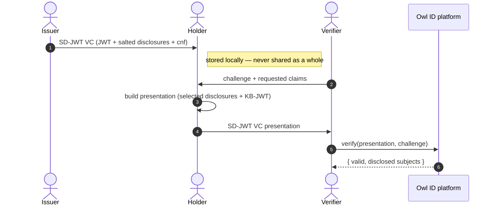

# Overview

Owl ID is a hosted privacy-preserving digital identity platform. Holders prove facts about themselves to verifiers without revealing the underlying documents. The credential format is **SD-JWT VC** (`application/dc+sd-jwt`); the holder selectively discloses claims and signs a key-binding JWT bound to the verifier's nonce.

## What you get

- **Selective disclosure** — holders reveal only the claims they choose. Hidden claims stay as salted SHA-256 hashes inside the issuer-signed JWT's `_sd` array.
- **On-device ZK predicates** — facts like `age ≥ 18`, `kyc ≥ substantial`, `nationality ∈ EU` are proven by the holder's wallet in zero knowledge on the device, in Compact. Midnight verifies the proof and records an attestation; the verifier checks the attestation. The underlying value (birthdate, KYC level, …) never leaves the wallet.
- **WebAuthn passkey + wallet-held key** — the passkey is the unlock + user-verification gate and PRF-wraps the key at rest; the wallet holds an Ed25519 or P-256 confirmation key. The KB-JWT is a standard EdDSA / ES256 JWS. The passkey itself is never the JWS signer.
- **Live revocation** — revoke, suspend, reactivate. IETF Token Status List (`statuslist+jwt`) + on-chain `revocation_registry`. Verifiers receive push events; cached results invalidate instantly.
- **OpenID4VCI + OpenID4VP** — standards-conformant issuance (with Batch Credential for unlinkability) and presentation (`direct_post`).
- **Plug-in IdP issuance** — DigiD, BankID, OIDC, SAML, Didit out of the box. Bring your own KYC.
- **On-chain trust anchor** — issuer keys (`issuer_registry`), revocations (`revocation_registry`), did-document hashes (`identity_registry`) published on Midnight. No central directory, no key escrow.

## How it works

The verifier never sees hidden claims. The issuer never sees which claims the holder later discloses, or to whom. The holder controls which presentations are generated and when.

## What each party sees

| Party    | Sees                                                                | Never sees                                               |
| -------- | ------------------------------------------------------------------- | -------------------------------------------------------- |
| Issuer   | The holder's verified identity, once, at issuance.                  | Which claims the holder later discloses, or to whom.     |
| Holder   | Their own full credential and every claim in it.                    | —                                                        |
| Verifier | Exactly the claims disclosed + the predicate results requested.     | Hidden claims; predicate witnesses; other presentations. |
| Platform | Hashed identifiers, trust/revocation mirrors, non-PII audit events. | Raw claim values (not retained past the session TTL).    |

## Three integration paths

| You're a…  | Read                                          |
| ---------- | --------------------------------------------- |
| Verifier   | [Verifier integration](/integration/verifier) |
| Issuer     | [Issuer integration](/integration/issuer)     |
| Holder app | [Holder integration](/integration/holder)     |

## Or use the apps as-is

You don't have to build everything. The platform ships:

- **[Owl ID Wallet](/apps#owl-id-wallet--for-holders)** — point your users here to receive and present credentials.
- **[Owl ID Verifier](/apps#owl-id-verifier--for-relying-parties)** — browser-based scanner for low-volume / kiosk verification, no code required.
- **[Operator dashboard](/apps#operator-dashboard--for-you)** — control panel for your account.

## What's next

- [Quickstart](/quickstart) — paste-able snippets for each persona
- [SDK reference](/sdk/verifier) — every class and method
- [SD-JWT VC primitives](/sdk/primitives) — the low-level token API
- [HTTP API](/api) — raw endpoints, for non-TypeScript integrations
- [How Owl ID works](/architecture/overview) — design rationale, threat model, data flow
