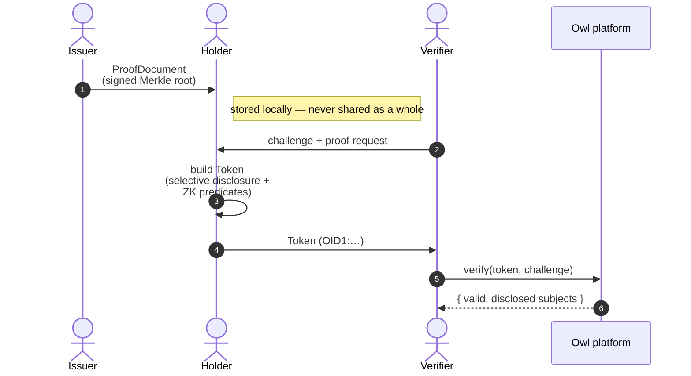

# Overview

OwlID is a hosted privacy-preserving digital identity platform. Holders prove facts about themselves to verifiers without revealing the underlying documents. Issuers sign Merkle-rooted credentials; holders generate selective-disclosure tokens locally; verifiers check signatures, predicates, expiry, and revocation through a single SDK call.

## What you get

- **Selective disclosure** — holders reveal only the attributes they choose. Hidden fields stay hashed under a salted Merkle root.
- **Zero-knowledge predicates** — prove `age ≥ 18`, `nationality ∈ EU set`, `KYC tier ≥ 2` without revealing the underlying value. Groth16 over BLS12-381.
- **WebAuthn passkey signing** — hardware-backed P-256 keys. Private key material never leaves the secure enclave.
- **Live revocation** — revoke, suspend, reactivate. Verifiers receive push events; cached results invalidate instantly.
- **Plug-in IdP issuance** — DigiD, BankID, OIDC, SAML, Didit out of the box. Bring your own KYC.
- **On-chain trust anchor** — issuer keys, revocations, identity commitments published on Midnight. No central directory, no key escrow.

## How it works

The verifier never sees hidden attributes. The issuer never sees which attributes the holder discloses. The holder controls which proofs are generated and when.

## Three integration paths

| You're a…  | Read                                          |
| ---------- | --------------------------------------------- |
| Verifier   | [Verifier integration](/integration/verifier) |
| Issuer     | [Issuer integration](/integration/issuer)     |
| Holder app | [Holder integration](/integration/holder)     |

## Or use the apps as-is

You don't have to build everything. The platform ships:

- **[OwlID Wallet](/apps#owlid-wallet--for-holders)** — point your users here to receive and present credentials.
- **[OwlID Verifier](/apps#owlid-verifier--for-relying-parties)** — browser-based scanner for low-volume / kiosk verification, no code required.
- **[Operator dashboard](/apps#operator-dashboard--for-you)** — control panel for your account.

## What's next

- [Quickstart](/quickstart) — paste-able snippets for each persona
- [SDK reference](/sdk/verifier) — every class and method
- [How OwlID works](/architecture/overview) — design rationale, threat model, data flow
