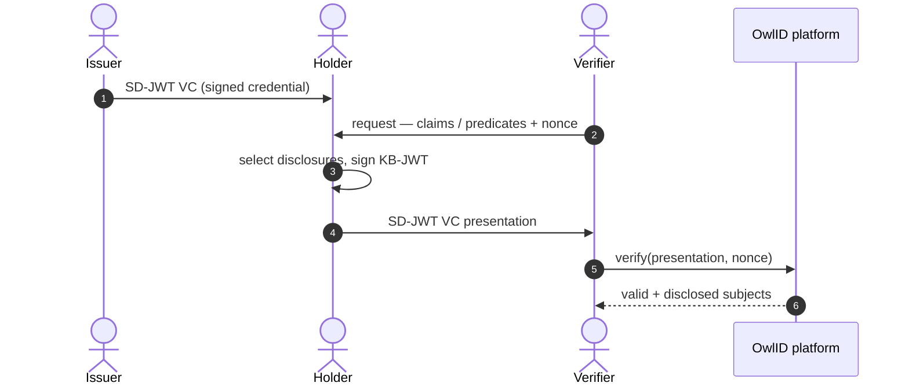
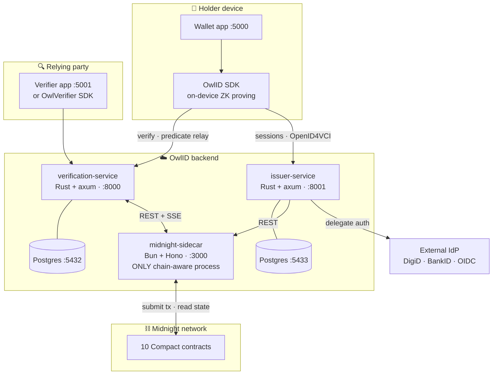
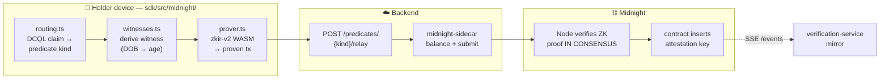
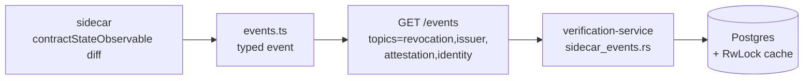
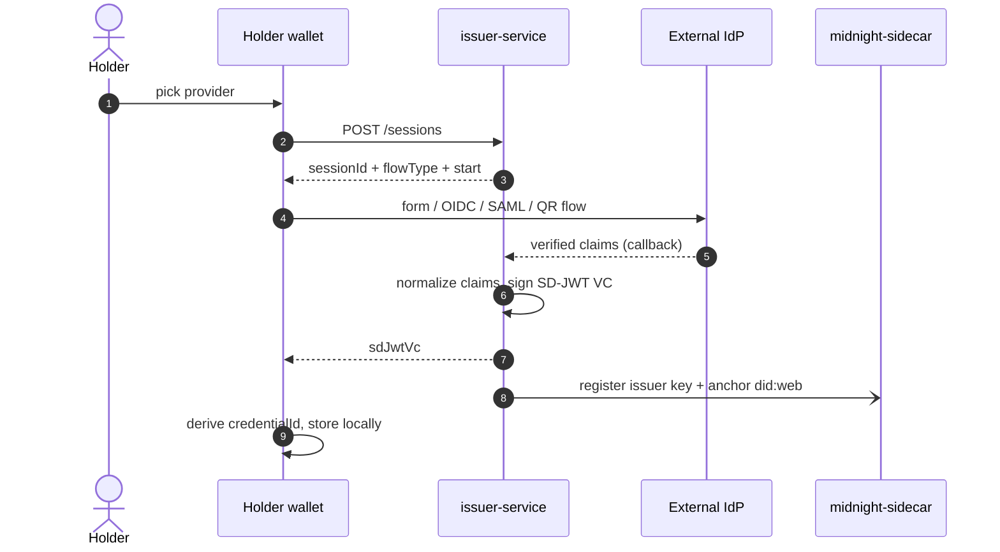
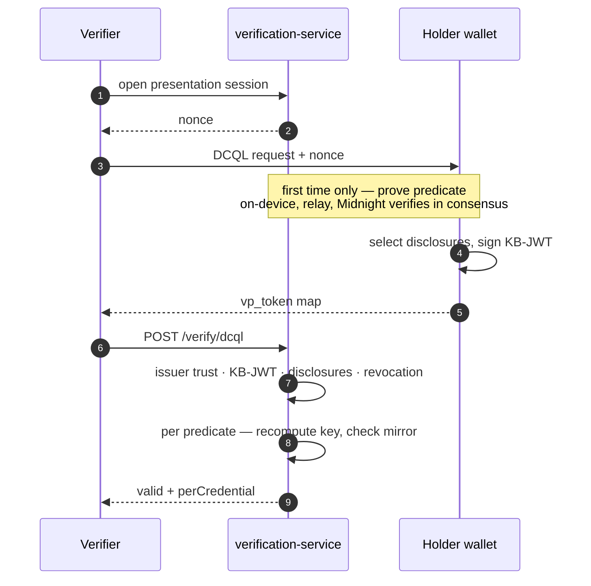

<div class="owl-hero">

# OwlID

<div class="text-2xl mt-3 font-light tracking-wide">
Privacy-preserving digital identity, <span class="accent">anchored on Midnight</span>
</div>

<div class="flex justify-center gap-3 mt-8 text-sm">
  <span class="chip">SD-JWT VC credentials</span>
  <span class="chip">witness-on-device ZK proofs</span>
  <span class="chip">on-chain trust</span>
</div>

</div>

<!--
Midnight is not a feature — it is the trust and compute core. No "Midnight off" mode.
-->

---
layout: section
class: section
---

# Agenda

<div class="text-left max-w-sm mt-4 leading-loose text-base">

<v-clicks>

1. The problem & the pitch
2. Vocabulary — SD-JWT VC, OpenID4VC
3. System architecture
4. The credential, in detail
5. **Where Midnight lives** — the sidecar
6. **10 Compact contracts**
7. **Witness-on-device ZK proving**
8. State sync & end-to-end flows
9. Standards, privacy & GDPR
10. Status & why Midnight

</v-clicks>

</div>

---
layout: center
class: text-center
---

# The problem

<div class="grid grid-cols-3 gap-5 mt-8 text-left">

<v-clicks>

<div class="card t-rose">
<div class="text-3xl mb-1">📄</div>
<div class="card-h h-rose">Oversharing</div>
<div class="body">Proving "I am over 18" today means handing over a full ID document — name, photo, exact birthdate, document number.</div>
</div>

<div class="card t-rose">
<div class="text-3xl mb-1">🔗</div>
<div class="card-h h-rose">Linkability</div>
<div class="body">The same credential bytes, shown twice, are a stable identifier — verifiers can correlate and track the holder.</div>
</div>

<div class="card t-rose">
<div class="text-3xl mb-1">🏢</div>
<div class="card-h h-rose">Central trust</div>
<div class="body">Issuer trust and revocation live in one operator's database — a single party to trust, and to breach.</div>
</div>

</v-clicks>

</div>

<div v-click class="mt-8 text-xl">
OwlID: the holder proves a <span class="accent">fact</span>, not a document — and trust is <span class="accent">on-chain</span>, not in a database.
</div>

---
layout: statement
class: text-center
---

# The pitch

<div class="text-2xl leading-snug max-w-3xl mx-auto">
A holder proves facts about themselves — <span class="accent">age ≥ 18</span>, <span class="accent">KYC level</span>, <span class="accent">nationality ∈ EU</span> — to <b>any standards-conformant verifier</b>, without revealing the underlying document.
</div>

<div class="mt-8 text-base opacity-65 max-w-2xl mx-auto">
Issuer trust, revocation, and predicate attestation are <b class="opacity-100">computed or anchored on Midnight</b>. The standards-shaped wire formats are the public <i>projection</i> of on-chain state — not a parallel system.
</div>

---

# Vocabulary — the standards, plainly

<div class="grid grid-cols-2 gap-3 mt-3 text-sm">

<div class="card t-blue">
<span class="card-h h-blue">SD-JWT VC</span>
<div class="body"><b>Selective-Disclosure JWT, Verifiable Credential profile</b> (IETF, RFC 9901). A signed credential where every claim is individually withholdable — reveal some, hide the rest, all still verifiable.</div>
</div>

<div class="card t-teal">
<span class="card-h h-teal">OpenID4VCI</span>
<div class="body"><b>OpenID for Verifiable Credential Issuance.</b> The protocol by which a wallet obtains a credential from an issuer — metadata, token, credential endpoints.</div>
</div>

<div class="card t-violet">
<span class="card-h h-violet">OpenID4VP + DCQL</span>
<div class="body"><b>OpenID for Verifiable Presentations.</b> How a verifier requests proofs and receives them. <b>DCQL</b> (Digital Credentials Query Language) is its machine-readable "what I need".</div>
</div>

<div class="card t-cyan">
<span class="card-h h-cyan">KB-JWT · Status List · did:web</span>
<div class="body"><b>KB-JWT</b> = key-binding JWT, proves the presenter holds the credential's key. <b>Token Status List</b> = compact revocation bitstring. <b>did:web</b> = a DNS-hosted decentralized identifier.</div>
</div>

</div>

---

# Three roles, one platform



<div class="grid grid-cols-3 gap-4 mt-2 text-xs">
<div class="card t-blue"><span class="card-h h-blue">👤 Issuer</span><div class="body">Vouches for the holder once. Never sees what the holder later discloses, or to whom.</div></div>
<div class="card t-teal"><span class="card-h h-teal">🦉 Holder</span><div class="body">Controls every presentation. Signing keys never leave the device.</div></div>
<div class="card t-violet"><span class="card-h h-violet">🔍 Verifier</span><div class="body">Never sees hidden claims. Trusts on-chain state, not OwlID.</div></div>
</div>

---
layout: two-cols-header
---

# System architecture

::left::

<div class="text-xs pr-4">

**Rust crates** — `crates/`

| Crate | Role |
|---|---|
| `crypto` | Ed25519 · P-256 · BLAKE3 |
| `proof-system` | SD-JWT VC · Status List · DID |
| `verification-service` | port 8000 — verify API |
| `issuer-service` | port 8001 — issuance API |
| `zk-circuits` | legacy Groth16 (retiring) |

**Databases** — one Postgres per service
`verification` :5432 · `issuer` :5433

</div>

::right::

<div class="text-xs">

**TypeScript packages** — `packages/`

| Package | Role | Port |
|---|---|---|
| `@owlid/sdk` | dev surface + on-device proving | — |
| `@owlid/app` | holder wallet | 5000 |
| `@owlid/verifier-app` | verifier demo | 5001 |
| `@owlid/admin` | operator dashboard | 4000 |
| `@owlid/midnight-sidecar` | chain bridge | 3000 |
| `@owlid/ui` · `config` | shared UI + config | — |

</div>

::bottom::

<div class="mt-3 text-center text-xs opacity-55">
The SDK is the only developer surface. The sidecar is internal-only and never publicly exposed.
</div>

---

# The full picture



<div class="text-center text-xs opacity-55 mt-2">
Exactly one process touches the chain. Everything else speaks REST + SSE to it.
</div>

---

# The credential — SD-JWT VC, in detail

<div class="text-xs opacity-65 mb-1">
A credential is a base JWT, signed by the issuer, followed by tilde-separated disclosures and a holder proof:
</div>

```text
 <issuer-signed JWT> ~ <disclosure> ~ <disclosure> ~ … ~ <KB-JWT>
```

<div class="grid grid-cols-3 gap-3 mt-3 text-xs">

<div class="card t-blue">
<div class="card-h h-blue">🖊 Issuer JWT</div>
<div class="body">Signed <b>EdDSA</b> by the issuer. Holds <code>_sd</code> (an array of salted SHA-256 claim digests), <code>cnf</code> (the holder's confirmation key), <code>vct</code> (credential type), and a <code>status</code> revocation pointer.</div>
</div>

<div class="card t-teal">
<div class="card-h h-teal">🧩 Disclosures</div>
<div class="body">One base64url <code>[salt, name, value]</code> triple per claim. Only its digest appears in <code>_sd</code>. The holder sends <b>only the disclosures the verifier asked for</b> — the rest stay secret yet provably present.</div>
</div>

<div class="card t-violet">
<div class="card-h h-violet">🔑 KB-JWT</div>
<div class="body">A fresh <b>key-binding JWT</b> per presentation — EdDSA or ES256 — signed over the verifier's nonce. Proves the presenter holds the <code>cnf</code> key; defeats credential replay.</div>
</div>

</div>

<div class="mt-3 text-xs opacity-65">
<b>Credential id</b> = <code>base64url(sha-256(issuer JWT))</code> — the 32-byte handle the Compact contracts key on. <b>Holder binding:</b> <code>cnf</code> is a wallet-held Ed25519/P-256 key; a WebAuthn passkey PRF-wraps that key at rest — the passkey unlocks the wallet, it does not sign credentials.
</div>

---
layout: section
class: section
---

# Where Midnight lives

<div class="text-lg opacity-60 mt-2">The single chain-aware process — and why there is exactly one.</div>

---
layout: two-cols-header
---

# The midnight-sidecar

::left::

<div class="text-xs pr-4">

`packages/midnight-sidecar` — **Bun + Hono, port 3000**.

The **only** chain-aware process in OwlID. The Rust services and the apps never import a Midnight SDK — they speak **REST + SSE** to the sidecar. It is internal-only and never publicly exposed.

It wraps the Midnight JS stack:

- `@midnight-ntwrk/midnight-js-*` **4.0.4**
- `ledger-v8` **8.0.3**, `compact-js` / `compact-runtime`
- `zkir-v2` **2.1.0** — in-process WASM prover
- `wallet-sdk-*` — balance & submit transactions

</div>

::right::

<div class="text-xs">

**Source layout**

| File | Role |
|---|---|
| `index.ts` | Hono app, API-key middleware |
| `client.ts` | Midnight providers |
| `wallet.ts` | balance + submit tx |
| `deploy.ts` | contract deployment |
| `events.ts` | state diff → typed SSE |
| `midnight.ts` | contract-call orchestration |
| `routes/*.ts` | issuers · revocations · identities · predicates |

</div>

::bottom::

<div class="mt-3 text-center text-xs opacity-55">
All <code>/api/*</code> and <code>/events</code> require <code>Authorization: Bearer &lt;key&gt;</code>. Only <code>/health</code> is open.
</div>

---

# The Midnight network

<div class="text-xs opacity-65 mb-2">Three processes — run locally via <code>docker-compose.midnight.yml</code>.</div>

<div class="text-sm">

| Process | Image | Port | Role |
|---|---|---|---|
| **Node** | `midnight-node:0.22.3` | 9944 | Consensus + RPC over `ws://` |
| **Indexer** | `indexer-standalone:4.0.1` | 8088 | GraphQL `/api/v3/graphql` (HTTP + WS) |
| **Proof server** | `proof-server:8.0.3` | 6300 | Transaction proof generation |

</div>

<div class="grid grid-cols-2 gap-4 mt-4 text-xs">

<div class="card t-cyan">
<div class="card-h h-cyan">Local devnet</div>
<div class="body"><code>CFG_PRESET=dev</code>, <code>NETWORK_ID=undeployed</code>. The genesis seed has pre-minted NIGHT; chain data is ephemeral.</div>
</div>

<div class="card t-indigo">
<div class="card-h h-indigo">Preview testnet</div>
<div class="body"><code>rpc.preview.midnight.network</code>. A real wallet mnemonic; secrets sourced from GCP Secret Manager.</div>
</div>

</div>

<div class="card t-amber mt-3 text-xs">
⚠️ <b class="h-amber">Midnight is not optional.</b> Both Rust services probe the sidecar on startup and <b>exit 1</b> if it is unreachable. There is no degraded mode and no in-memory-only path.
</div>

---
layout: section
class: section
---

# 10 Compact contracts

<div class="text-lg opacity-60 mt-2">3 registries hold trust — 7 predicate contracts verify ZK proofs in consensus.</div>

---

# Trust model — three registry contracts

<div class="text-sm">

| Contract | On-chain truth | Standard projection |
|---|---|---|
| **`issuer_registry`** | Trusted issuer key set + status | `did:web` issuer document |
| **`revocation_registry`** | Per-credential status | IETF Token Status List |
| **`identity_registry`** | `sha-256(did.json)` anchor | did:webs document-hash anchor |

</div>

<div class="grid grid-cols-3 gap-3 mt-4 text-xs">

<div class="card t-blue">
<div class="card-h h-blue">issuer_registry</div>
<div class="body">Owner-gated. Keys keyed by <code>persistentHash(publicKey)</code>. A presentation from a non-<code>ACTIVE</code> issuer is rejected at verify time.</div>
</div>

<div class="card t-rose">
<div class="card-h h-rose">revocation_registry</div>
<div class="body">A <code>revokedCredentials</code> set for fast checks, plus an append-only <code>HistoricMerkleTree</code> audit log. <code>REVOKED</code> is terminal.</div>
</div>

<div class="card t-teal">
<div class="card-h h-teal">identity_registry</div>
<div class="body">Anchors did-document hashes. Defeats DID-document substitution — the verifier re-hashes <code>did.json</code> and rejects any mismatch.</div>
</div>

</div>

<div class="mt-3 text-xs opacity-65">
Every contract is <b>Ownable</b> + <b>Pausable</b> (vendored OpenZeppelin Compact stdlib). <span class="accent">PII never reaches a contract</span> — only 32-byte commitments and hashes.
</div>

---

# Seven predicate contracts

<div class="text-xs opacity-65 mb-1">
A <b>predicate</b> is a fact derived from a credential attribute <i>without disclosing the attribute</i>. One Compact contract per kind — forced apart by Midnight's per-extrinsic block-weight cap.
</div>

<div class="text-xs">

| Contract | Circuit | Private witness |
|---|---|---|
| `predicate_age` | `attestAgeGte(rootHash, threshold)` | `ageValue: Uint<16>` |
| `predicate_age_range` | `attestAgeRange(rootHash, min, max)` | `ageValue: Uint<16>` |
| `predicate_kyc` | `attestKycGte(rootHash, threshold)` | `kycLevel: Uint<8>` |
| `predicate_residency` | `attestResidency(rootHash)` | `residencyValue: Uint<8>` |
| `predicate_email` | `attestEmailVerified(rootHash)` | `emailVerifiedFlag: Uint<8>` |
| `predicate_nationality` | `attestNationalityIn(rootHash)` | `nationalityPath: MerkleTreePath<5,…>` |
| `predicate_personhood` | `attestUniquePersonhood(rootHash, epoch, appId)` | `personhoodSecret: Bytes<32>` |

</div>

<div class="card t-violet mt-2 text-xs">
Each contract holds <code>attestations: Set&lt;Bytes&lt;32&gt;&gt;</code> — what the verifier checks — plus a <code>HistoricMerkleTree</code> audit trail. <span class="h-violet font-bold">predicate_personhood</span> also keeps a <code>nullifiers</code> set: sybil resistance scoped per <code>(epoch, appId)</code> — one human cannot attest twice in a campaign, yet stays uncorrelated across campaigns.
</div>

---
layout: statement
class: text-center
---

# The headline

<div class="text-2xl leading-snug max-w-3xl mx-auto">
<b class="accent">Witness-on-device ZK proving</b> — the holder's device proves the predicate, the Midnight node verifies that proof <b>in consensus</b>, and the verifier later just checks a mirrored on-chain set.
</div>

<div class="mt-8 text-base opacity-65 max-w-2xl mx-auto">
The witness — real age, KYC level, nationality, personhood secret — is consumed <b class="opacity-100">inside the circuit, on the device</b>, and never leaves it.
</div>

---

# ATTEST — one-time, asynchronous, off the hot path



<div class="grid grid-cols-2 gap-4 mt-3 text-xs">
<div class="card t-teal"><span class="card-h h-teal">In-process WASM everywhere</span><div class="body"><code>zkir-v2</code> proves on the device. No standalone proof server is in the predicate path.</div></div>
<div class="card t-blue"><span class="card-h h-blue">Paid once</span><div class="body">First proof ≈ 10 s (SRS fetch + WASM init); the attest round-trip ≈ 25–30 s on devnet — then reused forever.</div></div>
</div>

---
layout: two-cols-header
---

# VERIFY — the hot path never touches the chain

::left::

<div class="text-xs pr-4">

For each DCQL claim that routes to a predicate, the verifier **recomputes** the attestation key and checks set membership in the SSE-mirrored state:

```rust
key = persistentHash([
  pad32(tag),         // "owlid:attest:age:"
  credential_id_hex,  // sha-256(issuer JWT)
  param,              // threshold / hash
])

require key ∈ mirrored_attestation_set
```

The recipe is **parity-tested** between Compact's `persistentHash` and Rust's `proof-system/src/attestation.rs`.

</div>

::right::

<div class="text-xs">

<div class="card t-teal mb-3">
<div class="card-h h-teal">No replay</div>
<div class="body">The verifier recomputes the key from the <b>issuer-signed credential id</b> — it never trusts a key carried in the presentation, so one credential's attestation cannot be reused for another.</div>
</div>

<div class="card t-blue">
<div class="card-h h-blue">One-time cost</div>
<div class="body">Attestation happens once per <code>(credential, predicate, params)</code>, then is reused across unlimited presentations.</div>
</div>

</div>

::bottom::

<div class="mt-3 text-center text-xs opacity-55">
Verify is a pure set-membership check against Postgres + an in-memory cache. No ZK verification, no chain round-trip.
</div>

---

# State sync — the SSE mirror

<div class="text-xs opacity-65 mb-1">
The verify hot path must never touch the chain — so the sidecar streams chain state to the verification service over Server-Sent Events.
</div>



<div class="grid grid-cols-2 gap-4 mt-3 text-xs">

<div class="card t-cyan">
<div class="card-h h-cyan">Cold-start safe</div>
<div class="body">The sidecar <b>replays a full snapshot on connect</b>, then tails live diffs. Auto-reconnect with backoff.</div>
</div>

<div class="card t-indigo">
<div class="card-h h-indigo">Four topics</div>
<div class="body"><code>revocation</code> · <code>issuer</code> · <code>attestation</code> · <code>identity</code> — credential status, trust anchors, predicate keys, did:webs anchors.</div>
</div>

</div>

---

# Flow — issuance (OpenID4VCI)



<div class="text-center text-xs opacity-55 mt-1">
OpenID4VCI 1.0, including Batch Credential issuance — 1..64 one-time-use VCs so repeat shows stay unlinkable.
</div>

---

# Flow — presentation & verification (OpenID4VP)



<div class="text-center text-xs opacity-55 mt-1">
The verify path is pure local computation — no chain access on the hot path.
</div>

---

# Standards conformance

<div class="text-xs opacity-65 mb-1">
OwlID's public surface is built from published standards — each the interop projection of Midnight state.
</div>

<div class="text-xs">

| Area | Standard |
|---|---|
| Credential | SD-JWT (RFC 9901), SD-JWT VC (`draft-ietf-oauth-sd-jwt-vc`) |
| Holder binding | KB-JWT — EdDSA (Ed25519) **and** ES256 (P-256), strict `alg` ↔ key match |
| Issuance | OpenID4VCI 1.0 — metadata, `/token`, `/credential` endpoints |
| Issuance | OpenID4VCI **Batch Credential** — one-time-use VCs for unlinkability |
| Presentation | OpenID4VP 1.0 — DCQL (§6), `direct_post` (§5) |
| Revocation | IETF Token Status List (`statuslist+jwt`) |
| Issuer identity | DID Core · `did:web` · did:webs anchor · `did:key` · `did:jwk` |

</div>

<div class="mt-2 text-xs opacity-50">
Out of scope under the Midnight-only constraint: W3C VC 2.0 JSON-LD / <code>bbs-2023</code>, OpenID4VC HAIP, OpenID Federation / EUDI Trusted Lists, eIDAS 2.0 LoA-high, ISO 18013-5 mdoc. <code>did:midnight</code> syntax is validated; chain resolution is stubbed pending upstream.
</div>

---
layout: two-cols-header
---

# Privacy & GDPR — minimization is structural

::left::

<div class="text-xs pr-3">

<div class="card t-teal mb-3">
<div class="card-h h-teal">📱 Client / wallet</div>
<div class="body">Full SD-JWT VCs, disclosure salts, the PRF-wrapped holder key, and local-only <code>verifiedClaims</code>. No backend can reconstruct an identity profile.</div>
</div>

<div class="card t-blue">
<div class="card-h h-blue">☁️ Backend</div>
<div class="body">Hashed <code>credential_id</code> logs, the chain-state mirrors, non-PII audit events, SHA-256-hashed API keys. Encrypted at rest. No raw claim values.</div>
</div>

</div>

::right::

<div class="text-xs">

<div class="card t-violet mb-3">
<div class="card-h h-violet">⛓️ Chain</div>
<div class="body">Cryptographic commitments only — issuer key set, revocation slots, did-document hashes, attestation keys. No PII, ever.</div>
</div>

<div class="card t-cyan">
<div class="card-h h-cyan">Erasure</div>
<div class="body">Primarily a local wallet delete; server records via <code>DELETE /admin/gdpr-erasure/{key}</code>. Verification logs default to a 90-day retention.</div>
</div>

</div>

::bottom::

<div class="mt-3 text-center text-xs opacity-55">
The witness — real age, KYC level, nationality, personhood secret — is consumed on-device and never transmitted.
</div>

---
layout: two-cols-header
---

# Status & deployment

::left::

<div class="text-xs pr-4">

**Component status**

| Layer | Status |
|---|---|
| Crypto · proof-system | stable |
| Verification + Issuer APIs | stable |
| Midnight sidecar | stable |
| SDK · holder app · admin | stable |
| Compact contracts | testnet |
| Legacy ZK circuits | retiring |

</div>

::right::

<div class="text-xs">

**Deployment**

- **Target** — Google Cloud: Cloud Run + Cloud SQL, built by Cloud Build
- **IaC** — Terraform under `deploy/gcp/terraform/`
- **Contract addresses** are configuration, not secrets
- **Monitoring** — Prometheus + Grafana

</div>

::bottom::

<div class="card t-amber mt-3 text-xs">
🔭 <b class="h-amber">What's next:</b> production rollout of witness-on-device proving (require-attestation flip, DUST funding); <code>did:midnight</code> chain resolution once the upstream <code>midnight-did</code> release lands.
</div>

---
layout: center
class: text-center
---

# Why Midnight

<div class="grid grid-cols-2 gap-4 mt-6 text-left max-w-3xl mx-auto">

<v-clicks>

<div class="card t-blue">
<div class="card-h h-blue">🔐 ZK verified in consensus</div>
<div class="body">Predicate proofs are checked by the node itself, not by a trusted OwlID service. Trust moves on-chain.</div>
</div>

<div class="card t-teal">
<div class="card-h h-teal">🧩 Compact contracts</div>
<div class="body">Witness / ledger separation is a natural fit for "prove a fact, publish only a commitment."</div>
</div>

<div class="card t-violet">
<div class="card-h h-violet">👁 No PII on-chain</div>
<div class="body">Only 32-byte commitments and hashes are anchored — privacy is structural, not policy.</div>
</div>

<div class="card t-cyan">
<div class="card-h h-cyan">⚡ One-time cost</div>
<div class="body">Attest once, present forever. Chain latency never sits on the verifier hot path.</div>
</div>

</v-clicks>

</div>

---
layout: center
class: text-center
---

<div class="owl-hero">

# Thank you

<div class="text-xl opacity-60 mt-3">
Questions — architecture · Compact contracts · the proving path
</div>

<div class="flex justify-center gap-3 mt-8 text-sm">
  <span class="chip">docs/ARCHITECTURE.md</span>
  <span class="chip">docs/MIDNIGHT.md</span>
  <span class="chip">docs/COMPACT_CONTRACTS.md</span>
</div>

</div>
